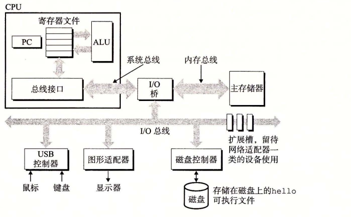

# 1.4.1 系统的硬件组成

为了理解运行 hello 程序时发生了什么，我们需要了解一个典型系统的硬件组织，如图 1-4 所示。这张图是近期 Intel 系统产品族的模型，但是所有其他系统也有相同的外观和特性。现在不要担心这张图很复杂——我们将在本书分阶段对其进行详尽的介绍。

## 1. 总线

贯穿整个系统的是一组电子管道，称作总线，它携带信息字节并负责在各个部件间传递。通常总线被设计成传送定长的字节块，也就是字（word）。字中的字节数（即字长）是一个基本的系统参数，各个系统中都不尽相同。现在的大多数机器字长要么是 4 个字节（32 位），要么是 8 个字节（64 位）。本书中，我们不对字长做任何固定的假设。相反，我们将在需要明确定义的上下文中具体说明一个“字”是多大。

## 2. I/O 设备

I/O（输入/输出）设备是系统与外部世界的联系通道。我们的示例系统包括四个 I/O 设备：作为用户输入的键盘和鼠标，作为用户输出的显示器，以及用于长期存储数据和程序的磁盘驱动器（简单地说就是磁盘）。最开始，可执行程序 hello 就存放在磁盘上。

每个 I/O 设备都通过一个控制器或适配器与 I/O 总线相连。控制器和适配器之间的区别主要在于它们的封装方式。控制器是 I/O 设备本身或者系统的主印制电路板（通常称作主板）上的芯片组。而适配器则是一块插在主板插槽上的卡。无论如何，它们的功能都是在 I/O 总线和 I/O 设备之间传递信息。

**图 1-4** 一个典型系统的硬件组成

CPU：中央处理单元；ALU：算术/逻辑单元；PC：程序计数器；USB：通用串行总线

第 6 章会更多地说明磁盘之类的 I/O 设备是如何工作的。在第 10 章中，你将学习如何在应用程序中利用 Unix I/O 接口访问设备。我们将特别关注网络类设备，不过这些技术对于其他设备来说也是通用的。

## 3. 主存

主存是一个临时存储设备，在处理器执行程序时，用来存放程序和程序处理的数据。从物理上来说，主存是由一组动态随机存取存储器（DRAM）芯片组成的。从逻辑上来说，存储器是一个线性的字节数组，每个字节都有其唯一的地址（数组索引），这些地址是从零开始的。一般来说，组成程序的每条机器指令都由不同数量的字节构成。与 C 程序变量相对应的数据项的大小是根据类型变化的。比如，在运行 Linux 的 x86-64 机器上，short 类型的数据需要 2 个字节，int 和 float 类型需要 4 个字节，而 long 和 double 类型需要 8 个字节。

第 6 章将具体介绍存储器技术，比如 DRAM 芯片是如何工作的，它们又是如何组合起来构成主存的。

## 4. 处理器

中央处理单元（CPU），简称处理器，是解释（或执行）存储在主存中指令的引擎。处理器的核心是一个大小为一个字的存储设备（或寄存器），称为程序计数器（PC）。在任何时刻，PC 都指向主存中的某条机器语言指令（即含有该条指令的地址）。①

> **注** PC 也普遍地被用来作为“个人计算机”的缩写。然而，两者之间的区别应该可以很清楚地从上下文中看出来。

从系统通电开始，直到系统断电，处理器一直在不断地执行程序计数器指向的指令，再更新程序计数器，使其指向下一条指令。处理器看上去是按照一个非常简单的指令执行模型来操作的，这个模型是由指令集架构决定的。在这个模型中，指令按照严格的顺序执行，而执行一条指令包含执行一系列的步骤。处理器从程序计数器指向的内存处读取指令，解释指令中的位，执行该指令指示的简单操作，然后更新 PC，使其指向下一条指令，而这条指令并不一定和在内存中刚刚执行的指令相邻。

这样的简单操作并不多，它们围绕着主存、寄存器文件（register file）和算术/逻辑单元（ALU）进行。寄存器文件是一个小的存储设备，由一些单个字长的寄存器组成，每个寄存器都有唯一的名字。ALU 计算新的数据和地址值。下面是一些简单操作的例子，CPU 在指令的要求下可能会执行这些操作。

- **加载：** 从主存复制一个字节或者一个字到寄存器，以覆盖寄存器原来的内容。
- **存储：** 从寄存器复制一个字节或者一个字到主存的某个位置，以覆盖这个位置上原来的内容。
- **操作：** 把两个寄存器的内容复制到 ALU，ALU 对这两个字做算术运算，并将结果存放到一个寄存器中，以覆盖该寄存器中原来的内容。
- **跳转：** 从指令本身中抽取一个字，并将这个字复制到程序计数器（PC）中，以覆盖 PC 中原来的值。

处理器看上去是它的指令集架构的简单实现，但是实际上现代处理器使用了非常复杂的机制来加速程序的执行。因此，我们将处理器的指令集架构和处理器的微体系结构区分开来：指令集架构描述的是每条机器代码指令的效果；而微体系结构描述的是处理器实际上是如何实现的。在第 3 章研究机器代码时，我们考虑的是机器的指令集架构所提供的抽象性。第 4 章将更详细地介绍处理器实际上是如何实现的。第 5 章用一个模型说明现代处理器是如何工作的，从而能预测和优化机器语言程序的性能。
