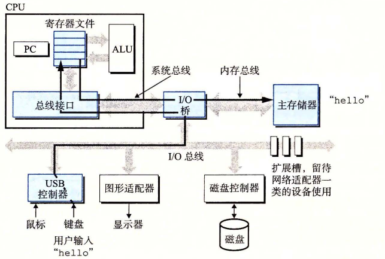
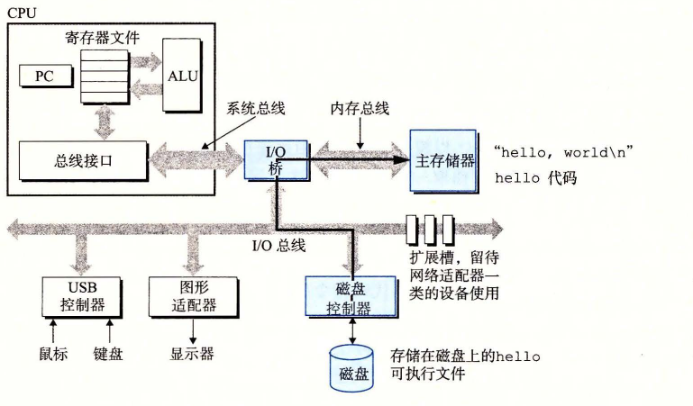
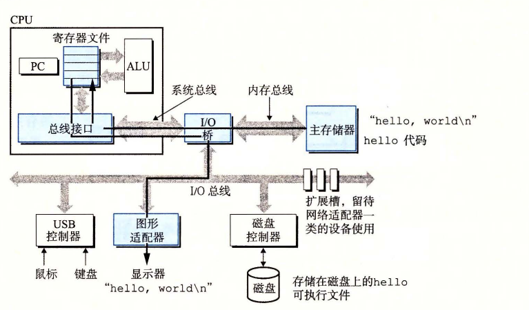

# 1.4.2 运行 hello 程序

前面简单描述了系统的硬件组成和操作，现在开始介绍当我们运行示例程序时到底发生了些什么。在这里必须省略很多细节，稍后会做补充，但是现在我们将很满意于这种整体上的描述。

初始时，shell 程序执行它的指令，等待我们输入一个命令。当我们在键盘上输入字符串“./hello”后，shell 程序将字符逐一读入寄存器，再把它存放到内存中，如图 1-5 所示。

**图 1-5** 从键盘上读取 hello 命令

当我们在键盘上敲回车键时，shell 程序就知道我们已经结束了命令的输入。然后 shell 执行一系列指令来加载可执行的 hello 文件，这些指令将 hello 目标文件中的代码和数据从磁盘复制到主存。数据包括最终会被输出的字符串“hello, world\n”。

利用直接存储器存取（DMA，将在第 6 章中讨论）技术，数据可以不通过处理器而直接从磁盘到达主存。这个步骤如图 1-6 所示。

**图 1-6** 从磁盘加载可执行文件到主存

一旦目标文件 hello 中的代码和数据被加载到主存，处理器就开始执行 hello 程序的 main 程序中的机器语言指令。这些指令将“hello, world\n”字符串中的字节从主存复制到寄存器文件，再从寄存器文件中复制到显示设备，最终显示在屏幕上。这个步骤如图 1-7 所示。

**图 1-7** 将输出字符串从存储器写到显示器
