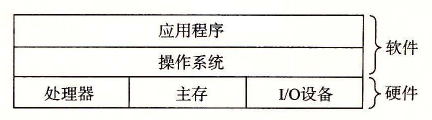
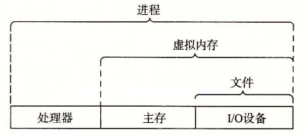

# 1.7 操作系统管理硬件

让我们回到 hello 程序的例子。当 shell 加载和运行 hello 程序时，以及 hello 程序输出自己的消息时，shell 和 hello 程序都没有直接访问键盘、显示器、磁盘或者主存。取而代之的是，它们依靠操作系统提供的服务。我们可以把操作系统看成是应用程序和硬件之间插入的一层软件，如图 1-10 所示。所有应用程序对硬件的操作尝试都必须通过操作系统。

**图 1-10** 计算机系统的分层视图

操作系统有两个基本功能：（1）防止硬件被失控的应用程序滥用；（2）向应用程序提供简单一致的机制来控制复杂而又通常大不相同的低级硬件设备。操作系统通过几个基本的抽象概念（进程、虚拟内存和文件）来实现这两个功能。如图 1-11 所示，文件是对 I/O 设备的抽象表示，虚拟内存是对主存和磁盘 I/O 设备的抽象表示，进程则是对处理器、主存和 I/O 设备的抽象表示。我们将依次讨论每种抽象表示。

**图 1-11** 操作系统提供的抽象表示

> **旁注 Unix、Posix 和标准 Unix 规范**
>
> 20 世纪 60 年代是大型、复杂操作系统盛行的年代，比如 IBM 的 OS/360 和 Honeywell 的 Multics 系统。OS/360 是历史上最成功的软件项目之一，而 Multics 虽然持续存在了多年，却从来没有被广泛应用过。贝尔实验室曾经是 Multics 项目的最初参与者，但是因为考虑到该项目的复杂性和缺乏进展而于 1969 年退出。鉴于 Multics 项目不愉快的经历，一群贝尔实验室的研究人员——Ken Thompson、Dennis Ritchie、Doug McIlroy 和 Joe Ossanna，从 1969 年开始在 DEC PDP-7 计算机上完全用机器语言编写了一个简单得多的操作系统。这个新系统中的很多思想，比如层次文件系统、作为用户级进程的 shell 概念，都是来自于 Multics，只不过在一个更小、更简单的程序包里实现。1970 年，Brian Kernighan 给新系统命名为“Unix”，这也是一个双关语，暗指“Multics”的复杂性。1973 年用 C 重新编写其内核，1974 年，Unix 开始正式对外发布[93]。
>
> 贝尔实验室以慷慨的条件向学校提供源代码，所以 Unix 在大专院校里获得了很多支持并得以持续发展。最有影响的工作发生在 20 世纪 70 年代晚期到 80 年代早期，在美国加州大学伯克利分校，研究人员在一系列发布版本中增加了虚拟内存和 Internet 协议，称为 Unix 4.xBSD（Berkeley Software Distribution）。与此同时，贝尔实验室也在发布自己的版本，称为 System V Unix。其他厂商的版本，比如 Sun Microsystems 的 Solaris 系统，则是从这些原始的 BSD 和 System V 版本中衍生而来。
>
> 20 世纪 80 年代中期，Unix 厂商试图通过加入新的、往往不兼容的特性来使它们的程序与众不同，麻烦也就随之而来了。为了阻止这种趋势，IEEE（电气和电子工程师协会）开始努力标准化 Unix 的开发，后来由 Richard Stallman 命名为“Posix”。结果就得到了一系列的标准，称作 Posix 标准。这套标准涵盖了很多方面，比如 Unix 系统调用的 C 语言接口、shell 程序和工具、线程及网络编程。最近，一个被称为“标准 Unix 规范”的独立标准化工作已经与 Posix 一起创建了统一的 Unix 系统标准。这些标准化工作的结果是 Unix 版本之间的差异已经基本消失。
