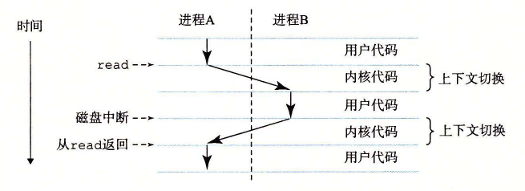

# 1.7.1 进程

像 hello 这样的程序在现代系统上运行时，操作系统会提供一种假象，就好像系统上只有这个程序在运行。程序看上去是独占地使用处理器、主存和 I/O 设备。处理器看上去就像在不间断地一条接一条地执行程序中的指令，即该程序的代码和数据是系统内存中唯一的对象。这些假象是通过进程的概念来实现的，进程是计算机科学中最重要和最成功的概念之一。

进程是操作系统对一个正在运行的程序的一种抽象。在一个系统上可以同时运行多个进程，而每个进程都好像在独占地使用硬件。而并发运行，则是说一个进程的指令和另一个进程的指令是交错执行的。在大多数系统中，需要运行的进程数是多于可以运行它们的 CPU 个数的。传统系统在一个时刻只能执行一个程序，而先进的多核处理器同时能够执行多个程序。无论是在单核还是多核系统中，一个 CPU 看上去都像是在并发地执行多个进程，这是通过处理器在进程间切换来实现的。操作系统实现这种交错执行的机制称为上下文切换。为了简化讨论，我们只考虑包含一个 CPU 的单处理器系统的情况。我们会在 1.9.2 节中讨论多处理器系统。

操作系统保持跟踪进程运行所需的所有状态信息。这种状态，也就是上下文，包括许多信息，比如 PC 和寄存器文件的当前值，以及主存的内容。在任何一个时刻，单处理器系统都只能执行一个进程的代码。当操作系统决定要把控制权从当前进程转移到某个新进程时，就会进行上下文切换，即保存当前进程的上下文、恢复新进程的上下文，然后将控制权传递到新进程。新进程就会从它上次停止的地方开始。图 1-12 展示了示例 hello 程序运行场景的基本理念。

示例场景中有两个并发的进程：shell 进程和 hello 进程。最开始，只有 shell 进程在运行，即等待命令行上的输入。当我们让它运行 hello 程序时，shell 通过调用一个专门的函数，即系统调用，来执行我们的请求，系统调用会将控制权传递给操作系统。操作系统保存 shell 进程的上下文，创建一个新的 hello 进程及其上下文，然后将控制权传给新的 hello 进程。hello 进程终止后，操作系统恢复 shell 进程的上下文，并将控制权传回给它，shell 进程会继续等待下一个命令行输入。

如图 1-12 所示，从一个进程到另一个进程的转换是由操作系统内核（kernel）管理的。内核是操作系统代码常驻主存的部分。当应用程序需要操作系统的某些操作时，比如读写文件，它就执行一条特殊的系统调用（system call）指令，将控制权传递给内核。然后内核执行被请求的操作并返回应用程序。注意，内核不是一个独立的进程。相反，它是系统管理全部进程所用代码和数据结构的集合。

**图 1-12** 进程的上下文切换

实现进程这个抽象概念需要低级硬件和操作系统软件之间的紧密合作。我们将在第 8 章中揭示这项工作的原理，以及应用程序是如何创建和控制它们的进程的。
