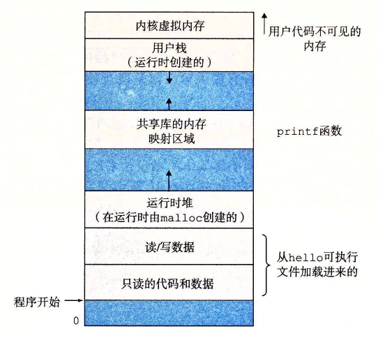

# 1.7.3 虚拟内存

虚拟内存是一个抽象概念，它为每个进程提供了一个假象，即每个进程都在独占地使用主存。每个进程看到的内存都是一致的，称为虚拟地址空间。图 1-13 所示的是 Linux 进程的虚拟地址空间（其他 Unix 系统的设计也与此类似）。在 Linux 中，地址空间最上面的区域是保留给操作系统中的代码和数据的，这对所有进程来说都是一样。地址空间的底部区域存放用户进程定义的代码和数据。请注意，图中的地址是从下往上增大的。

**图 1-13** 进程的虚拟地址空间

每个进程看到的虚拟地址空间由大量准确定义的区构成，每个区都有专门的功能。在本书的后续章节你将学到更多有关这些区的知识，但是先简单了解每一个区是非常有益的。我们从最低的地址开始，逐步向上介绍。

- **程序代码和数据。** 对所有的进程来说，代码是从同一固定地址开始，紧接着的是和 C 全局变量相对应的数据位置。代码和数据区是直接按照可执行目标文件的内容初始化的，在示例中就是可执行文件 hello。在第 7 章我们研究链接和加载时，你会学习更多有关地址空间的内容。
- **堆。** 代码和数据区后紧随着的是运行时堆。代码和数据区在进程一开始运行时就被指定了大小，与此不同，当调用像 malloc 和 free 这样的 C 标准库函数时，堆可以在运行时动态地扩展和收缩。在第 9 章学习管理虚拟内存时，我们将更详细地研究堆。
- **共享库。** 大约在地址空间的中间部分是一块用来存放像 C 标准库和数学库这样的共享库的代码和数据的区域。共享库的概念非常强大，也相当难懂。在第 7 章介绍动态链接时，将学习共享库是如何工作的。
- **栈。** 位于用户虚拟地址空间顶部的是用户栈，编译器用它来实现函数调用。和堆一样，用户栈在程序执行期间可以动态地扩展和收缩。特别地，每次我们调用一个函数时，栈就会增长；从一个函数返回时，栈就会收缩。在第 3 章中将学习编译器是如何使用栈的。
- **内核虚拟内存。** 地址空间顶部的区域是为内核保留的。不允许应用程序读写这个区域的内容或者直接调用内核代码定义的函数。相反，它们必须调用内核来执行这些操作。

虚拟内存的运作需要硬件和操作系统软件之间精密复杂的交互，包括对处理器生成的每个地址的硬件翻译。基本思想是把一个进程虚拟内存的内容存储在磁盘上，然后用主存作为磁盘的高速缓存。第 9 章将解释它如何工作，以及为什么对现代系统的运行如此重要。
