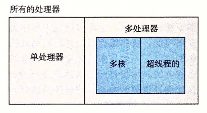
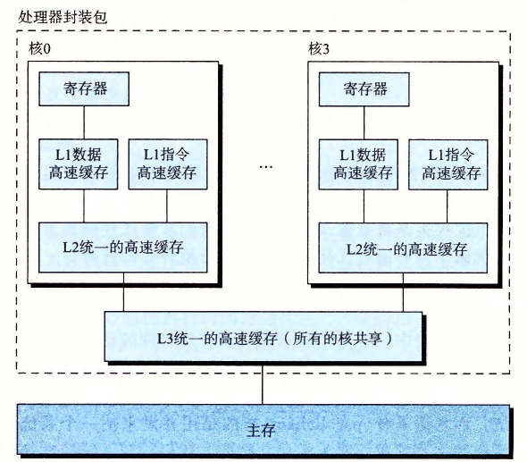

# 1.9.2 并发和并行

数字计算机的整个历史中，有两个需求是驱动进步的持续动力：一个是我们想要计算机做得更多，另一个是我们想要计算机运行得更快。当处理器能够同时做更多的事情时，这两个因素都会改进。我们用的术语并发（concurrency）是一个通用的概念，指一个同时具有多个活动的系统；而术语并行（parallelism）指的是用并发来使一个系统运行得更快。并行可以在计算机系统的多个抽象层次上运用。在此，我们按照系统层次结构中由高到低的顺序重点强调三个层次。

## 1. 线程级并发

构建在进程这个抽象之上，我们能够设计出同时有多个程序执行的系统，这就导致了并发。使用线程，我们甚至能够在一个进程中执行多个控制流。自 20 世纪 60 年代初期出现时间共享以来，计算机系统中就开始有了对并发执行的支持。传统意义上，这种并发执行只是模拟出来的，是通过使一台计算机在它正在执行的进程间快速切换来实现的，就好像一个杂耍艺人保持多个球在空中飞舞一样。这种并发形式允许多个用户同时与系统交互，例如，当许多人想要从一个 Web 服务器获取页面时。它还允许一个用户同时从事多个任务，例如，在一个窗口中开启 Web 浏览器，在另一窗口中运行字处理器，同时又播放音乐。在以前，即使处理器必须在多个任务间切换，大多数实际的计算也都是由一个处理器来完成的。这种配置称为单处理器系统。

当构建一个由单操作系统内核控制的多处理器组成的系统时，我们就得到了一个多处理器系统。其实从 20 世纪 80 年代开始，在大规模的计算中就有了这种系统，但是直到最近，随着多核处理器和超线程（hyperthreading）的出现，这种系统才变得常见。图 1-16 给出了这些不同处理器类型的分类。

**图 1-16** 不同的处理器配置分类。随着多核处理器和超线程的出现，多处理器变得普遍了

多核处理器是将多个 CPU（称为“核”）集成到一个集成电路芯片上。图 1-17 描述的是一个典型多核处理器的组织结构，其中微处理器芯片有 4 个 CPU 核，每个核都有自己的 L1 和 L2 高速缓存，其中的 L1 高速缓存分为两个部分——一个保存最近取到的指令，另一个存放数据。这些核共享更高层次的高速缓存，以及到主存的接口。工业界的专家预言他们能够将几十个、最终会是上百个核做到一个芯片上。

**图 1-17** 多核处理器的组织结构。4 个处理器核集成在一个芯片上

超线程，有时称为同时多线程（simultaneous multi-threading），是一项允许一个 CPU 执行多个控制流的技术。它涉及 CPU 某些硬件有多个备份，比如程序计数器和寄存器文件，而其他的硬件部分只有一份，比如执行浮点算术运算的单元。常规的处理器需要大约 20 000 个时钟周期做不同线程间的转换，而超线程的处理器可以在单个周期的基础上决定要执行哪一个线程。这使得 CPU 能够更好地利用它的处理资源。比如，假设一个线程必须等到某些数据被装载到高速缓存中，那 CPU 就可以继续去执行另一个线程。举例来说，Intel Core i7 处理器可以让每个核执行两个线程，所以一个 4 核的系统实际上可以并行地执行 8 个线程。

多处理器的使用可以从两方面提高系统性能。首先，它减少了在执行多个任务时模拟并发的需要。正如前面提到的，即使是只有一个用户使用的个人计算机也需要并发地执行多个活动。其次，它可以使应用程序运行得更快，当然，这必须要求程序是以多线程方式来书写的，这些线程可以并行地高效执行。因此，虽然并发原理的形成和研究已经超过 50 年的时间了，但是多核和超线程系统的出现才极大地激发了一种愿望，即找到书写应用程序的方法利用硬件开发线程级并行性。第 12 章会更深入地探讨并发，以及使用并发来提供处理器资源的共享，使程序的执行允许有更多的并行。

## 2. 指令级并行

在较低的抽象层次上，现代处理器可以同时执行多条指令的属性称为指令级并行。早期的微处理器，如 1978 年的 Intel 8086，需要多个（通常是 3～10 个）时钟周期来执行一条指令。最近的处理器可以保持每个时钟周期 2～4 条指令的执行速率。其实每条指令从开始到结束需要长得多的时间，大约 20 个或者更多周期，但是处理器使用了非常多的聪明技巧来同时处理多达 100 条指令。在第 4 章中，我们会研究流水线（pipelining）的使用。在流水线中，将执行一条指令所需要的活动划分成不同的步骤，将处理器的硬件组织成一系列的阶段，每个阶段执行一个步骤。这些阶段可以并行地操作，用来处理不同指令的不同部分。我们会看到一个相当简单的硬件设计，它能够达到接近于一个时钟周期一条指令的执行速率。

如果处理器可以达到比一个周期一条指令更快的执行速率，就称之为超标量（superscalar）处理器。大多数现代处理器都支持超标量操作。第 5 章中，我们将描述超标量处理器的高级模型。应用程序员可以用这个模型来理解程序的性能。然后，他们就能写出拥有更高程度的指令级并行性的程序代码，因而也运行得更快。

## 3. 单指令、多数据并行

在最低层次上，许多现代处理器拥有特殊的硬件，允许一条指令产生多个可以并行执行的操作，这种方式称为单指令、多数据，即 SIMD 并行。例如，较新几代的 Intel 和 AMD 处理器都具有并行地对 8 对单精度浮点数（C 数据类型 float）做加法的指令。

提供这些 SIMD 指令多是为了提高处理影像、声音和视频数据应用的执行速度。虽然有些编译器会试图从 C 程序中自动抽取 SIMD 并行性，但是更可靠的方法是用编译器支持的特殊的向量数据类型来写程序，比如 GCC 就支持向量数据类型。作为对第 5 章中比较通用的程序优化描述的补充，我们在网络旁注 OPT:SIMD 中描述了这种编程方式。
