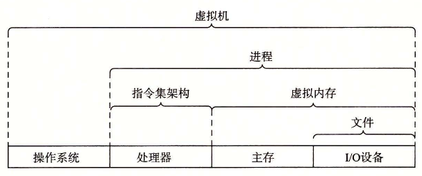

# 1.9.3 计算机系统中抽象的重要性

抽象的使用是计算机科学中最为重要的概念之一。例如，为一组函数规定一个简单的应用程序接口（API）就是一个很好的编程习惯，程序员无须了解它内部的工作便可以使用这些代码。不同的编程语言提供不同形式和等级的抽象支持，例如 Java 类的声明和 C 语言的函数原型。

我们已经介绍了计算机系统中使用的几个抽象，如图 1-18 所示。在处理器里，指令集架构提供了对实际处理器硬件的抽象。使用这个抽象，机器代码程序表现得就好像运行在一个一次只执行一条指令的处理器上。底层的硬件远比抽象描述的要复杂精细，它并行地执行多条指令，但又总是与那个简单有序的模型保持一致。只要执行模型一样，不同的处理器实现也能执行同样的机器代码，而又提供不同的开销和性能。

**图 1-18** 计算机系统提供的一些抽象。计算机系统中的一个重大主题就是提供不同层次的抽象表示，来隐藏实际实现的复杂性

在学习操作系统时，我们介绍了三个抽象：文件是对 I/O 设备的抽象，虚拟内存是对程序存储器的抽象，而进程是对一个正在运行的程序的抽象。我们再增加一个新的抽象：虚拟机，它提供对整个计算机的抽象，包括操作系统、处理器和程序。虚拟机的思想是 IBM 在 20 世纪 60 年代提出来的，但是最近才显示出其管理计算机方式上的优势，因为一些计算机必须能够运行为不同的操作系统（例如，Microsoft Windows、MacOS 和 Linux）或同一操作系统的不同版本设计的程序。

在本书后续的章节中，我们会具体介绍这些抽象。
