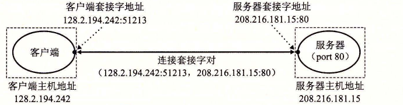

# 11.3.3 因特网连接

因特网客户端和服务器通过在连接上发送和接收字节流来通信。从连接一对进程的意义上而言，连接是点对点的。从数据可以同时双向流动的角度来说，它是全双工的。并且从（除了一些如粗心的耕锄机操作员切断了电缆引起灾难性的失败以外）由源进程发出的字节流最终被目的进程以它发出的顺序收到它的角度来说，它也是可靠的。

一个套接字是连接的一个端点。每个套接字都有相应的套接字地址，是由一个因特网地址和一个 16 位的整数端口[^ports]组成的，用“地址：端口”来表示。

当客户端发起一个连接请求时，客户端套接字地址中的端口是由内核自动分配的，称为临时端口（ephemeral port）。然而，服务器套接字地址中的端口通常是某个知名端口，是和这个服务相对应的。例如，Web 服务器通常使用端口 80，而电子邮件服务器使用端口 25。每个具有知名端口的服务都有一个对应的知名的服务名。例如，Web 服务的知名名字是 `http`，email 的知名名字是 `smtp`。文件 `/etc/services` 包含一张这台机器提供的知名名字和知名端口之间的映射。

一个连接是由它两端的套接字地址唯一确定的。这对套接字地址叫做套接字对（socket pair），由下列元组来表示：

```text
(cliaddr:cliport, servaddr:servport)
```

其中 `cliaddr` 是客户端的 IP 地址，`cliport` 是客户端的端口，`servaddr` 是服务器的 IP 地址，而 `servport` 是服务器的端口。例如，图 11-11 展示了一个 Web 客户端和一个 Web 服务器之间的连接。



**图 11-11** 因特网连接分析

在这个示例中，Web 客户端的套接字地址是

```text
128.2.194.242:51213
```

其中端口号 51213 是内核分配的临时端口号。Web 服务器的套接字地址是

```text
208.216.181.15:80
```

其中端口号 80 是和 Web 服务相关联的知名端口号。给定这些客户端和服务器套接字地址，客户端和服务器之间的连接就由下列套接字对唯一确定了：

```text
(128.2.194.242:51213, 208.216.181.15:80)
```

> **旁注 因特网的起源**
>
> 因特网是政府、学校和工业界合作的最成功的示例之一。它成功的因素很多，但是我们认为有两点尤其重要：美国政府 30 年持续不变的投资，以及充满激情的研究人员对麻省理工学院的 Dave Clarke 提出的“粗略一致和能用的代码”的投入。
>
> 因特网的种子是在 1957 年播下的，其时正值冷战的高峰，苏联发射 Sputnik，第一颗人造地球卫星，震惊了世界。作为响应，美国政府创建了高级研究计划署（ARPA），其任务就是重建美国在科学与技术上的领导地位。1967 年，ARPA 的 Lawrence Roberts 提出了一个计划，建立一个叫做 ARPANET 的新网络。第一个 ARPANET 节点是在 1969 年建立并运行的。到 1971 年，已有 13 个 ARPANET 节点，而且 email 作为第一个重要的网络应用涌现出来。
>
> 1972 年，Robert Kahn 概括了网络互联的一般原则：一组互相连接的网络，通过叫做“路由器”的黑盒子按照“以尽力传送作为基础”在互相独立处理的网络间实现通信。1974 年，Kahn 和 Vinton Cerf 发表了 TCP/IP 协议的第一本详细资料，到 1982 年它成为了 ARPANET 的标准网络互联协议。1983 年 1 月 1 日，ARPANET 的每个节点都切换到 TCP/IP，标志着全球 IP 因特网的诞生。
>
> 1985 年，Paul Mockapetris 发明了 DNS，有 1000 多台因特网主机。1986 年，国家科学基金会（NSF）用 56KB/s 的电话线连接了 13 个节点，构建了 NSFNET 的骨干网。其后在 1988 年升级到 1.5MB/s T1 的连接速率，1991 年为 45MB/s T3 的连接速率。到 1988 年，有超过 50 000 台主机。1989 年，原始的 ARPANET 正式退休了。1995 年，已经有几乎 10 000 000 台因特网主机了，NSF 取消了 NSFNET，并且用基于由公众网络接入点连接的私有商业骨干网的现代因特网架构取代了它。

[^ports]: 这些软件端口与网络中交换机和路由器的硬件端口没有关系。
