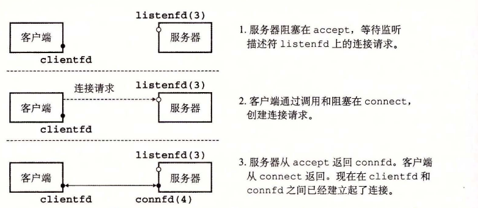

# 11.4.6 `accept` 函数

服务器通过调用 `accept` 函数来等待来自客户端的连接请求。

```c
#include <sys/socket.h>

int accept(int listenfd, struct sockaddr *addr, int *addrlen);
```

**返回：** 若成功则为非负连接描述符，若出错则为 -1。

`accept` 函数等待来自客户端的连接请求到达侦听描述符 `listenfd`，然后在 `addr` 中填写客户端的套接字地址，并返回一个已连接描述符（connected descriptor），这个描述符可被用来利用 Unix I/O 函数与客户端通信。

监听描述符和已连接描述符之间的区别使很多人感到迷惑。监听描述符是作为客户端连接请求的一个端点。它通常被创建一次，并存在于服务器的整个生命周期。已连接描述符是客户端和服务器之间已经建立起来了的连接的一个端点。服务器每次接受连接请求时都会创建一次，它只存在于服务器为一个客户端服务的过程中。

图 11-14 描绘了监听描述符和已连接描述符的角色。在第一步中，服务器调用 `accept`，等待连接请求到达监听描述符，具体地我们设定为描述符 3。回忆一下，描述符 0～2 是预留给了标准文件的。

在第二步中，客户端调用 `connect` 函数，发送一个连接请求到 `listenfd`。第三步，`accept` 函数打开了一个新的已连接描述符 `connfd`（我们假设是描述符 4），在 `clientfd` 和 `connfd` 之间建立连接，并且随后返回 `connfd` 给应用程序。客户端也从 `connect` 返回，在这一点以后，客户端和服务器就可以分别通过读和写 `clientfd` 和 `connfd` 来回传送数据了。



**图 11-14** 监听描述符和已连接描述符的角色

> **旁注 为何要有监听描述符和已连接描述符之间的区别？**
>
> 你可能很想知道为什么套接字接口要区别监听描述符和已连接描述符。乍一看，这像是不必要的复杂化。然而，区分这两者被证明是很有用的，因为它使得我们可以建立并发服务器，它能够同时处理许多客户端连接。例如，每次一个连接请求到达监听描述符时，我们可以派生（`fork`）一个新的进程，它通过已连接描述符与客户端通信。在第 12 章中将介绍更多关于并发服务器的内容。
