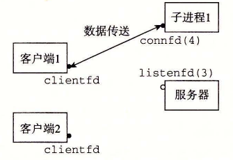

# 12.1 基于进程的并发编程

构造并发程序最简单的方法就是用进程，使用那些大家都很熟悉的函数，像 `fork`、`exec` 和 `waitpid`。例如，一个构造并发服务器的自然方法就是，在父进程中接受客户端连接请求，然后创建一个新的子进程来为每个新客户端提供服务。

为了解这是如何工作的，假设我们有两个客户端和一个服务器，服务器正在监听一个监听描述符（比如描述符 3）上的连接请求。现在假设服务器接受了客户端 1 的连接请求，并返回一个已连接描述符（比如描述符 4），如图 12-1 所示。在接受连接请求之后，服务器派生一个子进程，这个子进程获得服务器描述符表的完整副本。子进程关闭它的副本中的监听描述符 3，而父进程关闭它的已连接描述符 4 的副本，因为不再需要这些描述符了。这就得到了图 12-2 中的状态，其中子进程正忙于为客户端提供服务。

**图 12-1** 第一步：服务器接受客户端的连接请求

**图 12-2** 第二步：服务器派生一个子进程为这个客户端服务

因为父、子进程中的已连接描述符都指向同一个文件表表项，所以父进程关闭它的已连接描述符的副本是至关重要的。否则，将永不会释放已连接描述符 4 的文件表条目，而且由此引起的内存泄漏将最终消耗光可用的内存，使系统崩溃。

现在，假设在父进程为客户端 1 创建了子进程之后，它接受一个新的客户端 2 的连接请求，并返回一个新的已连接描述符（比如描述符 5），如图 12-3 所示。然后，父进程又派生另一个子进程，这个子进程用已连接描述符 5 为它的客户端提供服务，如图 12-4 所示。此时，父进程正在等待下一个连接请求，而两个子进程正在并发地为它们各自的客户端提供服务。

**图 12-3** 第三步：服务器接受另一个连接请求

**图 12-4** 第四步：服务器派生另一个子进程为新的客户端服务
