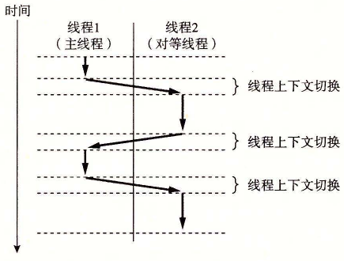

# 12.3.1 线程执行模型

多线程的执行模型在某些方面和多进程的执行模型是相似的。思考图 12-12 中的示例。每个进程开始生命周期时都是单一线程，这个线程称为主线程（main thread）。在某一时刻，主线程创建一个对等线程（peer thread），从这个时间点开始，两个线程就并发地运行。最后，因为主线程执行一个慢速系统调用，例如 `read` 或者 `sleep`，或者因为被系统的间隔计时器中断，控制就会通过上下文切换传递到对等线程。对等线程会执行一段时间，然后控制传递回主线程，依次类推。

**图 12-12** 并发线程执行

在一些重要的方面，线程执行是不同于进程的。因为一个线程的上下文要比一个进程的上下文小得多，线程的上下文切换要比进程的上下文切换快得多。另一个不同就是线程不像进程那样，不是按照严格的父子层次来组织的。和一个进程相关的线程组成一个对等（线程）池，独立于其他线程创建的线程。主线程和其他线程的区别仅在于它总是进程中第一个运行的线程。对等（线程）池概念的主要影响是，一个线程可以杀死它的任何对等线程，或者等待它的任意对等线程终止。另外，每个对等线程都能读写相同的共享数据。
