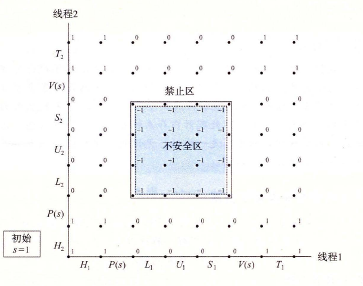

# 12.5.3 使用信号量来实现互斥

信号量提供了一种很方便的方法来确保对共享变量的互斥访问。基本思想是将每个共享变量（或者一组相关的共享变量）与一个信号量 $s$（初始为 1）联系起来，然后用 $P(s)$ 和 $V(s)$ 操作将相应的临界区包围起来。

以这种方式来保护共享变量的信号量叫做二元信号量（binary semaphore），因为它的值总是 0 或者 1。以提供互斥为目的的二元信号量常常也称为互斥锁（mutex）。在一个互斥锁上执行 P 操作称为对互斥锁加锁。类似地，执行 V 操作称为对互斥锁解锁。对一个互斥锁加了锁但是还没有解锁的线程称为占用这个互斥锁。一个被用作一组可用资源的计数器的信号量被称为计数信号量。

图 12-22 中的进度图展示了我们如何利用二元信号量来正确地同步计数器程序示例。每个状态都标出了该状态中信号量 $s$ 的值。关键思想是这种 P 和 V 操作的结合创建了一组状态，叫做禁止区（forbidden region），其中 $s<0$。因为信号量的不变性，没有实际可行的轨迹线能够包含禁止区中的状态。而且，因为禁止区完全包括了不安全区，所以没有实际可行的轨迹线能够接触不安全区的任何部分。因此，每条实际可行的轨迹线都是安全的，而且不管运行时指令顺序是怎样的，程序都会正确地增加计数器值。



**图 12-22**　使用信号量来互斥。$s<0$ 的不可行状态定义了一个禁止区，禁止区完全包括了不安全区，阻止了实际可行的轨迹线接触到不安全区

从可操作的意义上来说，由 P 和 V 操作创建的禁止区使得在任何时间点上，在被包围的临界区中，不可能有多个线程在执行指令。换句话说，信号量操作确保了对临界区的互斥访问。

总的来说，为了用信号量正确同步图 12-16 中的计数器程序示例，我们首先声明一个信号量 `mutex`：

```c
volatile long cnt = 0;  /* Counter */
sem_t mutex;            /* Semaphore that protects counter */
```

然后在主例程中将 `mutex` 初始化为 1：

```c
Sem_init(&mutex, 0, 1);  /* mutex = 1 */
```

最后，我们通过把在线程例程中对共享变量 `cnt` 的更新包围 P 和 V 操作，从而保护它们：

```c
for (i = 0; i < niters; i++) {
    P(&mutex);
    cnt++;
    V(&mutex);
}
```

当我们运行这个正确同步的程序时，现在它每次都能产生正确的结果了。

```text
linux> ./goodcnt 1000000
OK cnt=2000000
linux> ./goodcnt 1000000
OK cnt=2000000
```

> **旁注　进度图的局限性**
>
> 进度图给了我们一种较好的方法，将在单处理器上的并发程序执行可视化，也帮助我们理解为什么需要同步。然而，它们确实也有局限性，特别是对于在多处理器上的并发执行，在多处理器上一组 CPU／高速缓存对共享同一个主存。多处理器的工作方式是进度图不能解释的。特别是，一个多处理器内存系统可以处于一种状态，不对应于进度图中任何轨迹线。不管如何，结论总是一样的：无论是在单处理器还是多处理器上运行程序，都要同步你对共享变量的访问。
