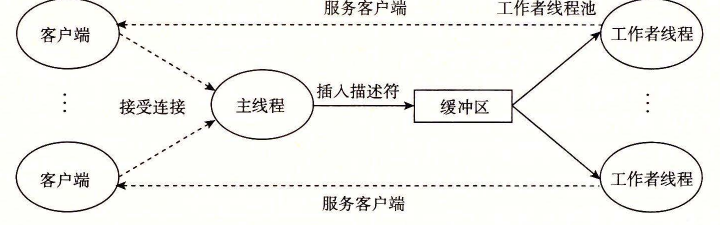

# 12.5.5 综合：基于预线程化的并发服务器

我们已经知道了如何使用信号量来访问共享变量和调度对共享资源的访问。为了帮助你更清晰地理解这些思想，让我们把它们应用到一个基于称为预线程化（prethreading）技术的并发服务器上。

在图 12-14 所示的并发服务器中，我们为每一个新客户端创建了一个新线程。这种方法的缺点是我们为每一个新客户端创建一个新线程，导致不小的代价。一个基于预线程化的服务器试图通过使用如图 12-27 所示的生产者—消费者模型来降低这种开销。服务器是由一个主线程和一组工作者线程构成的。主线程不断地接受来自客户端的连接请求，并将得到的连接描述符放在一个有限缓冲区中。每一个工作者线程反复地从共享缓冲区中取出描述符，为客户端服务，然后等待下一个描述符。



**图 12-27**　预线程化的并发服务器的组织结构。一组现有的线程不断地取出和处理来自有限缓冲区的已连接描述符

图 12-28 显示了我们怎样用 SBUF 包来实现一个预线程化的并发 `echo` 服务器。在初始化了缓冲区 `sbuf`（第 24 行）后，主线程创建了一组工作者线程（第 25～26 行）。然后它进入了无限的服务器循环，接受连接请求，并将得到的已连接描述符插入到缓冲区 `sbuf` 中。每个工作者线程的行为都非常简单。它等待直到它能从缓冲区中取出一个已连接描述符（第 39 行），然后调用 `echo_cnt` 函数回送客户端的输入。

图 12-29 所示的函数 `echo_cnt` 是图 11-22 中的 `echo` 函数的一个版本，它在全局变量 `byte_cnt` 中记录了从所有客户端接收到的累计字节数。这是一段值得研究的有趣代码，因为它向你展示了一个从线程例程调用的初始化程序包的一般技术。在这种情况中，我们需要初始化 `byte_cnt` 计数器和 `mutex` 信号量。一个方法是我们为 SBUF 和 RIO 程序包使用过的，它要求主线程显式地调用一个初始化函数。另外一个方法，在此显示的，是当第一次有某个线程调用 `echo_cnt` 函数时，使用 `pthread_once` 函数（第 19 行）去调用初始化函数。这个方法的优点是它使程序包的使用更加容易。这种方法的缺点是每一次调用 `echo_cnt` 都会导致调用 `pthread_once` 函数，而在大多数时候它没有做什么有用的事。

`code/conc/echoservert-pre.c`

```c
#include "csapp.h"
#include "sbuf.h"
#define NTHREADS 4
#define SBUFSIZE 16

void echo_cnt(int connfd);
void *thread(void *vargp);

sbuf_t sbuf;  /* Shared buffer of connected descriptors */

int main(int argc, char **argv)
{
    int i, listenfd, connfd;
    socklen_t clientlen;
    struct sockaddr_storage clientaddr;
    pthread_t tid;

    if (argc != 2) {
        fprintf(stderr, "usage: %s <port>\n", argv[0]);
        exit(0);
    }
    listenfd = Open_listenfd(argv[1]);

    sbuf_init(&sbuf, SBUFSIZE);
    for (i = 0; i < NTHREADS; i++)  /* Create worker threads */
        Pthread_create(&tid, NULL, thread, NULL);

    while (1) {
        clientlen = sizeof(struct sockaddr_storage);
        connfd = Accept(listenfd, (SA *) &clientaddr, &clientlen);
        sbuf_insert(&sbuf, connfd);  /* Insert connfd in buffer */
    }
}

void *thread(void *vargp)
{
    Pthread_detach(pthread_self());
    while (1) {
        int connfd = sbuf_remove(&sbuf);  /* Remove connfd from buffer */
        echo_cnt(connfd);                 /* Service client */
        Close(connfd);
    }
}
```

**图 12-28**　一个预线程化的并发 `echo` 服务器。这个服务器使用的是有一个生产者和多个消费者的生产者—消费者模型

`code/conc/echo-cnt.c`

```c
#include "csapp.h"

static int byte_cnt;   /* Byte counter */
static sem_t mutex;    /* and the mutex that protects it */

static void init_echo_cnt(void)
{
    Sem_init(&mutex, 0, 1);
    byte_cnt = 0;
}

void echo_cnt(int connfd)
{
    int n;
    char buf[MAXLINE];
    rio_t rio;
    static pthread_once_t once = PTHREAD_ONCE_INIT;

    Pthread_once(&once, init_echo_cnt);
    Rio_readinitb(&rio, connfd);
    while ((n = Rio_readlineb(&rio, buf, MAXLINE)) != 0) {
        P(&mutex);
        byte_cnt += n;
        printf("server received %d (%d total) bytes on fd %d\n",
               n, byte_cnt, connfd);
        V(&mutex);
        Rio_writen(connfd, buf, n);
    }
}
```

**图 12-29**　`echo_cnt`：`echo` 的一个版本，它对从客户端接收的所有字节计数

一旦程序包被初始化，`echo_cnt` 函数会初始化 RIO 带缓冲区的 I/O 包（第 20 行），然后回送从客户端接收到的每一个文本行。注意，在第 23～25 行中对共享变量 `byte_cnt` 的访问是被 P 和 V 操作保护的。

> **旁注　基于线程的事件驱动程序**
>
> I/O 多路复用不是编写事件驱动程序的唯一方法。例如，你可能已经注意到我们刚才开发的并发的预线程化的服务器实际上是一个事件驱动服务器，带有主线程和工作者线程的简单状态机。主线程有两种状态（“等待连接请求”和“等待可用的缓冲区槽位”）、两个 I/O 事件（“连接请求到达”和“缓冲区槽位变为可用”）和两个转换（“接受连接请求”和“插入缓冲区项目”）。类似地，每个工作者线程有一个状态（“等待可用的缓冲区项目”）、一个 I/O 事件（“缓冲区项目变为可用”）和一个转换（“取出缓冲区项目”）。
