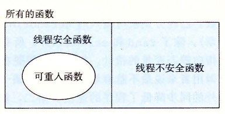

# 12.7.2 可重入性

有一类重要的线程安全函数，叫做可重入函数 (reentrant function)，其特点在于它们具有这样一种属性：当它们被多个线程调用时，不会引用任何共享数据。尽管线程安全和可重入有时会（不正确地）被用做同义词，但是它们之间还是有清晰的技术差别，值得留意。图 12-39 展示了可重入函数、线程安全函数和线程不安全函数之间的集合关系。所有函数的集合被划分成不相交的线程安全和线程不安全函数集合。可重入函数集合是线程安全函数的一个真子集。



**图 12-39** 可重入函数、线程安全函数和线程不安全函数之间的集合关系

可重入函数通常要比不可重入的线程安全的函数高效一些，因为它们不需要同步操作。更进一步来说，将第 2 类线程不安全函数转化为线程安全函数的唯一方法就是重写它，使之变为可重入的。例如，图 12-40 展示了图 12-37 中 `rand` 函数的一个可重入的版本。关键思想是我们用一个调用者传递进来的指针取代了静态的 `next` 变量。

`code/conc/rand-r.c`

```c
/* rand_r - return a pseudorandom integer on 0..32767 */
int rand_r(unsigned int *nextp)
{
    *nextp = *nextp * 1103515245 + 12345;
    return (unsigned int)(*nextp / 65536) % 32768;
}
```

**图 12-40** `rand_r`：图 12-37 中的 `rand` 函数的可重入版本

检查某个函数的代码并先验地断定它是可重入的，这可能吗？不幸的是，不一定能这样。如果所有的函数参数都是传值传递的（即没有指针），并且所有的数据引用都是本地的自动栈变量（即没有引用静态或全局变量），那么函数就是显式可重入的 (explicitly reentrant)，也就是说，无论它是被如何调用的，都可以断言它是可重入的。

然而，如果把假设放宽松一点，允许显式可重入函数中一些参数是引用传递的（即允许它们传递指针），那么我们就得到了一个隐式可重入的 (implicitly reentrant) 函数，也就是说，如果调用线程小心地传递指向非共享数据的指针，那么它是可重入的。例如，图 12-40 中的 `rand_r` 函数就是隐式可重入的。

我们总是使用术语可重入的 (reentrant) 既包括显式可重入函数也包括隐式可重入函数。然而，认识到可重入性有时既是调用者也是被调用者的属性，并不只是被调用者单独的属性是非常重要的。

> **练习题 12.12** 图 12-38 中的 `ctime_ts` 函数是线程安全的，但不是可重入的。请解释说明。
