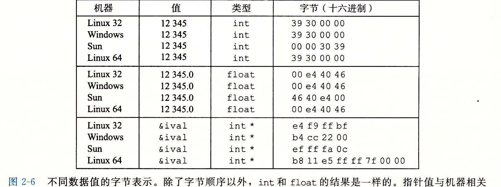

# 2.1.3 寻址和字节顺序

对于跨越多字节的程序对象，我们必须建立两个规则：这个对象的地址是什么，以及在内存中如何排列这些字节。在几乎所有的机器上，多字节对象都被存储为连续的字节序列，对象的地址为所使用字节中最小的地址。例如，假设一个类型为 `int` 的变量 `x` 的地址为 `0x100`，也就是说，地址表达式 `&x` 的值为 `0x100`。那么，（假设数据类型 `int` 为 32 位表示）`x` 的 4 个字节将被存储在内存的 `0x100`、`0x101`、`0x102` 和 `0x103` 位置。

排列表示一个对象的字节有两个通用的规则。考虑一个 w 位的整数，其位表示为 [x<sub>w-1</sub>, x<sub>w-2</sub>, ..., x₁, x₀]，其中 x<sub>w-1</sub> 是最高有效位，而 x₀ 是最低有效位。假设 w 是 8 的倍数，这些位就能被分组成为字节，其中最高有效字节包含位 [x<sub>w-1</sub>, x<sub>w-2</sub>, ..., x<sub>w-8</sub>]，而最低有效字节包含位 [x₇, x₆, ..., x₀]，其他字节包含中间的位。

某些机器选择在内存中按照从最低有效字节到最高有效字节的顺序存储对象，而另一些机器则按照从最高有效字节到最低有效字节的顺序存储。前一种规则--最低有效字节在最前面的方式，称为小端法（little endian）。后一种规则--最高有效字节在最前面的方式，称为大端法（big endian）。

假设变量 `x` 的类型为 `int`，位于地址 `0x100` 处，它的十六进制值为 `0x01234567`。地址范围 `0x100 ~ 0x103` 的字节顺序依赖于机器的类型：


大多数 Intel 兼容机都只用小端模式。另一方面，IBM 和 Oracle（从其 2010 年收购 Sun Microsystems 开始）的大多数机器则是按大端模式操作。注意我们说的是“大多数”。这些规则并没有严格按照企业界限来划分。比如，IBM 和 Oracle 制造的个人计算机使用的是 Intel 兼容的处理器，因此使用小端法。许多比较新的微处理器是双端法（bi-endian），也就是说可以把它们配置成作为大端或者小端的机器运行。然而，实际情况是：一旦选择了特定操作系统，那么字节顺序也就固定下来。比如，用于许多移动电话的 ARM 微处理器，其硬件可以按小端或大端两种模式操作，但是这些芯片上最常见的两种操作系统--Android（来自 Google）和 iOS（来自 Apple）--却只能运行于小端模式。

令人吃惊的是，在哪种字节顺序是合适的这个问题上，人们表现得非常情绪化。实际上，术语 “little endian（小端）” 和 “big endian（大端）” 出自 Jonathan Swift 的《格利佛游记》（Gulliver's Travels）一书，其中交战的两个派别无法就应该从哪一端（小端还是大端）打开一个半熟的鸡蛋达成一致。就像鸡蛋的问题一样，选择何种字节顺序没有技术上的理由，因此争论沦为关于社会政治论题的争论。只要选择了一种规则并且始终如一地坚持，对于哪种字节排序的选择都是任意的。

> **旁注：“端”的起源**
>
> 以下是 Jonathan Swift 在 1726 年关于大小端之争历史的描述：
>
> “……我下面要告诉你的是，Lilliput 和 Blefuscu 这两大强国在过去 36 个月里一直在苦战。战争开始是由于以下的原因：我们大家都认为，吃鸡蛋前，原始的方法是打破鸡蛋较大的一端，可是当今皇帝的祖父小时候吃鸡蛋，一次按古法打鸡蛋时碰巧将一个手指弄破了，因此他的父亲，当时的皇帝，就下了一道敕令，命令全体臣民吃鸡蛋时打破鸡蛋较小的一端，违令者重罚。老百姓们对这项命令极为反感。历史告诉我们，由此曾发生过六次叛乱，其中一个皇帝送了命，另一个丢了王位。这些叛乱大多都是由 Blefuscu 的国王大臣们煽动起来的。叛乱平息后，流亡的人总是逃到那个帝国去寻救避难。据估计，先后几次有 11 000 人情愿受死也不肯去打破鸡蛋较小的一端。关于这一争端，曾出版过几百本大部著作，不过大端派的书一直是受禁的，法律也规定该派的任何人不得做官。”（此段译文摘自网上蒋剑锋译的《格利佛游记》第一卷第 4 章。）
>
> 在他那个时代，Swift 是在讽刺英国（Lilliput）和法国（Blefuscu）之间持续的冲突。Danny Cohen，一位网络协议的早期开创者，第一次使用这两个术语来指代字节顺序 [24]，后来这个术语被广泛接纳了。

对于大多数应用程序员来说，其机器所使用的字节顺序是完全不可见的。无论为哪种类型的机器所编译的程序都会得到同样的结果。不过有时候，字节顺序会成为问题。首先是在不同类型的机器之间通过网络传送二进制数据时，一个常见的问题是当小端法机器产生的数据被发送到大端法机器或者反过来时，接收程序会发现，字里的字节成了反序的。为了避免这类问题，网络应用程序的代码编写必须遵守已建立的关于字节顺序的规则，以确保发送方机器将它的内部表示转换成网络标准，而接收方机器则将网络标准转换为它的内部表示。我们将在第 11 章中看到这种转换的例子。

第二种情况是，当阅读表示整数数据的字节序列时字节顺序也很重要。这通常发生在检查机器级程序时。作为一个示例，从某个文件中摘出了以下这行，它给出了一条 Intel x86-64 处理器上的机器级代码：

```text
4004d3: 01 05 43 0b 20 00    add %eax,0x200b43(%rip)
```

这行是由反汇编器生成的，反汇编器是一种确定可执行程序文件所表示的指令序列的工具。我们将在第 3 章中学习有关这些工具的更多知识，以及怎样解释像这样的行。现在，只要注意这行表述的指令中，十六进制字节序列 `43 0b 20 00` 是一个字节反序表示的字节序列。如果按照反序写出这些字节，就得到 `00 20 0b 43`，也就是十进制的 2 100 035。

第三种情况是，当编写规避正常的类型系统的程序时。在 C 语言中，可以通过使用强制类型转换（cast）或联合（union）来允许以一种数据类型引用一个对象，而这种数据类型与创建这个对象时定义的数据类型不同。大多数应用程序编程都强烈不推荐这种编码技巧，但是它对系统级编程来说是非常有用，甚至是必需的。

图 2-4 展示了使用强制类型转换来访问和打印不同程序对象的字节表示的代码。


过程 `show_int`、`show_float` 和 `show_pointer` 展示了如何使用程序 `show_bytes` 来分别输出类型为 `int`、`float` 和 `void *` 的 C 程序对象的字节表示。可以观察到它们仅仅传递给 `show_bytes` 一个指向它们参数 `x` 的指针 `&x`，且这个指针被强制类型转换为 `unsigned char *`，这种强制类型转换告诉编译器，程序应该把这个指针看成指向一个字节序列，而不是指向一个原始数据类型的对象。然后，这个指针会被看成是对象使用的最低字节地址。

这些过程使用 C 语言的运算符 `sizeof` 来确定对象使用的字节数。一般来说，表达式 `sizeof(T)` 返回存储一个类型为 `T` 的对象所需要的字节数。使用 `sizeof` 而不是一个固定的值，是向编写在不同机器类型上可移植的代码迈进了一步。

在几种不同的机器上运行如图 2-5 所示的代码，得到如图 2-6 所示的结果。




参数 12 345 的十六进制表示为 `0x00003039`。对于 `int` 类型的数据，除了字节顺序以外，我们在所有机器上都得到相同的结果。特别地，我们可以看到在 Linux 32、Windows 和 Linux 64 上，最低有效字节值 `0x39` 最先输出，这说明它们是小端法机器；而在 Sun 上最后输出，这说明 Sun 是大端法机器。同样地，`float` 数据的字节，除了字节顺序以外，也都是相同的。另一方面，指针值却是完全不同的。不同的机器/操作系统配置使用不同的存储分配规则。一个值得注意的特性是 Linux 32、Windows 和 Sun 的机器使用 4 字节地址，而 Linux 64 使用 8 字节地址。

> **给 C 语言初学者：使用 typedef 来命名数据类型**
>
> C 语言中的 `typedef` 声明提供了一种给数据类型命名的方式。这能够极大地改善代码的可读性，因为深度嵌套的类型声明很难读懂。
>
> `typedef` 的语法与声明变量的语法十分相像，除了它使用的是类型名，而不是变量名。因此，图 2-4 中 `byte_pointer` 的声明和将一个变量声明为类型 `unsigned char *` 有相同的形式。
>
> 例如，声明：
>
> ```text
> typedef int *int_pointer;
> int_pointer ip;
> ```
>
> 将类型 `int_pointer` 定义为一个指向 `int` 的指针，并且声明了一个这种类型的变量 `ip`。我们还可以将这个变量直接声明为：
>
> ```text
> int *ip;
> ```

可以观察到，尽管浮点型和整型数据都是对数值 12 345 编码，但是它们有截然不同的字节模式：整型为 `0x00003039`，而浮点数为 `0x4640E400`。一般而言，这两种格式使用不同的编码方法。如果我们将这些十六进制模式扩展为二进制形式，并且适当地将它们移位，就会发现一个有 13 个相匹配的位的序列，用一串星号标识出来：

```text
   0   0   0   0   3   0   3   9
00000000000000000011000000111001
            *************
   4   6   4   0   E   4   0   0
01000110010000001110010000000000
```

这并不是巧合。当我们研究浮点数格式时，还将再回到这个例子。

> **旁注：指针和数组**
>
> 在函数 `show_bytes`（图 2-4）中，我们看到指针和数组之间紧密的联系，这将在 3.8 节中详细描述。这个函数有一个类型为 `byte_pointer`（被定义为一个指向 `unsigned char` 的指针）的参数 `start`，但是我们在第 8 行上看到数组引用 `start[i]`。在 C 语言中，我们能够用数组表示法来引用指针，同时我们也能用指针表示法来引用数组元素。

**练习题 2.5**

考虑下面对 `show_bytes` 的三次调用：

```text
int val = 0x87654321;
byte_pointer valp = (byte_pointer) &val;

show_bytes(valp, 1);  /* A. */
show_bytes(valp, 2);  /* B. */
show_bytes(valp, 3);  /* C. */
```

指出在小端法机器和大端法机器上，每次调用的输出值。

| 调用 | 小端法 | 大端法 |
|---|---|---|
| A |  |  |
| B |  |  |
| C |  |  |

**练习题 2.6**

使用 `show_int` 和 `show_float`，我们确定整数 3510593 的十六进制表示为 `0x00359141`，而浮点数 3510593.0 的十六进制表示为 `0x4A564504`。

A. 写出这两个十六进制值的二进制表示。

B. 移动这两个二进制串的相对位置，使得它们相匹配的位数最多。有多少位相匹配呢？

C. 串中的什么部分不相匹配？
