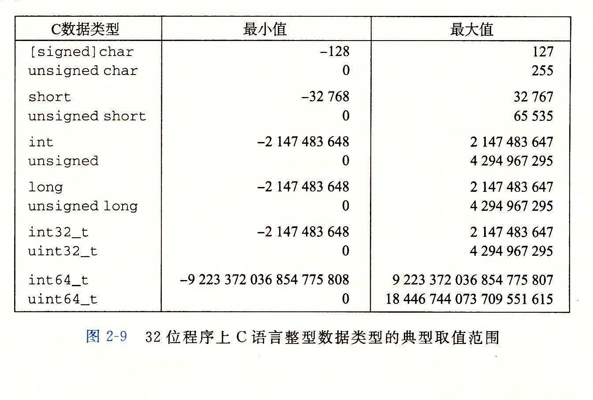
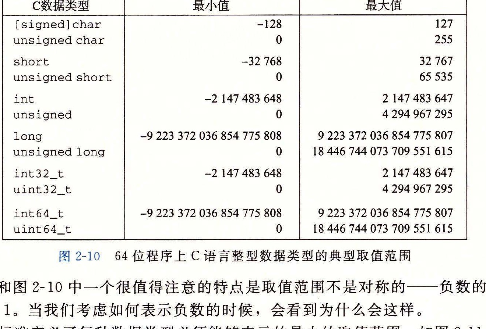
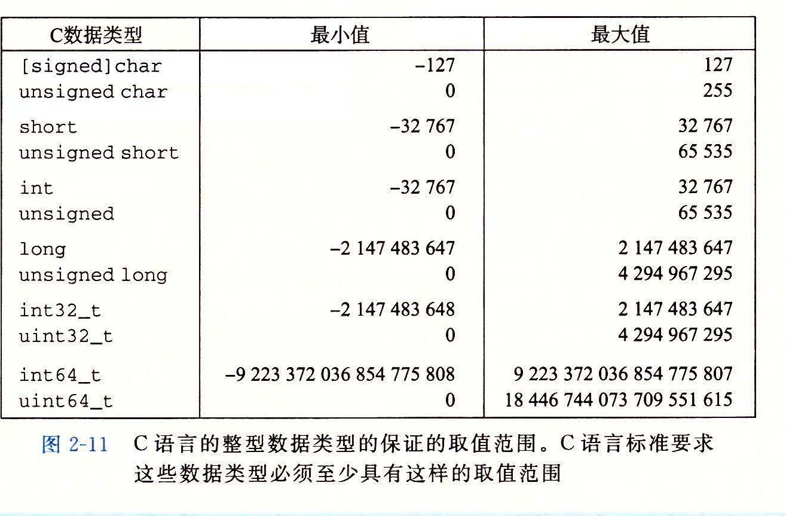

### 2.2.1 整型数据类型

C 语言支持多种整型数据类型，表示有限范围的整数。这些类型如图 2-9 和图 2-10 所示，其中还给出了“典型”32 位和 64 位机器的取值范围。每种类型都能用关键字来指定大小，这些关键字包括 `char`、`short`、`long`，同时还可以指示被表示的数字是非负数（声明为 `unsigned`），或者可能是负数（默认）。如图 2-3 所示，为这些不同的大小分配的字节数根据程序编译为 32 位还是 64 位而有所不同。根据字节分配，不同的大小所能表示的值的范围是不同的。这里给出来的唯一一个与机器相关的取值范围是大小指示符 `long` 的。大多数 64 位机器使用 8 个字节的表示，比 32 位机器上使用的 4 个字节的表示的取值范围大很多。

图 2-9 和图 2-10 中一个很值得注意的特点是取值范围不是对称的：负数的范围比正数的范围大 1。当我们考虑如何表示负数的时候，会看到为什么会这样。

C 语言标准定义了每种数据类型必须能够表示的最小的取值范围。如图 2-11 所示，它们的取值范围与图 2-9 和图 2-10 所示的典型实现一样或者小一些。特别地，除了固定大小的数据类型是例外，我们看到它们只要求正数和负数的取值范围是对称的。此外，数据类型 `int` 可以用 2 个字节的数字来实现，而这几乎回退到了 16 位机器的时代。还可以看到，`long` 的大小可以用 4 个字节的数字来实现，对 32 位程序来说这是很典型的。固定大小的数据类型保证数值的范围与图 2-9 给出的典型数值一致，包括负数与正数的不对称性。

> **给 C 语言初学者：C、C++ 和 Java 中的有符号和无符号数**
>
> C 和 C++ 都支持有符号（默认）和无符号数。Java 只支持有符号数。
