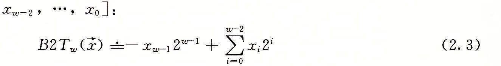
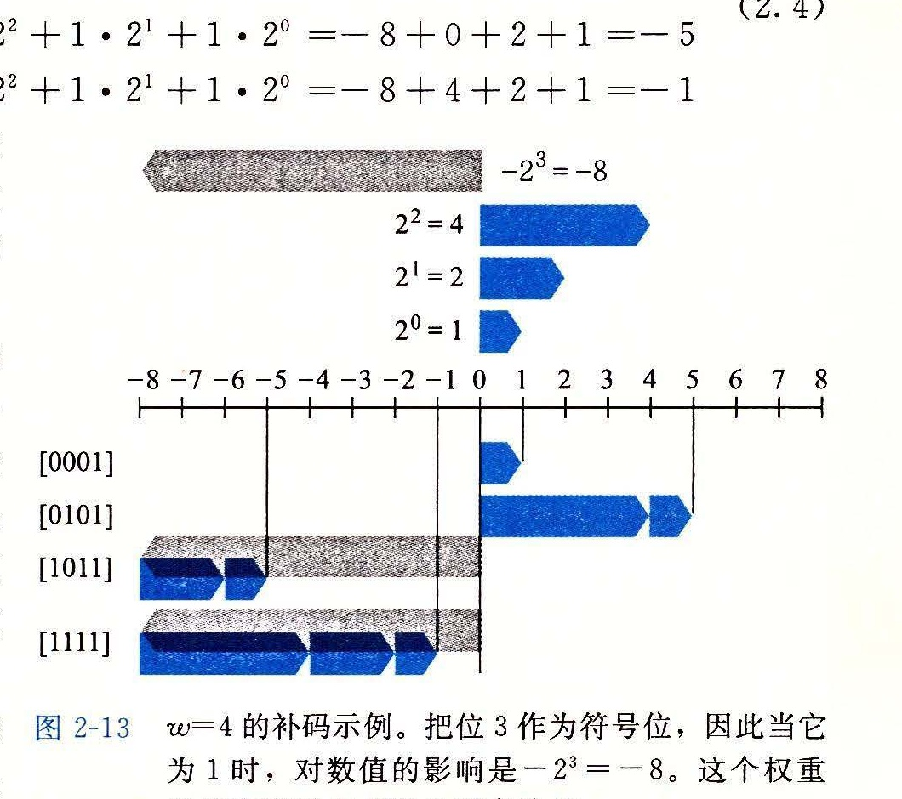
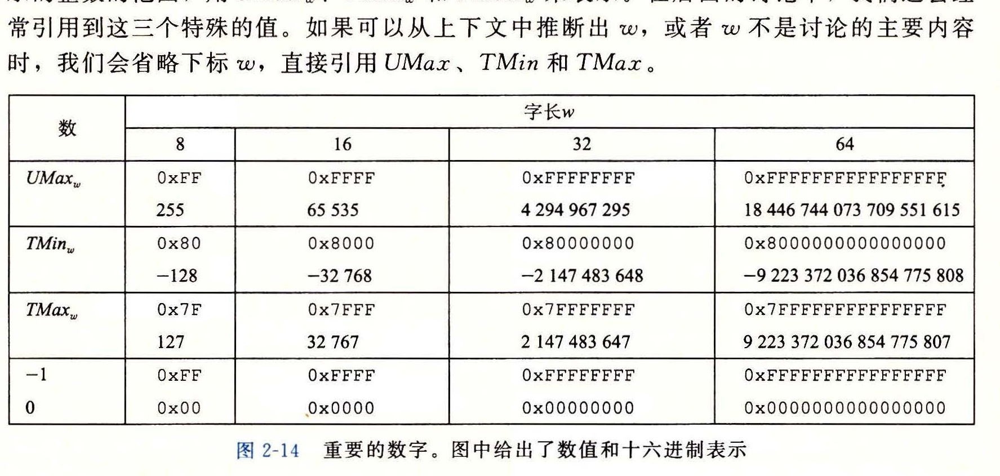
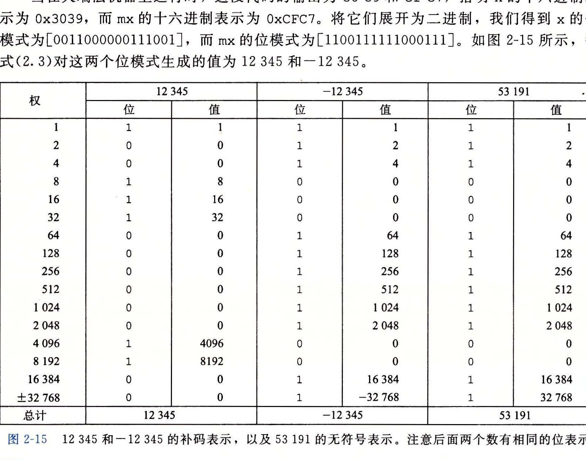

### 2.2.3 补码编码

对于许多应用，我们还希望表示负数值。最常见的有符号数的计算机表示方式就是补码（two's-complement）形式。在这个定义中，将字的最高有效位解释为负权（negative weight）。我们用函数 B2T<sub>w</sub>（Binary to Two's-complement 的缩写，长度为 w）来表示：

**原理：补码编码的定义**

对向量 x = [x<sub>w-1</sub>, x<sub>w-2</sub>, ..., x<sub>0</sub>]：



最高有效位 x<sub>w-1</sub> 也称为符号位，它的“权重”为 -2<sup>w-1</sup>，是无符号表示中权重的负数。符号位被设置为 1 时，表示值为负，而当设置为 0 时，值为非负。这里来看一个示例，图 2-13 展示的是下面几种情况下 B2T 给出的从位向量到整数的映射。

**示例（2.4）**

| 位向量 | B2T<sub>4</sub> 的取值 |
| --- | --- |
| [0001] | -0 · 2<sup>3</sup> + 0 · 2<sup>2</sup> + 0 · 2<sup>1</sup> + 1 · 2<sup>0</sup> = 0 + 0 + 0 + 1 = 1 |
| [0101] | -0 · 2<sup>3</sup> + 1 · 2<sup>2</sup> + 0 · 2<sup>1</sup> + 1 · 2<sup>0</sup> = 0 + 4 + 0 + 1 = 5 |
| [1011] | -1 · 2<sup>3</sup> + 0 · 2<sup>2</sup> + 1 · 2<sup>1</sup> + 1 · 2<sup>0</sup> = -8 + 0 + 2 + 1 = -5 |
| [1111] | -1 · 2<sup>3</sup> + 1 · 2<sup>2</sup> + 1 · 2<sup>1</sup> + 1 · 2<sup>0</sup> = -8 + 4 + 2 + 1 = -1 |

在这个图中，我们用向左指的条表示符号位具有负权重。于是，与一个位向量相关联的数值是由可能的向左指的条和向右指的条加起来决定的。

我们可以看到，图 2-12 和图 2-13 中的位模式都是一样的，对等式 (2.2) 和等式 (2.4) 来说也是一样，但是当最高有效位是 1 时，数值是不同的，这是因为在一种情况中，最高有效位的权重是 +8，而在另一种情况中，它的权重是 -8。



让我们来考虑一下 w 位补码所能表示的值的范围。它能表示的最小值是位向量 [10...0]（也就是设置这个位为负权，但是清除其他所有的位），其整数值为 TMin<sub>w</sub> = -2<sup>w-1</sup>。而最大值是位向量 [01...1]（清除具有负权的位，而设置其他所有的位），其整数值为 TMax<sub>w</sub> = 2<sup>w-1</sup> - 1。以长度为 4 为例，我们有 TMin<sub>4</sub> = B2T<sub>4</sub>([1000]) = -2<sup>3</sup> = -8，而 TMax<sub>4</sub> = B2T<sub>4</sub>([0111]) = 2<sup>2</sup> + 2<sup>1</sup> + 2<sup>0</sup> = 4 + 2 + 1 = 7。

我们可以看出 B2T<sub>w</sub> 是一个从长度为 w 的位模式到 TMin<sub>w</sub> 和 TMax<sub>w</sub> 之间数字的映射，写作 B2T<sub>w</sub>: {0, 1}<sup>w</sup> -> {TMin<sub>w</sub>, ..., TMax<sub>w</sub>}。同无符号表示一样，在可表示的取值范围内的每个数字都有一个唯一的 w 位的补码编码。这就导出了与无符号数相似的补码数原理：

**原理：补码编码的唯一性**

函数 B2T<sub>w</sub> 是一个双射。

我们定义函数 T2B<sub>w</sub>（即“补码到二进制”）作为 B2T<sub>w</sub> 的反函数。也就是说，对于每个数 x，满足 TMin<sub>w</sub> ≤ x ≤ TMax<sub>w</sub>，则 T2B<sub>w</sub>(x) 是 x 的（唯一的）w 位模式。

**练习题 2.17**

假设 w = 4，我们能给每个可能的十六进制数字赋予一个数值，假设用一个无符号或者补码表示。请根据这些表示，通过写出等式 (2.1) 和等式 (2.3) 所示的求和公式中的 2 的非零次幂，填写下表：

| x（十六进制） | x（二进制） | B2U<sub>4</sub>(x) | B2T<sub>4</sub>(x) |
| --- | --- | --- | --- |
| 0xE | [1110] | 2<sup>3</sup> + 2<sup>2</sup> + 2<sup>1</sup> = 14 | -2<sup>3</sup> + 2<sup>2</sup> + 2<sup>1</sup> = -2 |
| 0x0 |  |  |  |
| 0x5 |  |  |  |
| 0x8 |  |  |  |
| 0xD |  |  |  |
| 0xF |  |  |  |

图 2-14 展示了针对不同字长，几个重要数字的位模式和数值。前三个给出的是可表示的整数的范围，用 UMax<sub>w</sub>、TMin<sub>w</sub> 和 TMax<sub>w</sub> 来表示。在后面的讨论中，我们还会经常引用到这三个特殊的值。如果可以从上下文中推断出 w，或者 w 不是讨论的主要内容时，我们会省略下标 w，直接引用 UMax、TMin 和 TMax。



关于这些数字，有几点值得注意。第一，从图 2-9 和图 2-10 可以看到，补码的范围是不对称的：|TMin| = |TMax| + 1，也就是说，TMin 没有与之对应的正数。正如我们将会看到的，这导致了补码运算的某些特殊的属性，并且容易造成程序中细微的错误。之所以会有这样的不对称性，是因为一半的位模式（符号位设置为 1 的数）表示负数，而另一半（符号位设置为 0 的数）表示非负数。因为 0 是非负数，也就意味着能表示的整数比负数少一个。第二，最大的无符号数值刚好比补码的最大值的两倍大一点：UMax<sub>w</sub> = 2TMax<sub>w</sub> + 1。补码表示中所有表示负数的位模式在无符号表示中都变成了正数。图 2-14 也给出了常数 -1 和 0 的表示。注意 -1 和 UMax 有同样的位表示，一个全 1 的串。数值 0 在两种表示方式中都是全 0 的串。

C 语言标准并没有要求要用补码形式来表示有符号整数，但是几乎所有的机器都是这么做的。程序员如果希望代码具有最大可移植性，能够在所有可能的机器上运行，那么除了图 2-11 所示的那些范围之外，我们不应该假设任何可表示的数值范围，也不应该假设有符号数会使用何种特殊的表示方式。另一方面，许多程序的书写都假设用补码来表示有符号数，并且具有图 2-9 和图 2-10 所示的“典型的”取值范围，这些程序也能够在大量的机器和编译器上移植。C 库中的文件 `<limits.h>` 定义了一组常量，来限定编译器运行的这台机器的不同整型数据类型的取值范围。比如，它定义了常量 INT_MAX、INT_MIN 和 UINT_MAX，它们描述了有符号和无符号整数的范围。对于一个补码的机器，数据类型 int 有 w 位，这些常量就对应于 TMax<sub>w</sub>、TMin<sub>w</sub> 和 UMax<sub>w</sub> 的值。

> **旁注：关于确定大小的整数类型的更多内容**
>
> 对于某些程序来说，用某个确定大小的表示来编码数据类型非常重要。例如，当编写程序，使得机器能够按照一个标准协议在因特网上通信时，让数据类型与协议指定的数据类型兼容是非常重要的。我们前面看到了，某些 C 数据类型，特别是 long 型，在不同的机器上有不同的取值范围，而实际上 C 语言标准只指定了每种数据类型的最小范围，而不是确定的范围。虽然我们可以选择与大多数机器上的标准表示兼容的数据类型，但是这也不能保证可移植性。
>
> 我们已经见过了 32 位和 64 位版本的确定大小的整数类型（图 2-3），它们是一个更大数据类型类的一部分。ISO C99 标准在文件 `stdint.h` 中引入了这个整数类型类。这个文件定义了一组数据类型，它们的声明形如 `intN_t` 和 `uintN_t`，对不同的 N 值指定 N 位有符号和无符号整数。N 的具体值与实现相关，但是大多数编译器允许的值为 8、16、32 和 64。因此，通过将它的类型声明为 `uint16_t`，我们可以无歧义地声明一个 16 位无符号变量，而如果声明为 `int32_t`，就是一个 32 位有符号变量。
>
> 这些数据类型对应着一组宏，定义了每个 N 的值对应的最小和最大值。这些宏名字形如 `INTN_MIN`、`INTN_MAX` 和 `UINTN_MAX`。
>
> 确定宽度类型的带格式打印需要使用宏，以与系统相关的方式扩展为格式串。因此，举个例子来说，变量 x 和 y 的类型是 `int32_t` 和 `uint64_t`，可以通过调用 `printf` 来打印它们的值，如下所示：
>
> ```c
> printf("x = %" PRId32 ", y = %" PRIu64 "\n", x, y);
> ```
>
> 编译为 64 位程序时，宏 `PRId32` 展开成字符串 “d”，宏 `PRIu64` 则展开成两个字符串 “l” “u”。当 C 预处理器遇到仅用空格（或其他空白字符）分隔的一个字符串常量序列时，就把它们串联起来。因此，上面的 `printf` 调用就变成了：
>
> ```c
> printf("x = %d, y = %lu\n", x, y);
> ```
>
> 使用宏能保证：不论代码是如何被编译的，都能生成正确的格式字符串。

* 关于整数数据类型的取值范围和表示，Java 标准是非常明确的。它要求采用补码表示，取值范围与图 2-10 中 64 位的情况一样。在 Java 中，单字节数据类型称为 byte，而不是 char。这些非常具体的要求都是为了保证无论在什么机器上运行，Java 程序都能表现地完全一样。

> **旁注：有符号数的其他表示方法**
>
> 有符号数还有两种标准的表示方法：
>
> **反码（Ones' Complement）**：除了最高有效位的权是 -(2<sup>w-1</sup> - 1) 而不是 -2<sup>w-1</sup>，它和补码是一样的：
>
> B2O<sub>w</sub>(x) ≐ -x<sub>w-1</sub>(2<sup>w-1</sup> - 1) + ∑<sub>i=0</sub><sup>w-2</sup> x<sub>i</sub>2<sup>i</sup>
>
> **原码（Sign-Magnitude）**：最高有效位是符号位，用来确定剩下的位应该取负权还是正权：
>
> B2S<sub>w</sub>(x) ≐ (-1)<sup>x<sub>w-1</sub></sup> · (∑<sub>i=0</sub><sup>w-2</sup> x<sub>i</sub>2<sup>i</sup>)
>
> 这两种表示方法都有一个奇怪的属性，那就是对于数字 0 有两种不同的编码方式。这两种表示方法，把 [00...0] 都解释为 +0。而值 -0 在原码中表示为 [10...0]，在反码中表示为 [11...1]。虽然过去生产过基于反码表示的机器，但是几乎所有的现代机器都使用补码。我们将看到在浮点数中有使用原码编码。
>
> 请注意补码（Two's Complement）和反码（Ones' Complement）中撇号的位置是不同的。术语补码来源于这样一个情况，对于非负数 x，我们用 2<sup>w</sup> - x（这里只有一个 2）来计算 -x 的 w 位表示。术语反码来源于这样一个属性，我们用 [111...1] - x（这里有很多个 1）来计算 -x 的反码表示。

为了更好地理解补码表示，考虑下面的代码：

```c
short x = 12345;
short mx = -x;

show_bytes((byte_pointer) &x, sizeof(short));
show_bytes((byte_pointer) &mx, sizeof(short));
```

当在大端法机器上运行时，这段代码的输出为 `30 39` 和 `cf c7`，指明 x 的十六进制表示为 `0x3039`，而 mx 的十六进制表示为 `0xCFC7`。将它们展开为二进制，我们得到 x 的位模式为 [0011000000111001]，而 mx 的位模式为 [1100111111000111]。如图 2-15 所示，等式 (2.3) 对这两个位模式生成的值为 12 345 和 -12 345。



**练习题 2.18**

在第 3 章中，我们将看到由反汇编器生成的列表，反汇编器是一种将可执行程序文件转换回可读性更好的 ASCII 码形式的程序。这些文件包含许多十六进制数字，都是用典型的补码形式来表示这些值。能够认识这些数字并理解它们的意义（例如它们是正数还是负数），是一项重要的技巧。

在下面的列表中，对于标号为 A~I（标记在右边）的那些行，将指令名（sub、mov 和 add）右边显示的（32 位补码形式表示的）十六进制值转换为等价的十进制值。

```text
4004d0: 48 81 ec e0 02 00 00     sub    $0x2e0,%rsp             A.
4004d7: 48 8b 44 24 a8           mov    -0x58(%rsp),%rax        B.
4004dc: 48 03 47 28              add    0x28(%rdi),%rax         C.
4004e0: 48 89 44 24 d0           mov    %rax,-0x30(%rsp)        D.
4004e5: 48 8b 44 24 78           mov    0x78(%rsp),%rax         E.
4004ea: 48 89 87 88 00 00 00     mov    %rax,0x88(%rdi)         F.
4004f1: 48 8b 84 24 f8 01 00
4004f8: 00                       mov    0x1f8(%rsp),%rax        G.
4004f9: 48 03 44 24 08           add    0x8(%rsp),%rax
4004fe: 48 89 84 24 c0 00 00
400505: 00                       mov    %rax,0xc0(%rsp)         H.
400506: 48 8b 44 d4 b8           mov    -0x48(%rsp,%rdx,8),%rax I.
```
