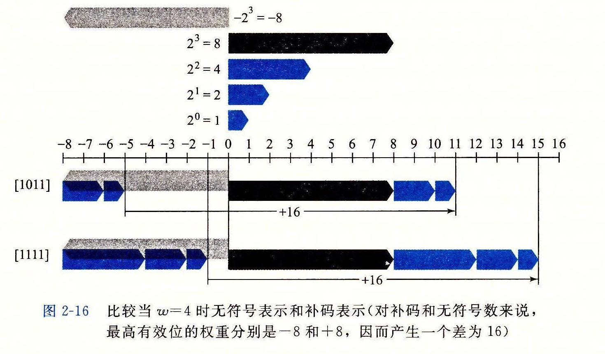
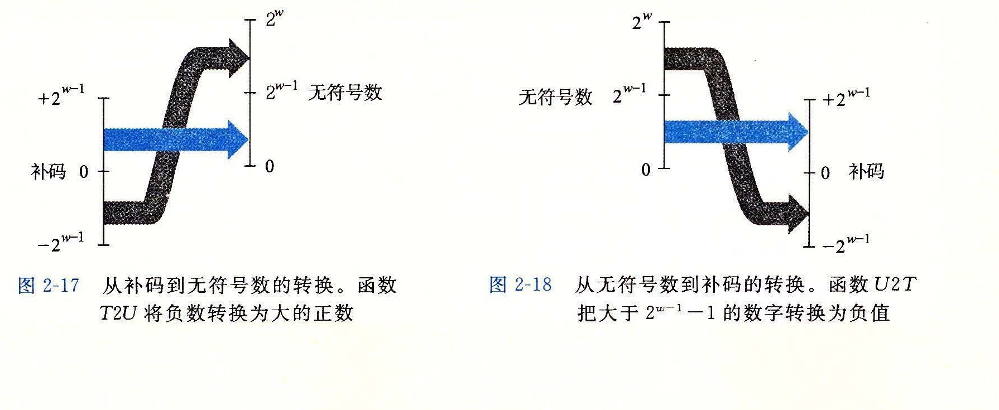

### 2.2.4 有符号数和无符号数之间的转换

C 语言允许在各种不同的数字数据类型之间做强制类型转换。例如，假设变量 x 声明为 int，u 声明为 unsigned。表达式 (unsigned) x 会将 x 的值转换成一个无符号数值，而 (int) u 将 u 的值转换成一个有符号整数。将有符号数强制类型转换成无符号数，或者反过来，会得到什么结果呢？从数学的角度来说，可以想象到几种不同的规则。很明显，对于在两种形式中都能表示的值，我们是想要保持不变的。另一方面，将负数转换成无符号数可能会得到 0。如果转换的无符号数太大以至于超出了补码能够表示的范围，可能会得到 TMax。不过，对于大多数 C 语言的实现来说，对这个问题的回答都是从位级角度来看的，而不是数的角度。

比如说，考虑下面的代码：

```c
short          int v  = -12345;
unsigned short    uv = (unsigned short) v;
printf("v = %d, uv = %u\n", v, uv);
```

在一台采用补码的机器上，上述代码会产生如下输出：

```text
v = -12345, uv = 53191
```

我们看到，强制类型转换的结果保持位值不变，只是改变了解释这些位的方式。在图 2-15 中我们看到过，-12 345 的 16 位补码表示与 53 191 的 16 位无符号表示是完全一样的。将 short 强制类型转换为 unsigned short 改变数值，但是不改变位表示。

类似地，考虑下面的代码：

<pre><code class="language-c">unsigned u  = 4294967295u;  /* UMax */
int      tu = (int) u;
printf("u = %u, tu = %d\n", u, tu);
</code></pre>

在一台采用补码的机器上，上述代码会产生如下输出：

```text
u = 4294967295, tu = -1
```

从图 2-14 我们可以看到，对于 32 位字长来说，无符号形式的 4 294 967 295（UMax<sub>32</sub>）和补码形式的 -1 的位模式是完全一样的。将 unsigned 强制类型转换成 int，底层的位表示保持不变。

对于大多数 C 语言的实现，处理同样字长的有符号数和无符号数之间相互转换的一般规则是：数值可能会改变，但是位模式不变。让我们用更数学化的形式来描述这个规则。我们定义函数 U2B<sub>w</sub> 和 T2B<sub>w</sub>，它们将数值映射为无符号数和补码形式的位表示。也就是说，给定 0 ≤ x ≤ UMax<sub>w</sub> 范围内的一个整数 x，函数 U2B<sub>w</sub>(x) 会给出 x 的唯一的 w 位无符号表示。相似地，当 x 满足 TMin<sub>w</sub> ≤ x ≤ TMax<sub>w</sub>，函数 T2B<sub>w</sub>(x) 会给出 x 的唯一的 w 位补码表示。

现在，将函数 T2U<sub>w</sub> 定义为 T2U<sub>w</sub>(x) ≐ B2U<sub>w</sub>(T2B<sub>w</sub>(x))。这个函数的输入是一个 TMin<sub>w</sub>~TMax<sub>w</sub> 的数，结果得到一个 0~UMax<sub>w</sub> 的值，这里两个数有相同的位模式，除了参数是无符号的，而结果是以补码表示的。类似地，对于 0~UMax<sub>w</sub> 之间的值 x，定义函数 U2T<sub>w</sub> 为 U2T<sub>w</sub>(x) ≐ B2T<sub>w</sub>(U2B<sub>w</sub>(x))，生成一个数的无符号表示和 x 的补码表示相同。

继续我们前面的例子，从图 2-15 中，我们看到 T2U<sub>16</sub>(-12 345) = 53 191，并且 U2T<sub>16</sub>(53 191) = -12 345。也就是说，十六进制表示写作 0xCFC7 的 16 位位模式既是 -12 345 的补码表示，又是 53 191 的无符号表示。同时请注意 12 345 + 53 191 = 65 536 = 2<sup>16</sup>。这个属性可以推广到给定位模式的两个数值（补码和无符号数）之间的关系。类似地，从图 2-14 我们看到 T2U<sub>32</sub>(-1) = 4 294 967 295，并且 U2T<sub>32</sub>(4 294 967 295) = -1。也就是说，无符号表示中的 UMax 有着和补码表示的 -1 相同的位模式。我们在这两个数之间也能看到这种关系：1 + UMax<sub>w</sub> = 2<sup>w</sup>。

接下来，我们看到函数 U2T 描述了从无符号数到补码的转换，而 T2U 描述的是补码到无符号数的转换。这两个函数描述了在大多数 C 语言实现中这两种数据类型之间的强制类型转换效果。

**练习题 2.19** 利用你解答练习题 2.17 时填写的表格，填写下列描述函数 T2U<sub>4</sub> 的表格。

| x | T2U<sub>4</sub>(x) |
| --- | --- |
| -8 |  |
| -3 |  |
| -2 |  |
| -1 |  |
| 0 |  |
| 5 |  |

通过上述这些例子，我们可以看到给定位模式的补码与无符号数之间的关系可以表示为函数 T2U 的一个属性：

**原理：补码转换为无符号数**

对满足 TMin<sub>w</sub> ≤ x ≤ TMax<sub>w</sub> 的 x 有：

| 条件 | T2U<sub>w</sub>(x) |
| --- | --- |
| x < 0 | x + 2<sup>w</sup> |
| x ≥ 0 | x |

（2.5）

比如，我们看到 T2U<sub>16</sub>(-12 345) = -12 345 + 2<sup>16</sup> = 53 191，同时 T2U<sub>w</sub>(-1) = -1 + 2<sup>w</sup> = UMax<sub>w</sub>。

该属性可以通过比较公式（2.1）和公式（2.3）推导出来。

**推导：补码转换为无符号数**

比较等式（2.1）和等式（2.3），我们可以发现对于位模式 x，如果我们计算 B2U<sub>w</sub>(x) - B2T<sub>w</sub>(x) 之差，从 0 到 w-2 的位的加权和将互相抵消掉，剩下一个值：x<sub>w-1</sub>(2<sup>w-1</sup> - (-2<sup>w-1</sup>)) = x<sub>w-1</sub>2<sup>w</sup>。这就得到一个关系：B2U<sub>w</sub>(x) = x<sub>w-1</sub>2<sup>w</sup> + B2T<sub>w</sub>(x)。我们因此就有：

> B2U<sub>w</sub>(T2B<sub>w</sub>(x)) = T2U<sub>w</sub>(x) = x + x<sub>w-1</sub>2<sup>w</sup>　（2.6）

根据公式（2.5）的两种情况，在 x 的补码表示中，位 x<sub>w-1</sub> 决定了 x 是否为负。

比如说，图 2-16 比较了当 w = 4 时函数 B2U 和 B2T 是如何将数值变成位模式的。对补码来说，最高有效位是符号位，我们用带向左箭头的条来表示。对于无符号数来说，最高有效位是正权重，我们用带向右的箭头的条来表示。从补码变为无符号数，最高有效位的权重从 -8 变为 +8。因此，补码表示的负数如果看成无符号数，值会增加 2<sup>4</sup> = 16。因而，-5 变成了 +11，而 -1 变成了 +15。



图 2-17 说明了函数 T2U 的一般行为。如图所示，当将一个有符号数映射为它相应的无符号数时，负数就被转换成了大的正数，而非负数会保持不变。

**练习题 2.20** 请说明等式（2.5）是如何应用到解答练习题 2.19 时生成的表格中的各项的。

反过来看，我们希望推导出一个无符号数 u 和与之对应的有符号数 U2T<sub>w</sub>(u) 之间的关系：

**原理：无符号数转换为补码**

对满足 0 ≤ u ≤ UMax<sub>w</sub> 的 u 有：

| 条件 | U2T<sub>w</sub>(u) |
| --- | --- |
| u ≤ TMax<sub>w</sub> | u |
| u > TMax<sub>w</sub> | u - 2<sup>w</sup> |

（2.7）

该原理证明如下：

**推导：无符号数转换为补码**

设 u = U2B<sub>w</sub>(u)，这个位向量也是 U2T<sub>w</sub>(u) 的补码表示。公式（2.1）和公式（2.3）结合起来有：

> U2T<sub>w</sub>(u) = -u<sub>w-1</sub>2<sup>w</sup> + u　（2.8）

在 u 的无符号表示中，对公式（2.7）的两种情况来说，位 u<sub>w-1</sub> 决定了 u 是否大于 TMax<sub>w</sub> = 2<sup>w-1</sup> - 1。

图 2-18 说明了函数 U2T 的行为。对于小的数（≤TMax<sub>w</sub>），从无符号到有符号的转换将保留数字的原值。对于大的数（>TMax<sub>w</sub>），数字将被转换为一个负数值。



总结一下，我们考虑无符号与补码表示之间互相转换的结果。对于在范围 0 ≤ x ≤ TMax<sub>w</sub> 之内的值 x 而言，我们得到 T2U<sub>w</sub>(x) = x 和 U2T<sub>w</sub>(x) = x。也就是说，在这个范围内的数字有相同的无符号和补码表示。对于这个范围以外的数值，转换需要加上或者减去 2<sup>w</sup>。例如，我们有 T2U<sub>w</sub>(-1) = -1 + 2<sup>w</sup> = UMax<sub>w</sub> —— 最靠近 0 的负数映射为最大的无符号数。在另一个极端，我们可以看到 T2U<sub>w</sub>(TMin<sub>w</sub>) = -2<sup>w-1</sup> + 2<sup>w</sup> = 2<sup>w-1</sup> = TMax<sub>w</sub> + 1 —— 最小的负数映射为一个刚好在补码的正数范围之外的无符号数。使用图 2-15 的示例，我们能看到 T2U<sub>16</sub>(-12 345) = 65 536 + -12 345 = 53 191。
