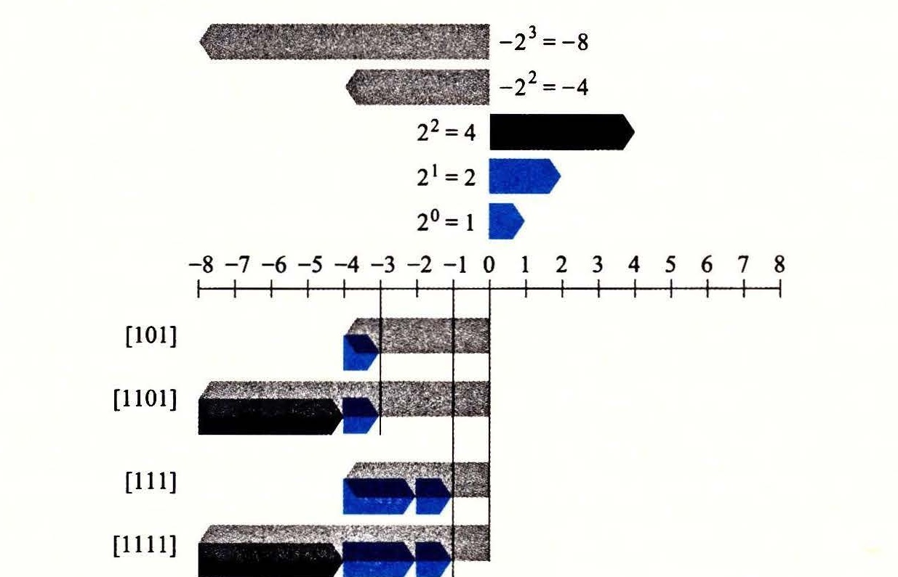
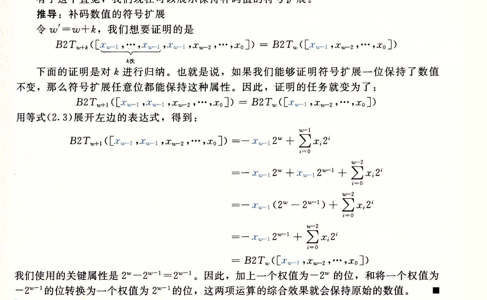

### 2.2.6 扩展一个数字的位表示

一个常见的运算是在不同字长的整数之间转换，同时又保持数值不变。当然，当目标数据类型太小以至于不能表示想要的值时，这根本就是不可能的。然而，从一个较小的数据类型转换到一个较大的类型，应该总是可能的。

要将一个无符号数转换为一个更大的数据类型，我们只要简单地在表示的开头添加 0。这种运算被称为零扩展（zero extension），表示原理如下：

**原理：无符号数的零扩展**

定义宽度为 w 的位向量 u = [u<sub>w-1</sub>, u<sub>w-2</sub>, ..., u<sub>0</sub>] 和宽度为 w' 的位向量 u' = [0, ..., 0, u<sub>w-1</sub>, u<sub>w-2</sub>, ..., u<sub>0</sub>]，其中 w' > w。则 B2U<sub>w</sub>(u) = B2U<sub>w'</sub>(u')。

按照公式（2.1），该原理可以看作是直接遵循了无符号数编码的定义。

要将一个补码数字转换为一个更大的数据类型，可以执行一个符号扩展（sign extension），在表示中添加最高有效位的值，表示为如下原理。我们用蓝色标出符号位 x<sub>w-1</sub> 来突出它在符号扩展中的角色。

**原理：补码数的符号扩展**

定义宽度为 w 的位向量 x = [x<sub>w-1</sub>, x<sub>w-2</sub>, ..., x<sub>0</sub>] 和宽度为 w' 的位向量 x' = [x<sub>w-1</sub>, ..., x<sub>w-1</sub>, x<sub>w-1</sub>, x<sub>w-2</sub>, ..., x<sub>0</sub>]，其中 w' > w。则 B2T<sub>w</sub>(x) = B2T<sub>w'</sub>(x')。

例如，考虑下面的代码：

```c
short sx = -12345;           /* -12345 */
unsigned short usx = sx;     /*  53191 */
int x = sx;                  /* -12345 */
unsigned ux = usx;           /*  53191 */

printf("sx  = %d:\t", sx);
show_bytes((byte_pointer) &sx, sizeof(short));
printf("usx = %u:\t", usx);
show_bytes((byte_pointer) &usx, sizeof(unsigned short));
printf("x   = %d:\t", x);
show_bytes((byte_pointer) &x, sizeof(int));
printf("ux  = %u:\t", ux);
show_bytes((byte_pointer) &ux, sizeof(unsigned));
```

在采用补码表示的 32 位大端法机器上运行这段代码时，打印出如下输出：

```text
sx  = -12345:     cf c7
usx = 53191:      cf c7
x   = -12345:     ff ff cf c7
ux  = 53191:      00 00 cf c7
```

我们看到，尽管 -12 345 的补码表示和 53 191 的无符号表示在 16 位字长时是相同的，但是在 32 位字长时却是不同的。特别地，-12 345 的十六进制表示为 0xFFFFCFC7，而 53 191 的十六进制表示为 0x0000CFC7。前者使用的是符号扩展，最开头加了 16 位，都是最高有效位 1，表示为十六进制就是 0xFFFF。后者开头使用 16 个 0 来扩展，表示为十六进制就是 0x0000。

图 2-20 给出了从字长 w = 3 到 w = 4 的符号扩展的结果。位向量 [101] 表示值 -4 + 1 = -3。对它应用符号扩展，得到位向量 [1101]，表示的值 -8 + 4 + 1 = -3。我们可以看到，对于 w = 4，最高两位的组合值是 -8 + 4 = -4，与 w = 3 时符号位的值相同。类似地，位向量 [111] 和 [1111] 都表示值 -1。



有了这个直觉，我们现在可以展示保持补码值的符号扩展。



**练习题 2.22** 通过应用等式（2.3），表明下面每个位向量都是 -5 的补码表示。

A. [1011]

B. [11011]

C. [111011]

可以看到第二个和第三个位向量可以通过对第一个位向量做符号扩展得到。

值得一提的是，从一个数据大小到另一个数据大小的转换，以及无符号和有符号数字之间的转换的相对顺序能够影响一个程序的行为。考虑下面的代码：

```c
short sx = -12345;  /* -12345 */
unsigned uy = sx;   /* Mystery! */

printf("uy = %u:\t", uy);
show_bytes((byte_pointer) &uy, sizeof(unsigned));
```

在一台大端法机器上，这部分代码产生如下输出：

```text
uy = 4294954951:    ff ff cf c7
```

这表明当把 short 转换成 unsigned 时，我们先要改变大小，之后再完成从有符号到无符号的转换。也就是说 (unsigned) sx 等价于 (unsigned) (int) sx，求值得到 4 294 954 951，而不等价于 (unsigned) (unsigned short) sx，后者求值得到 53 191。事实上，这个规则是 C 语言标准要求的。

**练习题 2.23** 考虑下面的 C 函数：

```c
int fun1(unsigned word) {
    return (int) ((word << 24) >> 24);
}

int fun2(unsigned word) {
    return ((int) word << 24) >> 24;
}
```

假设在一个采用补码运算的机器上以 32 位程序来执行这些函数。还假设有符号数值的右移是算术右移，而无符号数值的右移是逻辑右移。

A. 填写下表，说明这些函数对几个示例参数的结果。你会发现用十六进制表示来做会更方便，只要记住十六进制数字 8 到 F 的最高有效位等于 1。

| w | fun1(w) | fun2(w) |
| --- | --- | --- |
| 0x00000076 |  |  |
| 0x87654321 |  |  |
| 0x000000C9 |  |  |
| 0xEDCBA987 |  |  |

B. 用语言来描述这些函数执行的有用的计算。
