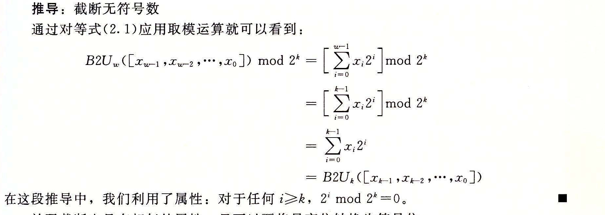
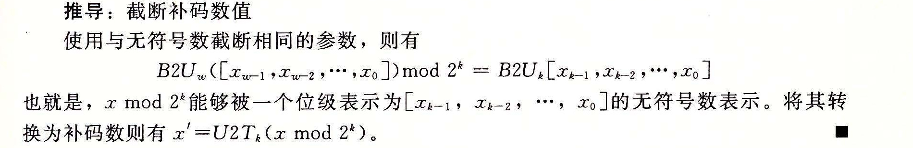

### 2.2.7 截断数字

假设我们不用额外的位来扩展一个数值，而是减少表示一个数字的位数。例如下面代码中这种情况：

```c
int x = 53191;
short sx = (short) x;  /* -12345 */
int y = sx;            /* -12345 */
```

当我们把 x 强制类型转换为 short 时，我们就将 32 位的 int 截断为了 16 位的 short int。就像前面所看到的，这个 16 位的位模式就是 -12 345 的补码表示。当我们把它强制类型转换回 int 时，符号扩展把高 16 位设置为 1，从而生成 -12 345 的 32 位补码表示。

当将一个 w 位的数 x = [x<sub>w-1</sub>, x<sub>w-2</sub>, ..., x<sub>0</sub>] 截断为一个 k 位数字时，我们会丢弃高 w-k 位，得到一个位向量 x' = [x<sub>k-1</sub>, x<sub>k-2</sub>, ..., x<sub>0</sub>]。截断一个数字可能会改变它的值，溢出的一种形式。对于一个无符号数，我们可以很容易得出其数值结果。

**原理：截断无符号数**

令 x 等于位向量 [x<sub>w-1</sub>, x<sub>w-2</sub>, ..., x<sub>0</sub>]，而 x' 是将其截断为 k 位的结果：[x<sub>k-1</sub>, x<sub>k-2</sub>, ..., x<sub>0</sub>]。令 x = B2U<sub>w</sub>(x)，x' = B2U<sub>k</sub>(x')。则 x' = x mod 2<sup>k</sup>。

该原理背后的直觉就是所有被截去的位其权重形式都为 2<sup>i</sup>，其中 i ≥ k，因此，每一个权在取模操作下结果都为零。可用如下推导表示：



补码截断也具有相似的属性，只不过要将最高位转换为符号位：

**原理：截断补码数值**

令 x 等于位向量 [x<sub>w-1</sub>, x<sub>w-2</sub>, ..., x<sub>0</sub>]，而 x' 是将其截断为 k 位的结果：[x<sub>k-1</sub>, x<sub>k-2</sub>, ..., x<sub>0</sub>]。令 x = B2U<sub>w</sub>(x)，x' = B2T<sub>k</sub>(x')。则 x' = U2T<sub>k</sub>(x mod 2<sup>k</sup>)。

在这个公式中，x mod 2<sup>k</sup> 将是 0 到 2<sup>k</sup>-1 之间的一个数。对其应用函数 U2T<sub>k</sub> 产生的效果是把最高有效位 x<sub>k-1</sub> 的权重从 2<sup>k-1</sup> 转变为 -2<sup>k-1</sup>。举例来看，将数值 x = 53 191 从 int 转换为 short。由于 2<sup>16</sup> = 65 536 ≥ x，我们有 x mod 2<sup>16</sup> = x。但是，当我们把这个数转换为 16 位的补码时，我们得到 x' = 53 191 - 65 536 = -12 345。



总而言之，无符号数的截断结果是公式（2.9），而补码数字的截断结果是公式（2.10）：

> B2U<sub>k</sub>([x<sub>k-1</sub>, x<sub>k-2</sub>, ..., x<sub>0</sub>]) = B2U<sub>w</sub>([x<sub>w-1</sub>, x<sub>w-2</sub>, ..., x<sub>0</sub>]) mod 2<sup>k</sup>　（2.9）
>
> B2T<sub>k</sub>([x<sub>k-1</sub>, x<sub>k-2</sub>, ..., x<sub>0</sub>]) = U2T<sub>k</sub>(B2U<sub>w</sub>([x<sub>w-1</sub>, x<sub>w-2</sub>, ..., x<sub>0</sub>]) mod 2<sup>k</sup>)　（2.10）

**练习题 2.24** 假设将一个 4 位数值（用十六进制数字 0~F 表示）截断到一个 3 位数值（用十六进制数字 0~7 表示）。填写下表，根据那些位模式的无符号和补码解释，说明这种截断对某些情况的结果。

| 十六进制：原始值 | 十六进制：截断值 | 无符号：原始值 | 无符号：截断值 | 补码：原始值 | 补码：截断值 |
| --- | --- | --- | --- | --- | --- |
| 0 | 0 | 0 |  | 0 |  |
| 2 | 2 | 2 |  | 2 |  |
| 9 | 1 | 9 |  | -7 |  |
| B | 3 | 11 |  | -5 |  |
| F | 7 | 15 |  | -1 |  |

解释如何将等式（2.9）和等式（2.10）应用到这些示例上。
