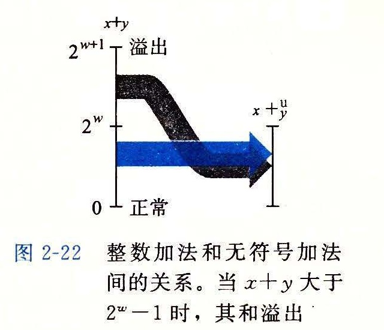
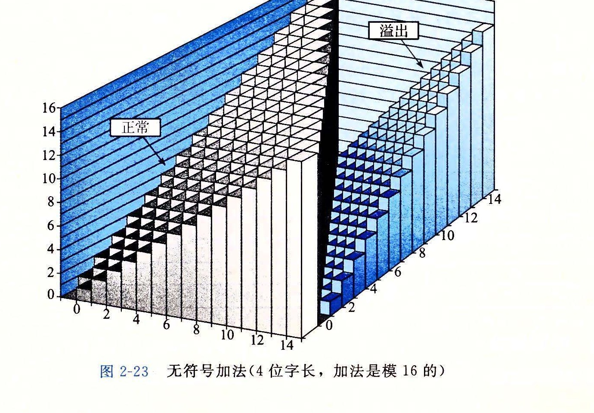

# 2.3.1 无符号加法

考虑两个非负整数 x 和 y，满足 0 ≤ x, y < 2<sup>w</sup>。每个数都能表示为 w 位无符号数字。然而，如果计算它们的和，我们就有一个可能的范围 0 ≤ x + y ≤ 2<sup>w+1</sup> - 2。表示这个和可能需要 w + 1 位。例如，图 2-21 展示了当 x 和 y 有 4 位表示时，函数 x + y 的坐标图。参数（显示在水平轴上）取值范围为 0~15，但是和的取值范围为 0~30。函数的形状是一个有坡度的平面（在两个维度上，函数都是线性的）。如果保持和为一个 w + 1 位的数字，并且把它加上另外一个数值，我们可能需要 w + 2 个位，以此类推。这种持续的“字长膨胀”意味着，要想完整地表示算术运算的结果，我们不能对字长做任何限制。一些编程语言，例如 Lisp，实际上就支持无限精度的运算，允许任意的（当然，要在机器的内存限制之内）整数运算。更常见的是，编程语言支持固定精度的运算，因此像“加法”和“乘法”这样的运算不同于它们在整数上的相应运算。


让我们为参数 x 和 y 定义运算 +<sup>u</sup><sub>w</sub>，其中 0 ≤ x, y < 2<sup>w</sup>，该操作是把整数和 x + y 截断为 w 位得到的结果，再把这个结果看做是一个无符号数。这可以被视为一种形式的模运算，对 x + y 的位级表示，简单丢弃任何权重大于 2<sup>w-1</sup> 的位就可以计算出和模 2<sup>w</sup>。比如，考虑一个 4 位数字表示，x = 9 和 y = 12 的位表示分别为 [1001] 和 [1100]。它们的和是 21，5 位的表示为 [10101]。但是如果丢弃最高位，我们就得到 [0101]，也就是说，十进制值的 5。这就和值 21 mod 16 = 5 一致。

我们可以将操作 +<sup>u</sup><sub>w</sub> 描述为：

**原理：无符号数加法**

对满足 0 ≤ x, y < 2<sup>w</sup> 的 x 和 y 有：

| x +<sup>u</sup><sub>w</sub> y | 条件 | 情况 |
| --- | --- | --- |
| x + y | x + y < 2<sup>w</sup> | 正常 |
| x + y - 2<sup>w</sup> | 2<sup>w</sup> ≤ x + y < 2<sup>w+1</sup> | 溢出 |

（2.11）

图 2-22 说明了公式 (2.11) 的这两种情况，左边的和 x + y 映射到右边的无符号 w 位的和 x +<sup>u</sup><sub>w</sub> y。正常情况下 x + y 的值保持不变，而溢出情况则是该和数减去 2<sup>w</sup> 的结果。



**推导：无符号数加法**

一般而言，我们可以看到，如果 x + y < 2<sup>w</sup>，和的 w + 1 位表示中的最高位会等于 0，因此丢弃它不会改变这个数值。另一方面，如果 2<sup>w</sup> ≤ x + y < 2<sup>w+1</sup>，和的 w + 1 位表示中的最高位会等于 1，因此丢弃它就相当于从和中减去了 2<sup>w</sup>。■

说一个算术运算溢出，是指完整的整数结果不能放到数据类型的字长限制中去。如等式 (2.11) 所示，当两个运算数的和为 2<sup>w</sup> 或者更大时，就发生了溢出。图 2-23 展示了字长 w = 4 的无符号加法函数的坐标图。这个和是按模 2<sup>4</sup> = 16 计算的。当 x + y < 16 时，没有溢出，并且 x +<sup>u</sup><sub>4</sub> y 就是 x + y。这对应于图中标记为“正常”的斜面。当 x + y ≥ 16 时，加法溢出，结果相当于从和中减去 16。这对应于图中标记为“溢出”的斜面。



当执行 C 程序时，不会将溢出作为错误而发信号。不过有的时候，我们可能希望判定是否发生了溢出。

**原理：检测无符号数加法中的溢出**

对在范围 0 ≤ x, y ≤ UMax<sub>w</sub> 中的 x 和 y，令 s = x +<sup>u</sup><sub>w</sub> y。则对计算 s，当且仅当 s < x（或者等价地 s < y）时，发生了溢出。

作为说明，在前面的示例中，我们看到 9 +<sup>u</sup><sub>4</sub> 12 = 5。由于 5 < 9，我们可以看出发生了溢出。

**推导：检测无符号数加法中的溢出**

通过观察发现 x + y ≥ x，因此如果 s 没有溢出，我们能够肯定 s ≥ x。另一方面，如果 s 确实溢出了，我们就有 s = x + y - 2<sup>w</sup>。假设 y < 2<sup>w</sup>，我们就有 y - 2<sup>w</sup> < 0，因此 s = x + (y - 2<sup>w</sup>) < x。■

**练习题 2.27**

写出一个具有如下原型的函数：

```c
/* Determine whether arguments can be added without overflow */
int uadd_ok(unsigned x, unsigned y);
```

如果参数 x 和 y 相加不会产生溢出，这个函数就返回 1。

模数加法形成了一种数学结构，称为阿贝尔群（Abelian group），这是以丹麦数学家 Niels Henrik Abel（1802~1829）的名字命名。也就是说，它是可交换的（这就是为什么叫 “abelian” 的地方）和可结合的。它有一个单位元 0，并且每个元素有一个加法逆元。让我们考虑 w 位的无符号数的集合，执行加法运算 +<sup>u</sup><sub>w</sub>。对于每个值 x，必然有某个值 -<sup>u</sup><sub>w</sub>x 满足 -<sup>u</sup><sub>w</sub>x +<sup>u</sup><sub>w</sub> x = 0。该加法的逆操作可以表述如下：

**原理：无符号数求反**

对满足 0 ≤ x < 2<sup>w</sup> 的任意 x，其 w 位的无符号逆元 -<sup>u</sup><sub>w</sub>x 由下式给出：

| -<sup>u</sup><sub>w</sub>x | 条件 |
| --- | --- |
| x | x = 0 |
| 2<sup>w</sup> - x | x > 0 |

（2.12）

该结果可以很容易地通过案例分析推导出来：

**推导：无符号数求反**

当 x = 0 时，加法逆元显然是 0。对于 x > 0，考虑值 2<sup>w</sup> - x。我们观察到这个数字在 0 < 2<sup>w</sup> - x < 2<sup>w</sup> 范围之内，并且 (x + 2<sup>w</sup> - x) mod 2<sup>w</sup> = 2<sup>w</sup> mod 2<sup>w</sup> = 0。因此，它就是 x 在 +<sup>u</sup><sub>w</sub> 下的逆元。■

**练习题 2.28**

我们能用一个十六进制数字来表示长度 w = 4 的位模式。对于这些数字的无符号解释，使用等式 (2.12) 填写下表，给出所示数字的无符号加法逆元的位表示（用十六进制形式）。

| x（十六进制） | x（十进制） | -<sup>u</sup><sub>4</sub>x（十进制） | -<sup>u</sup><sub>4</sub>x（十六进制） |
| --- | --- | --- | --- |
| 0 |  |  |  |
| 5 |  |  |  |
| 8 |  |  |  |
| D |  |  |  |
| F |  |  |  |
