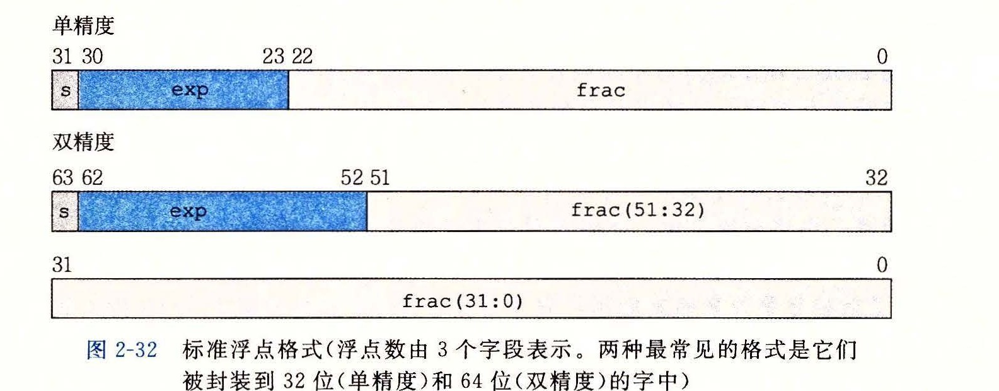
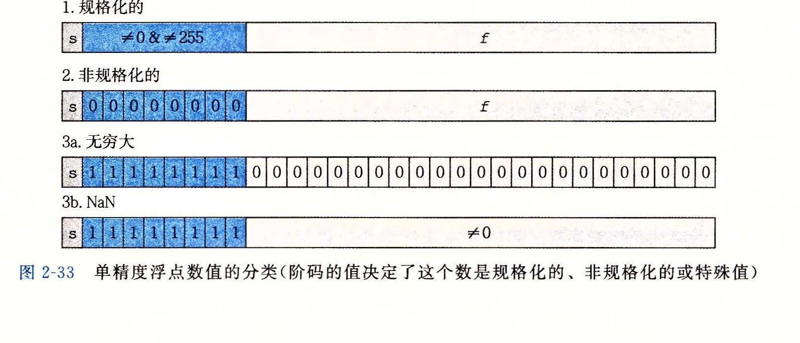

# 2.4.2 IEEE 浮点表示

前一节中谈到的定点表示法不能很有效地表示非常大的数字。例如，表达式 5 × 2100 是用 101 后面跟随 100 个零的位模式来表示。相反，我们希望通过给定 x 和 y 的值，来表示形如 x × 2y 的数。

IEEE 浮点标准用 V = (-1)s × M × 2E 的形式来表示一个数：

* 符号（sign）s 决定这个数是负数（s = 1）还是正数（s = 0），而对于数值 0 的符号位解释作为特殊情况处理。
* 尾数（significand）M 是一个二进制小数，它的范围是 1~2 - ε，或者是 0~1 - ε。
* 阶码（exponent）E 的作用是对浮点数加权，这个权重是 2 的 E 次幂（可能是负数）。

将浮点数的位表示划分为 3 个字段，分别对这些值进行编码：

* 一个单独的符号位 s 直接编码符号 s。
* k 位的阶码字段 exp = ek-1...e1e0 编码阶码 E。
* n 位小数字段 frac = fn-1...f1f0 编码尾数 M，但是编码出来的值也依赖于阶码字段的值是否等于 0。

图 2-32 给出了将这 3 个字段装进字中两种最常见的格式。在单精度浮点格式（C 语言中的 `float`）中，s、exp 和 frac 字段分别为 1 位、k = 8 位和 n = 23 位，得到一个 32 位的表示。在双精度浮点格式（C 语言中的 `double`）中，s、exp 和 frac 字段分别为 1 位、k = 11 位和 n = 52 位，得到一个 64 位的表示。

给定位表示，根据 exp 的值，被编码的值可以分成 3 种不同的情况（最后一种情况有两个变种）。图 2-33 说明了对单精度格式的情况。

**情况 1：规格化的值**

这是最普遍的情况。当 exp 的位模式既不全为 0（数值 0），也不全为 1（单精度数值为 255，双精度数值为 2047）时，都属于这类情况。在这种情况中，阶码字段被解释为以偏置（biased）形式表示的有符号整数。也就是说，阶码的值是 E = e - Bias，其中 e 是无符号数，其位表示为 ek-1...e1e0，而 Bias 是一个等于 2k-1 - 1（单精度是 127，双精度是 1023）的偏置值。由此产生指数的取值范围，对于单精度是 -126~+127，而对于双精度是 -1022~+1023。

小数字段 frac 被解释为描述小数值 f，其中 0 ≤ f < 1，其二进制表示为 0.fn-1...f1f0，也就是二进制小数点在最高有效位的左边。尾数定义为 M = 1 + f。有时，这种方式也叫做隐含的以 1 开头的（implied leading 1）表示，因为我们可以把 M 看成一个二进制表达式为 1.fn-1fn-2...f0 的数字。既然我们总是能够调整阶码 E，使得尾数 M 在范围 1 ≤ M < 2 之中（假设没有溢出），那么这种表示方法是一种轻松获得一个额外精度位的技巧。既然第一位总是等于 1，那么我们就不需要显式地表示它。

**情况 2：非规格化的值**

当阶码域为全 0 时，所表示的数是非规格化形式。在这种情况下，阶码值是 E = 1 - Bias，而尾数的值是 M = f，也就是小数字段的值，不包含隐含的开头的 1。

> **旁注：对于非规格化值为什么要这样设置偏置值**
>
> 使阶码值为 1 - Bias 而不是简单的 -Bias 似乎是违反直觉的。我们将很快看到，这种方式提供了一种从非规格化值平滑转换到规格化值的方法。

非规格化数有两个用途。首先，它们提供了一种表示数值 0 的方法，因为使用规格化数，我们必须总是使 M ≥ 1，因此我们就不能表示 0。实际上，+0.0 的浮点表示的位模式为全 0：符号位是 0，阶码字段全为 0（表明是一个非规格化值），而小数域也全为 0，这就得到 M = f = 0。令人奇怪的是，当符号位为 1，而其他域全为 0 时，我们得到值 -0.0。根据 IEEE 的浮点格式，值 +0.0 和 -0.0 在某些方面被认为是不同的，而在其他方面是相同的。

非规格化数的另外一个功能是表示那些非常接近于 0.0 的数。它们提供了一种属性，称为逐渐溢出（gradual underflow），其中，可能的数值分布均匀地接近于 0.0。

**情况 3：特殊值**

最后一类数值是当阶码全为 1 的时候出现的。当小数域全为 0 时，得到的值表示无穷，当 s = 0 时是 +∞，或者当 s = 1 时是 -∞。当我们把两个非常大的数相乘，或者除以零时，无穷能够表示溢出的结果。当小数域为非零时，结果值被称为 NaN，即“不是一个数（Not a Number）”的缩写。一些运算的结果不能是实数或无穷，就会返回这样的 NaN 值，比如当计算 √-1 或 ∞ - ∞ 时。在某些应用中，表示未初始化的数据时，它们也很有用处。
