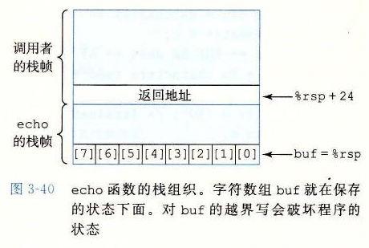

# 3.10.3 内存越界引用和缓冲区溢出

我们已经看到，C 对于数组引用不进行任何边界检查，而且局部变量和状态信息（例如保存的寄存器值和返回地址）都存放在栈中。这两种情况结合到一起就能导致严重的程序错误，对越界的数组元素的写操作会破坏存储在栈中的状态信息。当程序使用这个被破坏的状态，试图重新加载寄存器或执行 `ret` 指令时，就会出现很严重的错误。

一种特别常见的状态破坏称为缓冲区溢出（buffer overflow）。通常，在栈中分配某个字符数组来保存一个字符串，但是字符串的长度超出了为数组分配的空间。下面这个程序示例就说明了这个问题：

```c
/* Implementation of library function gets() */
char *gets(char *s)
{
    int c;
    char *dest = s;
    while ((c = getchar()) != '\n' && c != EOF)
        *dest++ = c;
    if (c == EOF && dest == s)
        /* No characters read */
        return NULL;
    *dest++ = '\0'; /* Terminate string */
    return s;
}

/* Read input line and write it back */
void echo()
{
    char buf[8]; /* Way too small! */
    gets(buf);
    puts(buf);
}
```

前面的代码给出了库函数 `gets` 的一个实现，用来说明这个函数的严重问题。它从标准输入读入一行，在遇到一个回车换行字符或某个错误情况时停止。它将这个字符串复制到参数 `s` 指明的位置，并在字符串结尾加上 null 字符。在函数 `echo` 中，我们使用了 `gets`，这个函数只是简单地从标准输入中读入一行，再把它回送到标准输出。

`gets` 的问题是它没有办法确定是否为保存整个字符串分配了足够的空间。在 `echo` 示例中，我们故意将缓冲区设得非常小——只有 8 个字节长。任何长度超过 7 个字符的字符串都会导致写越界。

检查 GCC 为 `echo` 产生的汇编代码，看看栈是如何组织的：

```text
void echo()

1  echo:
2      subq $24, %rsp       Allocate 24 bytes on stack
3      movq %rsp, %rdi      Compute buf as %rsp
4      call gets            Call gets
5      movq %rsp, %rdi      Compute buf as %rsp
6      call puts            Call puts
7      addq $24, %rsp       Deallocate stack space
8      ret                  Return
```

图 3-40 画出了 `echo` 执行时栈的组织。该程序把栈指针减去了 24（第 2 行），在栈上分配了 24 个字节。字符数组 `buf` 位于栈顶，可以看到，`%rsp` 被复制到 `%rdi` 作为调用 `gets` 和 `puts` 的参数。这个调用的参数和存储的返回指针之间的 16 字节是未被使用的。只要用户输入不超过 7 个字符，`gets` 返回的字符串（包括结尾的 null）就能够放进为 `buf` 分配的空间里。不过，长一些的字符串就会导致 `gets` 覆盖栈上存储的某些信息。随着字符串变长，下面的信息会被破坏：

| 输入的字符数量 | 附加的被破坏的状态 |
| --- | --- |
| 0～7 | 无 |
| 9～23 | 未被使用的栈空间 |
| 24～31 | 返回地址 |
| 32+ | `caller` 中保存的状态 |

字符串到 23 个字符之前都没有严重的后果，但是超过以后，返回指针的值以及更多可能的保存状态会被破坏。如果存储的返回地址的值被破坏了，那么 `ret` 指令（第 8 行）会导致程序跳转到一个完全意想不到的位置。如果只看 C 代码，根本就不可能看出会有上面这些行为。只有通过研究机器代码级别的程序才能理解像 `gets` 这样的函数进行的内存越界写的影响。



我们的 `echo` 代码很简单，但是有点太随意了。更好一点的版本是使用 `fgets` 函数，它包括一个参数，限制待读入的最大字节数。家庭作业 3.71 要求你写出一个能处理任意长度输入字符串的 `echo` 函数。通常，使用 `gets` 或其他任何能导致存储溢出的函数，都是不好的编程习惯。不幸的是，很多常用的库函数，包括 `strcpy`、`strcat` 和 `sprintf`，都有一个属性——不需要告诉它们目标缓冲区的大小，就产生一个字节序列 [97]。这样的情况就会导致缓冲区溢出漏洞。

**练习题 3.46** 图 3-41 是一个函数的（不太好的）实现，这个函数从标准输入读入一行，将字符串复制到新分配的存储中，并返回一个指向结果的指针。

考虑下面这样的场景。调用过程 `get_line`，返回地址等于 `0x400076`，寄存器 `%rbx` 等于 `0x0123456789ABCDEF`。输入的字符串为“0123456789012345678901234”。程序会因为段错误（segmentation fault）而中止。运行 GDB，确定错误是在执行 `get_line` 的 `ret` 指令时发生的。

A. 填写下图，尽可能多地说明在执行完反汇编代码中第 3 行指令后栈的相关信息。在右边标注出存储在栈中的数字含意（例如“返回地址”），在方框中写出它们的十六进制值（如果知道的话）。每个方框都代表 8 个字节。指出 `%rsp` 的位置。记住，字符 0～9 的 ASCII 代码是 `0x30`～`0x39`。

| 栈内容（每行 8 字节） | 含义或 `%rsp` 位置 |
| --- | --- |
| `00 00 00 00 00 40 00 76` | 返回地址 |
|  |  |
|  |  |
|  |  |
|  |  |

B. 修改你的图，展现调用 `gets` 的影响（第 5 行）。

C. 程序应该试图返回到什么地址？

D. 当 `get_line` 返回时，哪个（些）寄存器的值被破坏了？

E. 除了可能会缓冲区溢出以外，`get_line` 的代码还有哪两个错误？

```c
/* This is very low-quality code.
   It is intended to illustrate bad programming practices.
   See Practice Problem 3.46. */
char *get_line()
{
    char buf[4];
    char *result;
    gets(buf);
    result = malloc(strlen(buf));
    strcpy(result, buf);
    return result;
}
```

*a）C 代码*

```text
char *get_line()

1  0000000000400720 <get_line>:
2    400720: 53                       push %rbx
3    400721: 48 83 ec 10              sub $0x10,%rsp
         Diagram stack at this point
4    400725: 48 89 e7                 mov %rsp,%rdi
5    400728: e8 73 ff ff ff           callq 4006a0 <gets>
         Modify diagram to show stack contents at this point
```

*b）对 `gets` 调用的反汇编*

*图 3-41　练习题 3.46 的 C 和反汇编代码*

缓冲区溢出的一个更加致命的使用就是让程序执行它本来不愿意执行的函数。这是一种最常见的通过计算机网络攻击系统安全的方法。通常，输入给程序一个字符串，这个字符串包含一些可执行代码的字节编码，称为攻击代码（exploit code），另外，还有一些字节会用一个指向攻击代码的指针覆盖返回地址。那么，执行 `ret` 指令的效果就是跳转到攻击代码。

在一种攻击形式中，攻击代码会使用系统调用启动一个 shell 程序，给攻击者提供一组操作系统函数。在另一种攻击形式中，攻击代码会执行一些未授权的任务，修复对栈的破坏，然后第二次执行 `ret` 指令，（表面上）正常返回到调用者。

让我们来看一个例子，在 1988 年 11 月，著名的 Internet 蠕虫病毒通过 Internet 以四种不同的方法获取对许多计算机的访问。一种是对 finger 守护进程 `fingerd` 的缓冲区溢出攻击，`fingerd` 服务 FINGER 命令请求。通过以一个适当的字符串调用 FINGER，蠕虫可以使远程的守护进程缓冲区溢出并执行一段代码，让蠕虫访问远程系统。一旦蠕虫获得了对系统的访问，它就能自我复制，几乎完全地消耗掉机器上所有的计算资源。结果，在安全专家制定出如何消除这种蠕虫的方法之前，成百上千的机器实际上都瘫痪了。这种蠕虫的始作俑者最后被抓住并被起诉。时至今日，人们还是不断地发现遭受缓冲区溢出攻击的系统安全漏洞，这更加突显了仔细编写程序的必要性。任何到外部环境的接口都应该是“防弹的”，这样，外部代理的行为才不会导致系统出现错误。

> **旁注：蠕虫和病毒**
>
> 蠕虫和病毒都试图在计算机中传播它们自己的代码段。正如 Spafford [105] 所述，蠕虫（worm）可以自己运行，并且能够将自己的等效副本传播到其他机器。病毒（virus）能将自己添加到包括操作系统在内的其他程序中，但它不能独立运行。在一些大众媒体中，“病毒”用来指各种在系统间传播攻击代码的策略，所以你可能会听到人们把本来应该叫做“蠕虫”的东西称为“病毒”。
