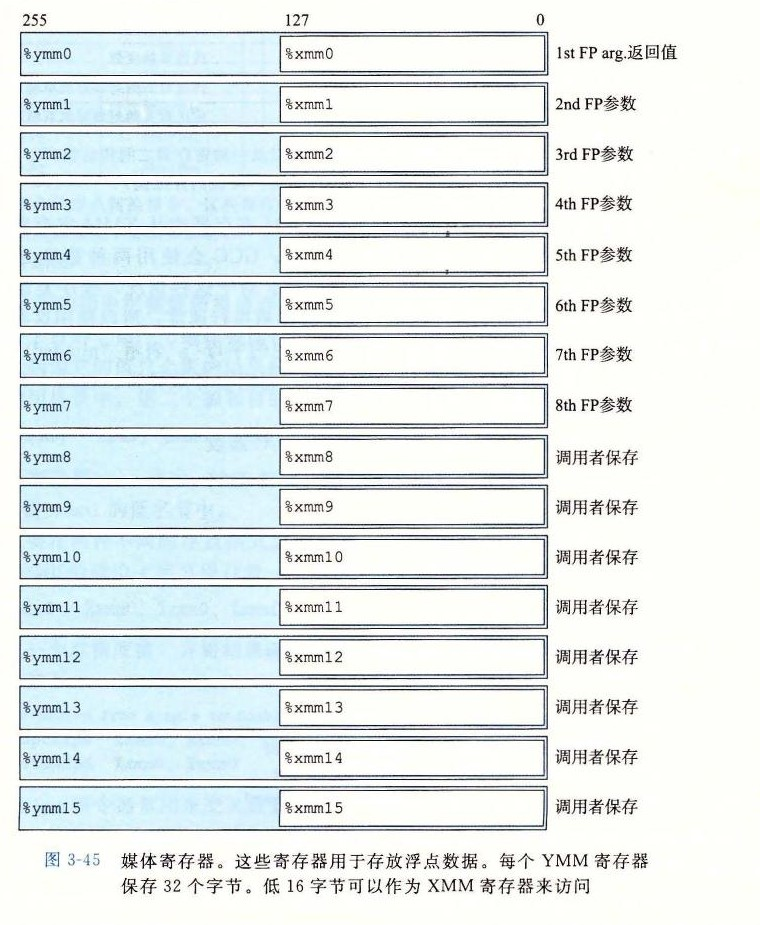

# 3.11 浮点代码

处理器的浮点体系结构包括多个方面，会影响对浮点数据操作的程序如何被映射到机器上，包括：

* 如何存储和访问浮点数值。通常是通过某种寄存器方式来完成。
* 对浮点数据操作的指令。
* 向函数传递浮点数参数和从函数返回浮点数结果的规则。
* 函数调用过程中保存寄存器的规则——例如，一些寄存器被指定为调用者保存，而其他的被指定为被调用者保存。

简要回顾历史会对理解 x86-64 的浮点体系结构有所帮助。1997 年出现了 Pentium/MMX，Intel 和 AMD 都引入了持续数代的媒体（media）指令，支持图形和图像处理。这些指令本意是允许多个操作以并行模式执行，称为单指令多数据或 SIMD（读作 sim-dee）。在这种模式中，对多个不同的数据并行执行同一个操作。近年来，这些扩展有了长足的发展。名字经过了一系列大的修改，从 MMX 到 SSE（Streaming SIMD Extension，流式 SIMD 扩展），以及最新的 AVX（Advanced Vector Extension，高级向量扩展）。每一代中，都有一些不同的版本。每个扩展都是管理寄存器组中的数据，这些寄存器组在 MMX 中称为“MM”寄存器，SSE 中称为“XMM”寄存器，而在 AVX 中称为“YMM”寄存器；MM 寄存器是 64 位的，XMM 是 128 位的，而 YMM 是 256 位的。所以，每个 YMM 寄存器可以存放 8 个 32 位值，或 4 个 64 位值，这些值可以是整数，也可以是浮点数。

2000 年 Pentium 4 中引入了 SSE2，媒体指令开始包括那些对标量浮点数据进行操作的指令，使用 XMM 或 YMM 寄存器的低 32 位或 64 位中的单个值。这个标量模式提供了一组寄存器和指令，它们更类似于其他处理器支持浮点数的方式。所有能够执行 x86-64 代码的处理器都支持 SSE2 或更高的版本，因此 x86-64 浮点数是基于 SSE 或 AVX 的，包括传递过程参数和返回值的规则 [77]。

我们的讲述基于 AVX2，即 AVX 的第二个版本，它是在 2013 年 Core i7 Haswell 处理器中引入的。当给定命令行参数 `-mavx2` 时，GCC 会生成 AVX2 代码。基于不同版本的 SSE 以及第一个版本的 AVX 的代码从概念上来说是类似的，不过指令名和格式有所不同。我们只介绍用 GCC 编译浮点程序时会出现的那些指令。其中大部分是标量 AVX 指令，我们也会说明对整个数据向量进行操作的指令出现的情况。后文中的网络旁注 OPT: SIMD 更全面地说明了如何利用 SSE 和 AVX 的 SIMD 功能。读者可能希望参考 AMD 和 Intel 对每条指令的说明文档 [4, 51]。和整数操作一样，注意我们表述中使用的 ATT 格式不同于这些文档中使用的 Intel 格式。特别地，这两种版本中列出指令操作数的顺序是不同的。

如图 3-45 所示，AVX 浮点体系结构允许数据存储在 16 个 YMM 寄存器中，它们的名字为 `%ymm0`～`%ymm15`。每个 YMM 寄存器都是 256 位（32 字节）。当对标量数据操作时，这些寄存器只保存浮点数，而且只使用低 32 位（对于 `float`）或 64 位（对于 `double`）。汇编代码用寄存器的 SSE XMM 寄存器名字 `%xmm0`～`%xmm15` 来引用它们，每个 XMM 寄存器都是对应的 YMM 寄存器的低 128 位（16 字节）。

