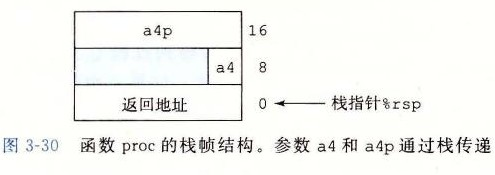

# 3.7.3 数据传送

当调用一个过程时，除了要把控制传递给它并在过程返回时再传递回来之外，过程调用还可能包括把数据作为参数传递，而从过程返回还有可能包括返回一个值。x86-64 中，大部分过程间的数据传送是通过寄存器实现的。例如，我们已经看到无数的函数示例，参数在寄存器 `%rdi`、`%rsi` 和其他寄存器中传递。当过程 P 调用过程 Q 时，P 的代码必须首先把参数复制到适当的寄存器中。类似地，当 Q 返回到 P 时，P 的代码可以访问寄存器 `%rax` 中的返回值。在本节中，我们更详细地探讨这些规则。

x86-64 中，可以通过寄存器最多传递 6 个整型（例如整数和指针）参数。寄存器的使用是有特殊顺序的，寄存器使用的名字取决于要传递的数据类型的大小，如图 3-28 所示。会根据参数在参数列表中的顺序为它们分配寄存器。可以通过 64 位寄存器适当的部分访问小于 64 位的参数。例如，如果第一个参数是 32 位的，那么可以用 `%edi` 来访问它。

| 操作数大小（位） | 参数 1 | 参数 2 | 参数 3 | 参数 4 | 参数 5 | 参数 6 |
| --- | --- | --- | --- | --- | --- | --- |
| 64 | `%rdi` | `%rsi` | `%rdx` | `%rcx` | `%r8` | `%r9` |
| 32 | `%edi` | `%esi` | `%edx` | `%ecx` | `%r8d` | `%r9d` |
| 16 | `%di` | `%si` | `%dx` | `%cx` | `%r8w` | `%r9w` |
| 8 | `%dil` | `%sil` | `%dl` | `%cl` | `%r8b` | `%r9b` |

*图 3-28　传递函数参数的寄存器。寄存器是按照特殊顺序来使用的，而使用的名字是根据参数的大小来确定的*

如果一个函数有大于 6 个整型参数，超出 6 个的部分就要通过栈来传递。假设过程 P 调用过程 Q，有 n 个整型参数，且 n > 6。那么 P 的代码分配的栈帧必须要能容纳 7 到 n 号参数的存储空间，如图 3-25 所示。要把参数 1～6 复制到对应的寄存器，把参数 7～n 放到栈上，而参数 7 位于栈顶。通过栈传递参数时，所有的数据大小都向 8 的倍数对齐。参数到位以后，程序就可以执行 `call` 指令将控制转移到过程 Q 了。过程 Q 可以通过寄存器访问参数，有必要的话也可以通过栈访问。相应地，如果 Q 也调用了某个有超过 6 个参数的函数，它也需要在自己的栈帧中为超出 6 个部分的参数分配空间，如图 3-25 中标号为“参数构造区”的区域所示。

作为参数传递的示例，考虑图 3-29a 所示的 C 函数 `proc`。这个函数有 8 个参数，包括字节数不同的整数（8、4、2 和 1）和不同类型的指针，每个都是 8 字节的。

```c
void proc(long a1, long *a1p,
          int a2, int *a2p,
          short a3, short *a3p,
          char a4, char *a4p)
{
    *a1p += a1;
    *a2p += a2;
    *a3p += a3;
    *a4p += a4;
}
```

*a) C 代码*

```text
void proc(a1, a1p, a2, a2p, a3, a3p, a4, a4p)
Arguments passed as follows:
    a1  in %rdi       (64 bits)
    a1p in %rsi       (64 bits)
    a2  in %edx       (32 bits)
    a2p in %rcx       (64 bits)
    a3  in %r8w       (16 bits)
    a3p in %r9        (64 bits)
    a4  at %rsp+8     ( 8 bits)
    a4p at %rsp+16    (64 bits)

1  proc:
2      movq 16(%rsp), %rax     Fetch a4p       (64 bits)
3      addq %rdi, (%rsi)       *a1p += a1      (64 bits)
4      addl %edx, (%rcx)       *a2p += a2      (32 bits)
5      addw %r8w, (%r9)        *a3p += a3      (16 bits)
6      movl 8(%rsp), %edx      Fetch a4        ( 8 bits)
7      addb %dl, (%rax)        *a4p += a4      ( 8 bits)
8      ret                     Return
```

*b) 生成的汇编代码*

*图 3-29　有多个不同类型参数的函数示例。参数 1～6 通过寄存器传递，而参数 7～8 通过栈传递*

图 3-29b 中给出 `proc` 生成的汇编代码。前面 6 个参数通过寄存器传递，后面 2 个通过栈传递，就像图 3-30 中画出来的那样。可以看到，作为过程调用的一部分，返回地址被压入栈中。因而这两个参数位于相对于栈指针距离为 8 和 16 的位置。在这段代码中，我们可以看到根据操作数的大小，使用了 ADD 指令的不同版本：`a1`（`long`）使用 `addq`，`a2`（`int`）使用 `addl`，`a3`（`short`）使用 `addw`，而 `a4`（`char`）使用 `addb`。请注意第 6 行的 `movl` 指令从内存读入 4 字节，而后面的 `addb` 指令只使用其中的低位一字节。



**练习题 3.33** C 函数 `procprob` 有 4 个参数 `u`、`a`、`v` 和 `b`，每个参数要么是一个有符号数，要么是一个指向有符号数的指针，这里的数大小不同。该函数的函数体如下：

```c
*u += a;
*v += b;
return sizeof(a) + sizeof(b);
```

编译得到如下 x86-64 代码：

```text
1  procprob:
2      movslq %edi, %rdi
3      addq %rdi, (%rdx)
4      addb %sil, (%rcx)
5      movl $6, %eax
6      ret
```

确定 4 个参数的合法顺序和类型。有两种正确答案。
