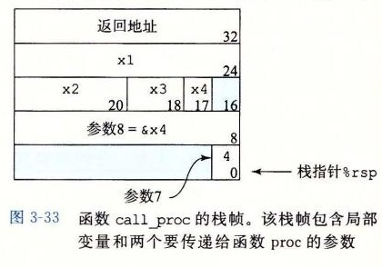

# 3.7.4 栈上的局部存储

到目前为止我们看到的大多数过程示例都不需要超出寄存器大小的本地存储区域。不过有些时候，局部数据必须存放在内存中，常见的情况包括：

- 寄存器不足够存放所有的本地数据。
- 对一个局部变量使用地址运算符“`&`”，因此必须能够为它产生一个地址。
- 某些局部变量是数组或结构，因此必须能够通过数组或结构引用被访问到。在描述数组和结构分配时，我们会讨论这个问题。

一般来说，过程通过减小栈指针在栈上分配空间。分配的结果作为栈帧的一部分，标号为“局部变量”，如图 3-25 所示。

来看一个处理地址运算符的例子，图 3-31a 中给出的两个函数。函数 `swap_add` 交换指针 `xp` 和 `yp` 指向的两个值，并返回这两个值的和。函数 `caller` 创建到局部变量 `arg1` 和 `arg2` 的指针，把它们传递给 `swap_add`。图 3-31b 展示了 `caller` 是如何用栈帧来实现这些局部变量的。`caller` 的代码开始的时候把栈指针减掉了 16；实际上这就是在栈上分配了 16 个字节。S 表示栈指针的值，可以看到这段代码计算 `&arg2` 为 S+8（第 5 行），而 `&arg1` 为 S。因此可以推断局部变量 `arg1` 和 `arg2` 存放在栈帧中相对于栈指针偏移量为 0 和 8 的地方。当对 `swap_add` 的调用完成后，`caller` 的代码会从栈上取出这两个值（第 8～9 行），计算它们的差，再乘以 `swap_add` 在寄存器 `%rax` 中返回的值（第 10 行）。最后，该函数把栈指针加 16，释放栈帧（第 11 行）。通过这个例子可以看到，运行时栈提供了一种简单的、在需要时分配、函数完成时释放局部存储的机制。

如图 3-32 所示，函数 `call_proc` 是一个更复杂的例子，说明 x86-64 栈行为的一些特性。尽管这个例子有点儿长，但还是值得仔细研究。它给出了一个必须在栈上分配局部变量存储空间的函数，同时还要向有 8 个参数的函数 `proc` 传递值（图 3-29）。该函数创建一个栈帧，如图 3-33 所示。

```c
long swap_add(long *xp, long *yp)
{
    long x = *xp;
    long y = *yp;
    *xp = y;
    *yp = x;
    return x + y;
}

long caller()
{
    long arg1 = 534;
    long arg2 = 1057;
    long sum = swap_add(&arg1, &arg2);
    long diff = arg1 - arg2;
    return sum * diff;
}
```

*a) `swap_add` 和调用函数的代码*

```text
long caller()
1  caller:
2      subq $16, %rsp              Allocate 16 bytes for stack frame
3      movq $534, (%rsp)           Store 534 in arg1
4      movq $1057, 8(%rsp)         Store 1057 in arg2
5      leaq 8(%rsp), %rsi          Compute &arg2 as second argument
6      movq %rsp, %rdi             Compute &arg1 as first argument
7      call swap_add               Call swap_add(&arg1, &arg2)
8      movq (%rsp), %rdx           Get arg1
9      subq 8(%rsp), %rdx          Compute diff = arg1 - arg2
10     imulq %rdx, %rax            Compute sum * diff
11     addq $16, %rsp              Deallocate stack frame
12     ret                         Return
```

*b) 调用函数生成的汇编代码*

*图 3-31　过程定义和调用的示例。由于会使用地址运算符，所以调用代码必须分配一个栈帧*

```c
long call_proc()
{
    long x1 = 1; int x2 = 2;
    short x3 = 3; char x4 = 4;
    proc(x1, &x1, x2, &x2, x3, &x3, x4, &x4);
    return (x1+x2)*(x3-x4);
}
```

*a) `swap_add` 和调用函数的代码*

*图 3-32　调用在图 3-29 中定义的函数 `proc` 的代码示例。该代码创建了一个栈帧*

```text
long call_proc()
1  call_proc:
   Set up arguments to proc
2      subq $32, %rsp          Allocate 32-byte stack frame
3      movq $1, 24(%rsp)       Store 1 in &x1
4      movl $2, 20(%rsp)       Store 2 in &x2
5      movw $3, 18(%rsp)       Store 3 in &x3
6      movb $4, 17(%rsp)       Store 4 in &x4
7      leaq 17(%rsp), %rax     Create &x4
8      movq %rax, 8(%rsp)      Store &x4 as argument 8
9      movl $4, (%rsp)         Store 4 as argument 7
10     leaq 18(%rsp), %r9      Pass &x3 as argument 6
11     movl $3, %r8d           Pass 3 as argument 5
12     leaq 20(%rsp), %rcx     Pass &x2 as argument 4
13     movl $2, %edx           Pass 2 as argument 3
14     leaq 24(%rsp), %rsi     Pass &x1 as argument 2
15     movl $1, %edi           Pass 1 as argument 1
   Call proc
16     call proc
   Retrieve changes to memory
17     movslq 20(%rsp), %rdx   Get x2 and convert to long
18     addq 24(%rsp), %rdx     Compute x1+x2
19     movswl 18(%rsp), %eax   Get x3 and convert to int
20     movsbl 17(%rsp), %ecx   Get x4 and convert to int
21     subl %ecx, %eax         Compute x3-x4
22     cltq                    Convert to long
23     imulq %rdx, %rax        Compute (x1+x2) * (x3-x4)
24     addq $32, %rsp          Deallocate stack frame
25     ret                     Return
```

*b) 调用函数生成的汇编代码*

*图 3-32（续）*

看看 `call_proc` 的汇编代码（图 3-32b），可以看到代码中一大部分（第 2～15 行）是为调用 `proc` 做准备。其中包括为局部变量和函数参数建立栈帧，将函数参数加载至寄存器。如图 3-33 所示，在栈上分配局部变量 `x1`～`x4`，它们具有不同的大小：24～31（`x1`），20～23（`x2`），18～19（`x3`）和 17（`x4`）。用 `leaq` 指令生成到这些位置的指针（第 7、10、12 和 14 行）。参数 7（值为 4）和 8（指向 `x4` 的位置的指针）存放在栈中相对于栈指针偏移量为 0 和 8 的地方。

当调用过程 `proc` 时，程序会开始执行图 3-29b 中的代码。如图 3-30 所示，参数 7 和 8 现在位于相对于栈指针偏移量为 8 和 16 的地方，因为返回地址这时已经被压入栈中了。

当程序返回 `call_proc` 时，代码会取出 4 个局部变量（第 17～20 行），并执行最终的计算。在程序结束前，把栈指针加 32，释放这个栈帧。


