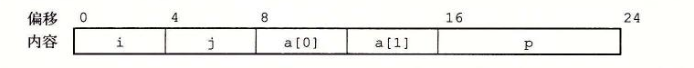

# 3.9.1 结构

C 语言的 `struct` 声明创建一个数据类型，将可能不同类型的对象聚合到一个对象中。用名字来引用结构的各个组成部分。类似于数组的实现，结构的所有组成部分都存放在内存中一段连续的区域内，而指向结构的指针就是结构第一个字节的地址。编译器维护关于每个结构类型的信息，指示每个字段（field）的字节偏移。它以这些偏移作为内存引用指令中的位移，从而产生对结构元素的引用。

> **给 C 语言初学者　将一个对象表示为 `struct`**
>
> C 语言提供的 `struct` 数据类型的构造函数（constructor）与 C++ 和 Java 的对象最为接近。它允许程序员在一个数据结构中保存关于某个实体的信息，并用名字来引用这些信息。
>
> 例如，一个图形程序可能要用结构来表示一个长方形：
>
> ```c
> struct rect {
>     long llx;             /* X coordinate of lower-left corner */
>     long lly;             /* Y coordinate of lower-left corner */
>     unsigned long width;  /* Width (in pixels)                 */
>     unsigned long height; /* Height (in pixels)                */
>     unsigned color;       /* Coding of color                   */
> };
> ```
>
> 可以声明一个 `struct rect` 类型的变量 r，并将它的字段值设置如下：
>
> ```c
> struct rect r;
> r.llx = r.lly = 0;
> r.color = 0xFF00FF;
> r.width = 10;
> r.height = 20;
> ```
>
> 这里表达式 `r.llx` 就会选择结构 r 的 `llx` 字段。
>
> 另外，我们可以在一条语句中既声明变量又初始化它的字段：
>
> ```c
> struct rect r = { 0, 0, 10, 20, 0xFF00FF };
> ```
>
> 将指向结构的指针从一个地方传递到另一个地方，而不是复制它们，这是很常见的。例如，下面的函数计算长方形的面积，这里，传递给函数的就是一个指向长方形 `struct` 的指针：
>
> ```c
> long area(struct rect *rp) {
>     return (*rp).width * (*rp).height;
> }
> ```
>
> 表达式 `(*rp).width` 间接引用了这个指针，并且选取所得结构的 `width` 字段。这里必须要用括号，因为编译器会将表达式 `*rp.width` 解释为 `*(rp.width)`，而这是非法的。间接引用和字段选取结合起来使用非常常见，以至于 C 语言提供了一种替代的表示法 `->`。即 `rp->width` 等价于表达式 `(*rp).width`。例如，我们可以写一个函数，它将一个长方形顺时针旋转 90 度：
>
> ```c
> void rotate_left(struct rect *rp) {
>     /* Exchange width and height */
>     long t = rp->height;
>     rp->height = rp->width;
>     rp->width = t;
>     /* Shift to new lower-left corner */
>     rp->llx -= t;
> }
> ```
>
> C++ 和 Java 的对象比 C 语言中的结构要复杂精细得多，因为它们将一组可以被调用来执行计算的方法与一个对象联系起来。在 C 语言中，我们可以简单地把这些方法写成普通函数，就像上面所示的函数 `area` 和 `rotate_left`。

让我们来看看这样一个例子，考虑下面这样的结构声明：

```c
struct rec {
    int i;
    int j;
    int a[2];
    int *p;
};
```

这个结构包括 4 个字段：两个 4 字节 `int`、一个由两个类型为 `int` 的元素组成的数组和一个 8 字节整型指针，总共是 24 个字节：



可以观察到，数组 a 是嵌入到这个结构中的。上图中顶部的数字给出的是各个字段相对于结构开始处的字节偏移。

为了访问结构的字段，编译器产生的代码要将结构的地址加上适当的偏移。例如，假设 `struct rec *` 类型的变量 r 放在寄存器 `%rdi` 中。那么下面的代码将元素 `r->i` 复制到元素 `r->j`：

```text
Registers: r in %rdi

1  movl (%rdi), %eax      Get r->i
2  movl %eax, 4(%rdi)     Store in r->j
```

因为字段 i 的偏移量为 0，所以这个字段的地址就是 r 的值。为了存储到字段 j，代码要将 r 的地址加上偏移量 4。

要产生一个指向结构内部对象的指针，我们只需将结构的地址加上该字段的偏移量。例如，只用加上偏移量 8 + 4 × 1 = 12，就可以得到指针 `&(r->a[1])`。对于在寄存器 `%rdi` 中的指针 r 和在寄存器 `%rsi` 中的长整数变量 i，我们可以用一条指令产生指针 `&(r->a[i])` 的值：

```text
Registers: r in %rdi, i in %rsi

1  leaq 8(%rdi,%rsi,4), %rax    Set %rax to &r->a[i]
```

最后举一个例子，下面的代码实现的是语句：

```c
r->p = &r->a[r->i + r->j];
```

开始时 r 在寄存器 `%rdi` 中：

```text
Registers: r in %rdi

1  movl 4(%rdi), %eax            Get r->j
2  addl (%rdi), %eax             Add r->i
3  cltq                          Extend to 8 bytes
4  leaq 8(%rdi,%rax,4), %rax     Compute &r->a[r->i + r->j]
5  movq %rax, 16(%rdi)           Store in r->p
```

综上所述，结构的各个字段的选取完全是在编译时处理的。机器代码不包含关于字段声明或字段名字的信息。

**练习题 3.41** 考虑下面的结构声明：

```c
struct prob {
    int *p;
    struct {
        int x;
        int y;
    } s;
    struct prob *next;
};
```

这个声明说明一个结构可以嵌套在另一个结构中，就像数组可以嵌套在结构中、数组可以嵌套在数组中一样。

下面的过程（省略了某些表达式）对这个结构进行操作：

```c
void sp_init(struct prob *sp) {
    sp->s.x = ________;
    sp->p = ________;
    sp->next = ________;
}
```

A. 下列字段的偏移量是多少（以字节为单位）？

```text
p:     ________
s.x:   ________
s.y:   ________
next:  ________
```

B. 这个结构总共需要多少字节？

C. 编译器为 `sp_init` 的主体产生的汇编代码如下：

```text
void sp_init(struct prob *sp)
sp in %rdi

1  sp_init:
2      movl 12(%rdi), %eax
3      movl %eax, 8(%rdi)
4      leaq 8(%rdi), %rax
5      movq %rax, (%rdi)
6      movq %rdi, 16(%rdi)
7      ret
```

根据这些信息，填写 `sp_init` 代码中缺失的表达式。

**练习题 3.42** 下面的代码给出了类型 ELE 的结构声明以及函数 `fun` 的原型：

```c
struct ELE {
    long v;
    struct ELE *p;
};

long fun(struct ELE *ptr);
```

当编译 `fun` 的代码时，GCC 会产生如下汇编代码：

```text
long fun(struct ELE *ptr)
ptr in %rdi

1  fun:
2      movl $0, %eax
3      jmp .L2
4  .L3:
5      addq (%rdi), %rax
6      movq 8(%rdi), %rdi
7  .L2:
8      testq %rdi, %rdi
9      jne .L3
10     rep; ret
```

A. 利用逆向工程技巧写出 `fun` 的 C 代码。

B. 描述这个结构实现的数据结构以及 `fun` 执行的操作。
