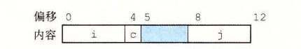
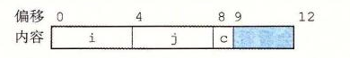

# 3.9.3 数据对齐

许多计算机系统对基本数据类型的合法地址做出了一些限制，要求某种类型对象的地址必须是某个值 K（通常是 2、4 或 8）的倍数。这种对齐限制简化了形成处理器和内存系统之间接口的硬件设计。例如，假设一个处理器总是从内存中取 8 个字节，则地址必须为 8 的倍数。如果我们能保证将所有的 `double` 类型数据的地址对齐成 8 的倍数，那么就可以用一个内存操作来读或者写值了。否则，我们可能需要执行两次内存访问，因为对象可能被分放在两个 8 字节内存块中。

无论数据是否对齐，x86-64 硬件都能正确工作。不过，Intel 还是建议要对齐数据以提高内存系统的性能。对齐原则是任何 K 字节的基本对象的地址必须是 K 的倍数。可以看到这条原则会得到如下对齐：

| K | 类型 |
| ---: | --- |
| 1 | `char` |
| 2 | `short` |
| 4 | `int`, `float` |
| 8 | `long`, `double`, `char *` |

确保每种数据类型都是按照指定方式来组织和分配，即每种类型的对象都满足它的对齐限制，就可保证实施对齐。编译器在汇编代码中放入命令，指明全局数据所需的对齐。例如，3.6.8 节开始的跳转表的汇编代码声明在第 2 行包含下面这样的命令：

```asm
.align 8
```

这就保证了它后面的数据（在此，是跳转表的开始）的起始地址是 8 的倍数。因为每个表项长 8 个字节，后面的元素都会遵守 8 字节对齐的限制。

对于包含结构的代码，编译器可能需要在字段的分配中插入间隙，以保证每个结构元素都满足它的对齐要求。而结构本身对它的起始地址也有一些对齐要求。

比如说，考虑下面的结构声明：

```c
struct S1 {
    int i;
    char c;
    int j;
};
```

假设编译器用最小的 9 字节分配，画出图来是这样的：


它是不可能满足字段 i（偏移为 0）和 j（偏移为 5）的 4 字节对齐要求的。取而代之地，编译器在字段 c 和 j 之间插入一个 3 字节的间隙（在此用蓝色阴影表示）：



结果，j 的偏移量为 8，而整个结构的大小为 12 字节。此外，编译器必须保证任何 `struct S1 *` 类型的指针 p 都满足 4 字节对齐。用我们前面的符号，设指针 p 的值为 x<sub>p</sub>。那么，x<sub>p</sub> 必须是 4 的倍数。这就保证了 `p->i`（地址 x<sub>p</sub>）和 `p->j`（地址 x<sub>p</sub> + 8）都满足它们的 4 字节对齐要求。

另外，编译器结构的末尾可能需要一些填充，这样结构数组中的每个元素都会满足它的对齐要求。例如，考虑下面这个结构声明：

```c
struct S2 {
    int i;
    int j;
    char c;
};
```

如果我们将这个结构打包成 9 个字节，只要保证结构的起始地址满足 4 字节对齐要求，我们仍然能够保证满足字段 i 和 j 的对齐要求。不过，考虑下面的声明：

```c
struct S2 d[4];
```

分配 9 个字节，不可能满足 d 的每个元素的对齐要求，因为这些元素的地址分别为 x<sub>d</sub>、x<sub>d</sub> + 9、x<sub>d</sub> + 18 和 x<sub>d</sub> + 27。相反，编译器会为结构 S2 分配 12 个字节，最后 3 个字节是浪费的空间：



这样一来，d 的元素的地址分别为 x<sub>d</sub>、x<sub>d</sub> + 12、x<sub>d</sub> + 24 和 x<sub>d</sub> + 36。只要 x<sub>d</sub> 是 4 的倍数，所有的对齐限制就都可以满足了。

**练习题 3.44** 对下面每个结构声明，确定每个字段的偏移量、结构总的大小，以及在 x86-64 下它的对齐要求：

A. `struct P1 { int i; char c; int j; char d; };`

B. `struct P2 { int i; char c; char d; long j; };`

C. `struct P3 { short w[3]; char c[3]; };`

D. `struct P4 { short w[5]; char *c[3]; };`

E. `struct P5 { struct P3 a[2]; struct P2 t; };`

**练习题 3.45** 对于下列结构声明回答后续问题：

```c
struct {
    char   *a;
    short   b;
    double  c;
    char    d;
    float   e;
    char    f;
    long    g;
    int     h;
} rec;
```

A. 这个结构中所有的字段的字节偏移量是多少？

B. 这个结构总的大小是多少？

C. 重新排列这个结构中的字段，以最小化浪费的空间，然后再给出重排过的结构的字节偏移量和总的大小。

> **旁注　强制对齐的情况**
>
> 对于大多数 x86-64 指令来说，保持数据对齐能够提高效率，但是它不会影响程序的行为。另一方面，如果数据没有对齐，某些型号的 Intel 和 AMD 处理器对于有些实现多媒体操作的 SSE 指令，就无法正确执行。这些指令对 16 字节数据块进行操作，在 SSE 单元和内存之间传送数据的指令要求内存地址必须是 16 的倍数。任何试图以不满足对齐要求的地址来访问内存都会导致异常（参见 8.1 节），默认的行为是程序终止。
>
> 因此，任何针对 x86-64 处理器的编译器和运行时系统都必须保证分配用来保存可能会被 SSE 寄存器读或写的数据结构的内存，都必须满足 16 字节对齐。这个要求有两个后果：
>
> - 任何内存分配函数（`alloca`、`malloc`、`calloc` 或 `realloc`）生成的块的起始地址都必须是 16 的倍数。
> - 大多数函数的栈帧的边界都必须是 16 字节的倍数。（这个要求有一些例外。）
>
> 较近版本的 x86-64 处理器实现了 AVX 多媒体指令。除了提供 SSE 指令的超集，支持 AVX 的指令并没有强制性的对齐要求。
