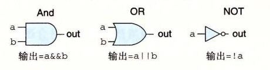

# 4.2.1 逻辑门

逻辑门是数字电路的基本计算单元。它们产生的输出，等于它们输入位值的某个布尔函数。图 4-9 是布尔函数 AND、OR 和 NOT 的标准符号，C 语言中运算符（2.1.8 节）的逻辑门下面是对应的 HCL 表达式：AND 用 `&&` 表示，OR 用 `||` 表示，而 NOT 用 `!` 表示。我们用这些符号而不用 C 语言中的位运算符 `&`、`|` 和 `~`，这是因为逻辑门只对单个位的数进行操作，而不是整个字。虽然图中只说明了 AND 和 OR 门的两个输入的版本，但是常见的是它们作为 n 路操作，n > 2。不过，在 HCL 中我们还是把它们写作二元运算符，所以，三个输入的 AND 门，输入为 a、b 和 c，用 HCL 表示就是 `a && b && c`。

*图 4-9　逻辑门类型。每个门产生的输出等于它输入的某个布尔函数*

逻辑门总是活动的（active）。一旦一个门的输入变化了，在很短的时间内，输出就会相应地变化。
