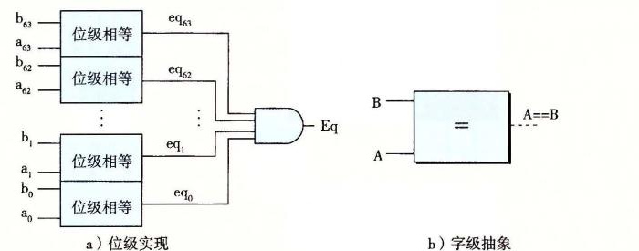
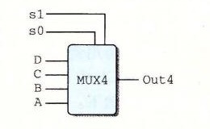
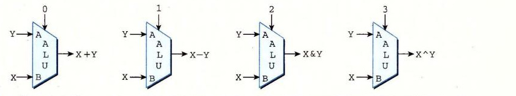

# 4.2.3 字级的组合电路和 HCL 整数表达式

通过将逻辑门组合成大的网，可以构造出能计算更加复杂函数的组合电路。通常，我们设计能对数据字（word）进行操作的电路。有一些位级信号，代表一个整数或一些控制模式。例如，我们的处理器设计将包含有很多字，字的大小的范围为 4 位到 64 位，代表整数、地址、指令代码和寄存器标识符。

执行字级计算的组合电路根据输入字的各个位，用逻辑门来计算输出字的各个位。例如图 4-12 中的一个组合电路，它测试两个 64 位字 A 和 B 是否相等。也就是，当且仅当 A 的每一位都和 B 的相应位相等时，输出才为 1。这个电路是用 64 个图 4-10 中所示的单个位相等电路实现的。这些单个位电路的输出用一个 AND 门连起来，形成了这个电路的输出。



*图 4-12　字级相等测试电路。当字 A 的每一位与字 B 中相应的位均相等时，输出等于 1。字级相等是 HCL 中的一个操作*

在 HCL 中，我们将所有字级的信号都声明为 `int`，不指定字的大小。这样做是为了简单。在全功能的硬件描述语言中，每个字都可以声明为有特定的位数。HCL 允许比较字是否相等，因此图 4-12 所示的电路的函数可以在字级上表达成

```hcl
bool Eq = (A == B);
```

这里参数 A 和 B 是 `int` 型的。注意我们使用和 C 语言中一样的语法习惯，`=` 表示赋值，而 `==` 是相等运算符。

如图 4-12 中右边所示，在画字级电路的时候，我们用中等粗度的线来表示携带字的每个位的线路，而用虚线来表示布尔信号结果。

**练习题 4.10** 假设你用练习题 4.9 中的异或电路而不是位级的相等电路来实现一个字级的相等电路。设计一个 64 位字的相等电路需要 64 个位级的异或电路，另外还要两个逻辑门。

图 4-13 是字级的多路复用器电路。这个电路根据控制输入位 s，产生一个 64 位的字 Out，等于两个输入字 A 或者 B 中的一个。这个电路由 64 个相同的子电路组成，每个子电路的结构都类似于图 4-11 中的位级多路复用器。不过这个字级的电路并没有简单地复制 64 次位级多路复用器，它只产生一次 `!s`，然后在每个位的地方都重复使用它，从而减少反相器或非门（inverters）的数量。


*图 4-13　字级多路复用器电路。当控制信号 s 为 1 时，输出会等于输入字 A，否则等于 B。HCL 中用情况（case）表达式来描述多路复用器*

处理器中会用到很多种多路复用器，使得我们能根据某些控制条件，从许多源中选出一个字。在 HCL 中，多路复用函数是用情况表达式（case expression）来描述的。情况表达式的通用格式如下：

```hcl
[
    select1 : expr1;
    select2 : expr2;
    ...
    selectk : exprk;
]
```

这个表达式包含一系列的情况，每种情况 i 都有一个布尔表达式 `select_i` 和一个整数表达式 `expr_i`，前者表明什么时候该选择这种情况，后者指明的是得到的值。

同 C 的 `switch` 语句不同，我们不要求不同的选择表达式之间互斥。从逻辑上讲，这些选择表达式是顺序求值的，且第一个求值为 1 的情况会被选中。例如，图 4-13 中的字级多路复用器用 HCL 来描述就是：

```hcl
word Out = [
    s : A;
    1 : B;
];
```

在这段代码中，第二个选择表达式就是 1，表明如果前面没有情况被选中，那就选择这种情况。这是 HCL 中一种指定默认情况的方法。几乎所有的情况表达式都是以此结尾的。

允许不互斥的选择表达式使得 HCL 代码的可读性更好。实际的硬件多路复用器的信号必须互斥，它们要控制哪个输入字应该被传送到输出，就像图 4-13 中的信号 s 和 `!s`。要将一个 HCL 情况表达式翻译成硬件，逻辑合成程序需要分析选择表达式集合，并解决任何可能的冲突，确保只有第一个满足的情况才会被选中。

选择表达式可以是任意的布尔表达式，可以有任意多的情况。这就使得情况表达式能描述带复杂选择标准的、多种输入信号的块。例如，考虑图 4-14 中所示的四路复用器的图。这个电路根据控制信号 s1 和 s0，从 4 个输入字 A、B、C 和 D 中选择一个，将控制信号看作一个两位的二进制数。我们可以用 HCL 来表示这个电路，用布尔表达式描述控制位模式的不同组合：



*图 4-14　四路复用器。控制信号 s1 和 s0 的不同组合决定了哪个数据输入会被传送到输出*

```hcl
word Out4 = [
    !s1 && !s0 : A; # 00
    !s1          : B; # 01
    !s0          : C; # 10
    1            : D; # 11
];
```

右边的注释（任何以 `#` 开头到行尾结束的文字都是注释）表明了 s1 和 s0 的什么组合会导致该种情况会被选中。可以看到选择表达式有时可以简化，因为只有第一个匹配的情况才会被选中。例如，第二个表达式可以写成 `!s1`，而不用写得更完整 `!s1 && s0`，因为另一种可能 s1 等于 0 已经出现在了第一个选择表达式中了。类似地，第三个表达式可以写作 `!s0`，而第四个可以简单地写成 1。

来看最后一个例子，假设我们想设计一个逻辑电路来找一组字 A、B 和 C 中的最小值，如下图所示：

```text
C ─┐
B ─┼─> [MIN3] ─> Min3
A ─┘
```

用 HCL 来表达就是：

```hcl
word Min3 = [
    A <= B && A <= C : A;
    B <= A && B <= C : B;
    1                : C;
];
```

**练习题 4.11** 计算三个字中最小值的 HCL 代码包含了 4 个形如 `X <= Y` 的比较表达式。重写代码计算同样的结果，但只使用三个比较。

**练习题 4.12** 写一个电路的 HCL 代码，对于输入字 A、B 和 C，选择中间值。也就是说，输出等于三个输入中居于最小值和最大值之间的那个字。

组合逻辑电路可以设计成在字级数据上执行许多不同类型的操作。具体的设计已经超出了我们讨论的范围。算术／逻辑单元（ALU）是一种很重要的组合电路，图 4-15 是它的一个抽象的图示。这个电路有三个输入：标号为 A 和 B 的两个数据输入，以及一个控制输入。根据控制输入的设置，电路会对数据输入执行不同的算术或逻辑操作。可以看到，这个 ALU 中画的四个操作对应于 Y86-64 指令集支持的四种不同的整数操作，而控制值和这些操作的功能码相对应（图 4-3）。我们还注意到减法的操作数顺序，是输入 B 减去输入 A。之所以这样做，是为了使这个顺序与 `subq` 指令的参数顺序一致。



*图 4-15　算术／逻辑单元（ALU）。根据函数输入的设置，该电路会执行四种算术和逻辑运算中的一种*
