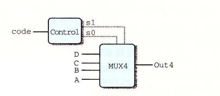

# 4.2.4 集合关系

在处理器设计中，很多时候都需要将一个信号与许多可能匹配的信号做比较，以此来检测正在处理的某个指令代码是否属于某一类指令代码。下面来看一个简单的例子，假设想从一个两位信号 code 中选择高位和低位来为图 4-14 中的四路复用器产生信号 s1 和 s0，如下图所示：



在这个电路中，两位的信号 code 就可以用来控制对 4 个数据字 A、B、C 和 D 做选择。根据可能的 code 值，可以用相等测试来表示信号 s1 和 s0 的产生：

```hcl
bool s1 = code == 2 || code == 3;
bool s0 = code == 1 || code == 3;
```

还有一种更简洁的方式来表示这样的属性：当 code 在集合 {2, 3} 中时 s1 为 1，而 code 在集合 {1, 3} 中时 s0 为 1：

```hcl
bool s1 = code in { 2, 3 };
bool s0 = code in { 1, 3 };
```

判断集合关系的通用格式是：

```hcl
iexpr in { iexpr1, iexpr2, ..., iexprk }
```

这里被测试的值 `iexpr` 和待匹配的值 `iexpr1`～`iexprk` 都是整数表达式。
