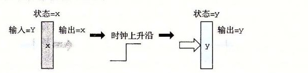
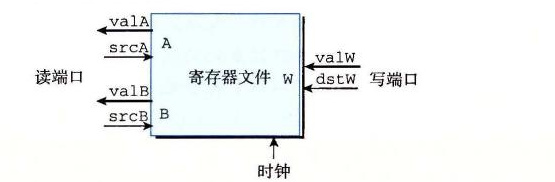

# 4.2.5 存储器和时钟

组合电路从本质上讲，不存储任何信息。相反，它们只是简单地响应输入信号，产生等于输入的某个函数的输出。为了产生时序电路（sequential circuit），也就是有状态并且在这个状态上进行计算的系统，我们必须引入按位存储信息的设备。存储设备都是由同一个时钟控制的，时钟是一个周期性信号，决定什么时候要把新值加载到设备中。考虑两类存储器设备：

- 时钟寄存器（简称寄存器）存储单个位或字。时钟信号控制寄存器加载输入值。
- 随机访问存储器（简称内存）存储多个字，用地址来选择该读或该写哪个字。随机访问存储器的例子包括：1）处理器的虚拟内存系统，硬件和操作系统软件结合起来使处理器可以在一个很大的地址空间内访问任意的字；2）寄存器文件，在此，寄存器标识符作为地址。在 IA32 或 Y86-64 处理器中，寄存器文件有 15 个程序寄存器（`%rax`～`%r14`）。

正如我们看到的那样，在说到硬件和机器级编程时，“寄存器”这个词是两个有细微差别的事情。在硬件中，寄存器直接将它的输入和输出线连接到电路的其他部分。在机器级编程中，寄存器代表的是 CPU 中为数不多的可寻址的字，这里的地址是寄存器 ID。这些字通常都存在寄存器文件中，虽然我们会看到硬件有时可以直接将一个字从一个指令传送到另一个指令，以避免先写寄存器文件再读出来的延迟。需要避免歧义时，我们会分别称呼这两类寄存器为“硬件寄存器”和“程序寄存器”。

图 4-16 更详细地说明了一个硬件寄存器以及它是如何工作的。大多数时候，寄存器都保持在稳定状态（用 x 表示），产生的输出等于它的当前状态。信号沿着寄存器前面的组合逻辑传播，这时，产生了一个新的寄存器输入（用 y 表示），但只要时钟是低电位的，寄存器的输出就仍然保持不变。当时钟变成高电位的时候，输入信号就加载到寄存器中，成为下一个状态 y，直到下一个时钟上升沿，这个状态就一直是寄存器的新输出。关键是寄存器是作为电路不同部分中的组合逻辑之间的屏障。每当每个时钟到达上升沿时，值才会从寄存器的输入传送到输出。我们的 Y86-64 处理器会用时钟寄存器保存程序计数器（PC）、条件代码（CC）和程序状态（Stat）。

*图 4-16　寄存器操作。寄存器输出会一直保持在当前寄存器状态上，直到时钟信号上升。当时钟上升时，寄存器输入上的值会成为新的寄存器状态*

下面的图展示了一个典型的寄存器文件：

寄存器文件有两个读端口（A 和 B），还有一个写端口（W）。这样一个多端口随机访问存储器允许同时进行多个读和写操作。图中所示的寄存器文件中，电路可以读两个程序寄存器的值，同时更新第三个寄存器的状态。每个端口都有一个地址输入，表明该选择哪个程序寄存器，另外还有一个数据输出或对应该程序寄存器的输入值。地址是用图 4-4 中编码表示的寄存器标识符。两个读端口有地址输入 srcA 和 srcB（“source A” 和 “source B” 的缩写）和数据输出 valA 和 valB（“value A” 和 “value B” 的缩写）。写端口有地址输入 dstW（“destination W” 的缩写），以及数据输入 valW（“value W” 的缩写）。

虽然寄存器文件不是组合电路，因为它有内部存储。不过，在我们的实现中，从寄存器文件读数据就好像它是一个以地址为输入、数据为输出的一个组合逻辑块。当 srcA 或 srcB 被设成某个寄存器 ID 时，在一段延迟之后，存储在相应程序寄存器的值就会出现在 valA 或 valB 上。例如，将 srcA 设为 3，就会读出程序寄存器 `%rbx` 的值，然后这个值就会出现在输出 valA 上。

向寄存器文件写入字是由时钟信号控制的，控制方式类似于将值加载到时钟寄存器。每次时钟上升时，输入 valW 上的值会被写入输入 dstW 上的寄存器 ID 指示的程序寄存器。当 dstW 设为特殊的 ID 值 `0xF` 时，不会写任何程序寄存器。由于寄存器文件既可以读也可以写，一个很自然的问题就是“如果我们试图同时读和写同一个寄存器会发生什么？”答案简单明了：如果更新一个寄存器，同时在读端口上用同一个寄存器 ID，我们会看到一个从旧值到新值的变化。当我们把这个寄存器文件加入到处理器设计中，我们保证会考虑到这个属性的。

处理器有一个随机访问存储器来存储程序数据，如下图所示：

这个内存有一个地址输入，一个写的数据输入，以及一个读的数据输出。同寄存器文件一样，从内存中读的操作方式类似于组合逻辑：如果我们在输入 address 上提供一个地址，并将 write 控制信号设置为 0，那么在经过一些延迟之后，存储在那个地址上的值会出现在输出 data 上。如果地址超出了范围，error 信号会设置为 1，否则就设置为 0。写内存是由时钟控制的：我们将 address 设置为期望的地址，将 data in 设置为期望的值，而 write 设置为 1。然后当我们控制时钟时，只要地址是合法的，就会更新内存中指定的位置。对于读操作来说，如果地址是不合法的，error 信号会被设置为 1。这个信号是由组合逻辑产生的，因为所需要的边界检查纯粹就是地址输入的函数，不涉及保存任何状态。

> **旁注：现实的存储器设计**
>
> 真实微处理器中的存储器系统比我们在设计中假想的这个简单的存储器要复杂得多。它是由几种形式的硬件存储器组成的，包括几种随机访问存储器和磁盘，以及管理这些设备的各种硬件和软件机制。存储器系统的设计和特点在第 6 章中描述。
>
> 不过，我们简单的存储器设计可以用于较小的系统，它提供了更复杂系统的处理器和存储器之间接口的抽象。

我们的处理器还包括另外一个只读存储器，用来读指令。在大多数实际系统中，这两个存储器被合并为一个具有双端口的存储器：一个用来读指令，另一个用来读或者写数据。
