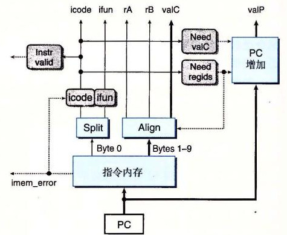
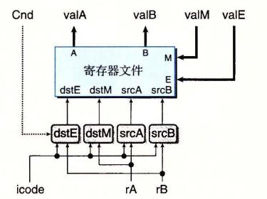

# 4.3.4 SEQ 阶段的实现

本节会设计实现 SEQ 所需要的控制逻辑块的 HCL 描述。完整的 SEQ 的 HCL 描述请参见网络旁注 ARCH:HCL。在此，我们给出一些例子，而其他的作为练习题。建议你做做这些练习来检验你的理解，即这些块是如何与不同指令的计算需求相联系的。

我们没有讲的那部分 SEQ 的 HCL 描述，是不同整数和布尔信号的定义，它们可以作为 HCL 操作的参数。其中包括不同硬件信号的名字，以及不同指令代码、功能码、寄存器名字、ALU 操作和状态码的常数值。只列出了那些在控制逻辑中必须被显式引用的常数。图 4-26 列出了我们使用的常数。按照习惯，常数值都是大写的。

| 名称 | 值（十六进制） | 含义 |
|---|---:|---|
| `IHALT` | 0 | `halt` 指令的代码 |
| `INOP` | 1 | `nop` 指令的代码 |
| `IRRMOVQ` | 2 | `rrmovq` 指令的代码 |
| `IIRMOVQ` | 3 | `irmovq` 指令的代码 |
| `IRMMOVQ` | 4 | `rmmovq` 指令的代码 |
| `IMRMOVQ` | 5 | `mrmovq` 指令的代码 |
| `IOPQ` | 6 | 整数运算指令的代码 |
| `IJXX` | 7 | 跳转指令的代码 |
| `ICALL` | 8 | `call` 指令的代码 |
| `IRET` | 9 | `ret` 指令的代码 |
| `IPUSHQ` | A | `pushq` 指令的代码 |
| `IPOPQ` | B | `popq` 指令的代码 |
| `FNONE` | 0 | 默认功能码 |
| `RRSP` | 4 | `%rsp` 的寄存器 ID |
| `RNONE` | F | 表明没有寄存器文件访问 |
| `ALUADD` | 0 | 加法运算的功能 |
| `SAOK` | 1 | 正常操作状态码 |
| `SADR` | 2 | 地址异常状态码 |
| `SINS` | 3 | 非法指令异常状态码 |
| `SHLT` | 4 | `halt` 状态码 |

*图 4-26　HCL 描述中使用的常数值。这些值表示的是指令、功能码、寄存器 ID、ALU 操作和状态码的编码*

除了图 4-18～图 4-21 中所示的指令以外，还包括了对 `nop` 和 `halt` 指令的处理。`nop` 指令只是简单地经过各个阶段，除了要将 PC 加 1，不进行任何处理。`halt` 指令使得处理器状态被设置为 HLT，导致处理器停止运行。

## 1. 取指阶段

如图 4-27 所示，取指阶段包括指令内存硬件单元。以 PC 作为第一个字节（字节 0）的地址，这个单元一次从内存读出 10 个字节。第一个字节被解释成指令字节，（标号为“Split”的单元）分为两个 4 位的数。然后，标号为“icode”和“ifun”的控制逻辑块计算指令和功能码，或者使之等于从内存读出的值，或者当指令地址不合法时（由信号 `imem_error` 指明），使这些值对应于 `nop` 指令。根据 `icode` 的值，我们可以计算三个一位的信号（用虚线表示）：

- `instr_valid`：这个字节对应于一个合法的 Y86-64 指令吗？这个信号用来发现不合法的指令。
- `need_regids`：这个指令包括一个寄存器指示符字节吗？
- `need_valC`：这个指令包括一个常数字吗？

（当指令地址越界时会产生的）信号 `instr_valid` 和 `imem_error` 在访存阶段被用来产生状态码。



*图 4-27　SEQ 的取指阶段。以 PC 作为起始地址，从指令内存中读出 10 个字节。根据这些字节，我们产生出各个指令字段。PC 增加模块计算信号 `valP`*

让我们再来看一个例子，`need_regids` 的 HCL 描述只是确定了 `icode` 的值是否为一条带有寄存器指示值字节的指令。

```hcl
bool need_regids =
    icode in { IRRMOVQ, IOPQ, IPUSHQ, IPOPQ,
               IIRMOVQ, IRMMOVQ, IMRMOVQ };
```

**练习题 4.19** 写出 SEQ 实现中信号 `need_valC` 的 HCL 代码。

如图 4-27 所示，从指令内存中读出的剩下 9 个字节是寄存器指示符字节和常数字的组合编码。标号为“Align”的硬件单元会处理这些字节，将它们放入寄存器字段和常数字中。当被计算出的信号 `need_regids` 为 1 时，字节 1 被分开装入寄存器指示符 `rA` 和 `rB` 中。否则，这两个字段会被设为 `0xF`（`RNONE`），表明这条指令没有指明寄存器。回想一下（图 4-2），任何只有一个寄存器操作数的指令，寄存器指示值字节的另一个字段都设为 `0xF`（`RNONE`）。因此，可以将信号 `rA` 和 `rB` 看成，要么放着我们想要访问的寄存器，要么表明不需要访问任何寄存器。这个标号为“Align”的单元还产生常数字 `valC`。根据信号 `need_regids` 的值，要么根据字节 1～8 来产生 `valC`，要么根据字节 2～9 来产生。

PC 增加器硬件单元根据当前的 PC 以及两个信号 `need_regids` 和 `need_valC` 的值，产生信号 `valP`。对于 PC 值 p、`need_regids` 值 r 以及 `need_valC` 值 i，增加器产生值

<p align="center">p + 1 + r + 8i</p>

## 2. 译码和写回阶段

图 4-28 给出了 SEQ 中实现译码和写回阶段的逻辑的详细情况。把这两个阶段联系在一起是因为它们都要访问寄存器文件。

寄存器文件有四个端口。它支持同时进行两个读（在端口 A 和 B 上）和两个写（在端口 E 和 M 上）。每个端口都有一个地址连接和一个数据连接，地址连接是一个寄存器 ID，而数据连接是一组 64 根线路，既可以作为寄存器文件的输出字（对读端口来说），也可以作为它的输入字（对写端口来说）。两个读端口的地址输入为 `srcA` 和 `srcB`，而两个写端口的地址输入为 `dstE` 和 `dstM`。如果某个地址端口上的值为特殊标识符 `0xF`（`RNONE`），则表明不需要访问寄存器。



*图 4-28　SEQ 的译码和写回阶段。指令字段译码，产生寄存器文件使用的四个地址（两个读和两个写）的寄存器标识符。从寄存器文件中读出的值成为信号 `valA` 和 `valB`。两个写回值 `valE` 和 `valM` 作为写操作的数据*

根据指令代码 `icode` 以及寄存器指示值 `rA` 和 `rB`，可能还会根据执行阶段计算出的 `Cnd` 条件信号，图 4-28 底部的四个块产生出四个不同的寄存器文件的寄存器 ID。寄存器 ID `srcA` 表明应该读哪个寄存器以产生 `valA`。所需要的值依赖于指令类型，如图 4-18～图 4-21 中译码阶段第一行中所示。将所有这些条目都整合到一个计算中就得到下面的 `srcA` 的 HCL 描述（回想 `RRSP` 是 `%rsp` 的寄存器 ID）：

```hcl
word srcA = [
    icode in { IRRMOVQ, IRMMOVQ, IOPQ, IPUSHQ } : rA;
    icode in { IPOPQ, IRET } : RRSP;
    1 : RNONE;  # Don't need register
];
```

**练习题 4.20** 寄存器信号 `srcB` 表明应该读哪个寄存器以产生信号 `valB`。所需要的值如图 4-18～图 4-21 中译码阶段第二步所示。写出 `srcB` 的 HCL 代码。

寄存器 ID `dstE` 表明写端口 E 的目的寄存器，计算出来的值 `valE` 将放在那里。图 4-18～图 4-21 写回阶段第一步表明了这一点。如果我们暂时忽略条件移动指令，综合所有不同指令的目的寄存器，就得到下面的 `dstE` 的 HCL 描述：

```hcl
# WARNING: Conditional move not implemented correctly here
word dstE = [
    icode in { IRRMOVQ } : rB;
    icode in { IIRMOVQ, IOPQ } : rB;
    icode in { IPUSHQ, IPOPQ, ICALL, IRET } : RRSP;
    1 : RNONE;  # Don't write any register
];
```

我们查看执行阶段时，会重新审视这个信号，看看如何实现条件传送。

**练习题 4.21** 寄存器 ID `dstM` 表明写端口 M 的目的寄存器，从内存中读出来的值 `valM` 将放在那里，如图 4-18～图 4-21 中写回阶段第二步所示。写出 `dstM` 的 HCL 代码。

**练习题 4.22** 只有 `popq` 指令会同时用到寄存器文件的两个写端口。对于指令 `popq %rsp`，E 和 M 两个写端口会用到同一个地址，但是写入的数据不同。为了解决这个冲突，必须对两个写端口设立一个优先级，这样一来，当同一个周期内两个写端口都试图对一个寄存器进行写时，只有较高优先级端口上的写才会发生。那么要实现练习题 4.8 中确定的行为，哪个端口该具有较高的优先级呢？

## 3. 执行阶段

执行阶段包括算术/逻辑单元（ALU）。这个单元根据 `alufun` 信号的设置，对输入 `aluA` 和 `aluB` 执行 ADD、SUBTRACT、AND 或 EXCLUSIVE-OR 运算。如图 4-29 所示，这些数据和控制信号是由三个控制块产生的。ALU 的输出就是 `valE` 信号。


*图 4-29　SEQ 执行阶段。ALU 要么为整数运算指令执行操作，要么作为加法器。根据 ALU 的值，设置条件码寄存器。检测条件码的值，判断是否该选择分支*

在图 4-18～图 4-21 中，执行阶段的第一步就是每条指令的 ALU 计算。列出的操作数 `aluB` 在前面，后面是 `aluA`，这样是为了保证 `subq` 指令是 `valB` 减去 `valA`。可以看到，根据指令的类型，`aluA` 的值可以是 `valA`、`valC`，或者是 -8 或 +8。因此我们可以用下面的方式来表达产生 `aluA` 的控制块的行为：

```hcl
word aluA = [
    icode in { IRRMOVQ, IOPQ } : valA;
    icode in { IIRMOVQ, IRMMOVQ, IMRMOVQ } : valC;
    icode in { ICALL, IPUSHQ } : -8;
    icode in { IRET, IPOPQ } : 8;
    # Other instructions don't need ALU
];
```

**练习题 4.23** 根据图 4-18～图 4-21 中执行阶段第一步的第一个操作数，写出 SEQ 中信号 `aluB` 的 HCL 描述。

观察 ALU 在执行阶段执行的操作，可以看到它通常作为加法器来使用。不过，对于 `OPq` 指令，我们希望它使用指令 `ifun` 字段中编码的操作。因此，可以将 ALU 控制的 HCL 描述写成：

```hcl
word alufun = [
    icode == IOPQ : ifun;
    1 : ALUADD;
];
```

执行阶段还包括条件码寄存器。每次运行时，ALU 都会产生三个与条件码相关的信号——零、符号和溢出。不过，我们只希望在执行 `OPq` 指令时才设置条件码。因此产生了一个信号 `set_cc` 来控制是否该更新条件码寄存器：

```hcl
bool set_cc = icode in { IOPQ };
```

标号为“cond”的硬件单元会根据条件码和功能码来确定是否进行条件分支或者条件数据传送（图 4-3）。它产生信号 `Cnd`，用于设置条件传送的 `dstE`，也用在条件分支的下一个 PC 逻辑中。对于其他指令，取决于指令的功能码和条件码的设置，`Cnd` 信号可以被设置为 1 或者 0。但是控制逻辑会忽略它。我们省略这个单元的详细设计。

**练习题 4.24** 条件传送指令（简称 `cmovXX`）的指令代码为 `IRRMOVQ`。如图 4-28 所示，我们可以用执行阶段中产生的 `Cnd` 信号实现这些指令。修改 `dstE` 的 HCL 代码以实现这些指令。

## 4. 访存阶段

访存阶段的任务就是读或者写程序数据。如图 4-30 所示，两个控制块产生内存地址和内存输入数据（为写操作）的值。另外两个块产生表明应该执行读操作还是写操作的控制信号。当执行读操作时，数据内存产生值 `valM`。


*图 4-30　SEQ 访存阶段。数据内存既可以写，也可以读内存的值。从内存中读出的值就形成了信号 `valM`*

图 4-18～图 4-21 的访存阶段给出了每个指令类型所需要的内存操作。可以看到内存读和写的地址总是 `valE` 或 `valA`。这个块用 HCL 描述就是：

```hcl
word mem_addr = [
    icode in { IRMMOVQ, IPUSHQ, ICALL, IMRMOVQ } : valE;
    icode in { IPOPQ, IRET } : valA;
    # Other instructions don't need address
];
```

**练习题 4.25** 观察图 4-18～图 4-21 所示的不同指令的访存操作，我们可以看到内存写的数据总是 `valA` 或 `valP`。写出 SEQ 中信号 `mem_data` 的 HCL 代码。

我们希望只为从内存读数据的指令设置控制信号 `mem_read`，用 HCL 代码表示就是：

```hcl
bool mem_read = icode in { IMRMOVQ, IPOPQ, IRET };
```

**练习题 4.26** 我们希望只为向内存写数据的指令设置控制信号 `mem_write`。写出 SEQ 中信号 `mem_write` 的 HCL 代码。

访存阶段最后的功能是根据取指阶段产生的 `icode`、`imem_error`、`instr_valid` 值以及数据内存产生的 `dmem_error` 信号，从指令执行的结果来计算状态码 `Stat`。

**练习题 4.27** 写出 `Stat` 的 HCL 代码，产生四个状态码 `SAOK`、`SADR`、`SINS` 和 `SHLT`（参见图 4-26）。

## 5. 更新 PC 阶段

SEQ 中最后一个阶段会产生程序计数器的新值（见图 4-31）。如图 4-18～图 4-21 中最后步骤所示，依据指令的类型和是否要选择分支，新的 PC 可能是 `valC`、`valM` 或 `valP`。用 HCL 来描述这个选择就是：


*图 4-31　SEQ 更新 PC 阶段。根据指令代码和分支标志，从信号 `valC`、`valM` 和 `valP` 中选出下一个 PC 的值*

```hcl
word new_pc = [
    # Call. Use instruction constant
    icode == ICALL : valC;
    # Taken branch. Use instruction constant
    icode == IJXX && Cnd : valC;
    # Completion of RET instruction. Use value from stack
    icode == IRET : valM;
    # Default: Use incremented PC
    1 : valP;
];
```

## 6. SEQ 小结

现在我们已经浏览了 Y86-64 处理器的一个完整的设计。可以看到，通过将执行每条不同指令所需的步骤组织成一个统一的流程，就可以用很少量的各种硬件单元以及一个时钟来控制计算的顺序，从而实现整个处理器。不过这样一来，控制逻辑就必须要在这些单元之间路由信号，并根据指令类型和分支条件产生适当的控制信号。

SEQ 唯一的问题就是它太慢了。时钟必须非常慢，以使信号能在一个周期内传播所有的阶段。让我们来看看处理一条 `ret` 指令的例子。在时钟周期起始时，从更新过的 PC 开始，要从指令内存中读出指令，从寄存器文件中读出栈指针，ALU 将栈指针加 8，为了得到程序计数器的下一个值，还要从内存中读出返回地址。所有这一切都必须在这个周期结束之前完成。

这种实现方法不能充分利用硬件单元，因为每个单元只在整个时钟周期的一部分时间内才被使用。我们会看到引入流水线能获得更好的性能。
