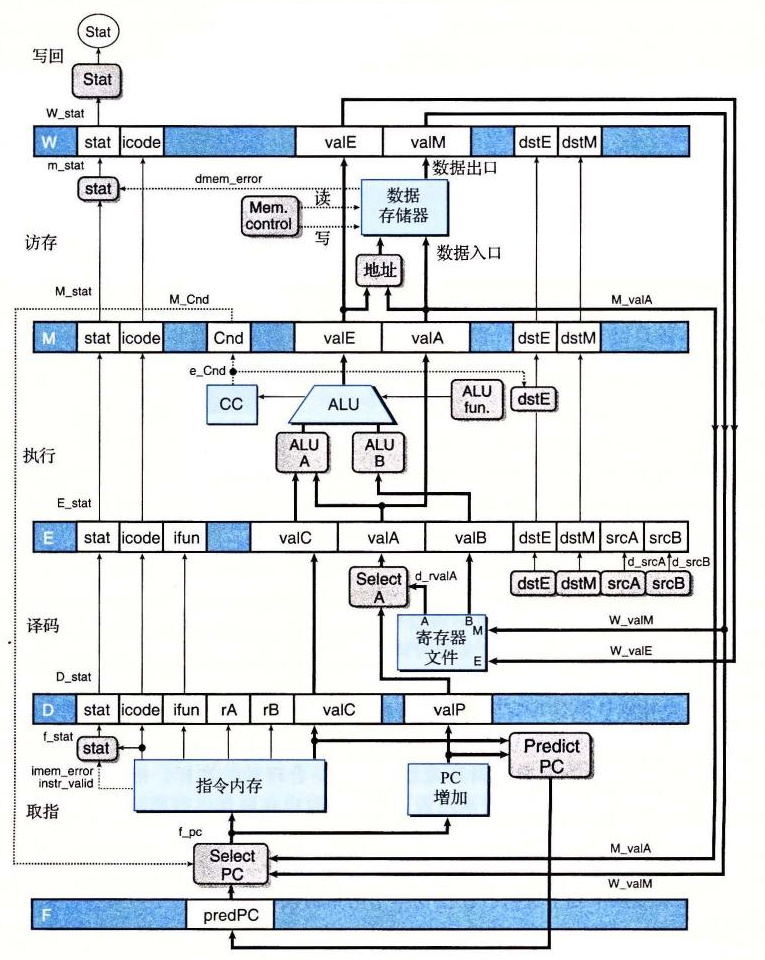
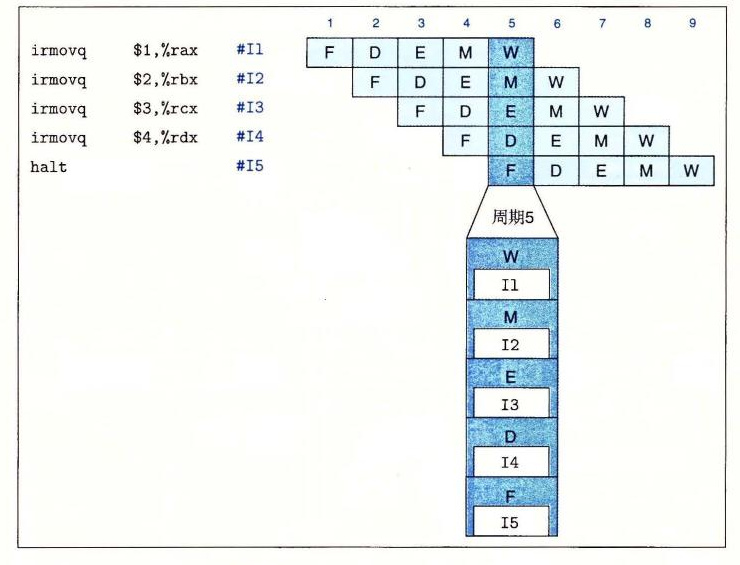

# 4.5.2 插入流水线寄存器

在创建一个流水线化的 Y86-64 处理器的最初尝试中，我们要在 SEQ+ 的各个阶段之间插入流水线寄存器，并对信号重新排列，得到 PIPE− 处理器，这里的“−”代表这个处理器和最终的处理器设计相比，性能要差一点。PIPE− 的抽象结构如图 4-41 所示。流水线寄存器在该图中用黑色方框表示，每个寄存器包括不同的字段，用白色方框表示。正如多个字段表明的那样，每个流水线寄存器可以存放多个字节和字。同两个顺序处理器的硬件结构（图 4-23 和图 4-40）中的圆角方框不同，这些白色的方框表示实际的硬件组成。

可以看到，PIPE− 使用了与顺序设计 SEQ+（图 4-40）几乎一样的硬件单元，但是有流水线寄存器分隔开这些阶段。两个系统中信号的不同之处在 4.5.3 节中讨论。

流水线寄存器按如下方式标号：

- **F**　保存程序计数器的预测值，稍后讨论。
- **D**　位于取指和译码阶段之间。它保存关于最新取出的指令的信息，即将由译码阶段进行处理。
- **E**　位于译码和执行阶段之间。它保存关于最新译码的指令和从寄存器文件读出的值的信息，即将由执行阶段进行处理。
- **M**　位于执行和访存阶段之间。它保存最新执行的指令的结果，即将由访存阶段进行处理。它还保存关于用于处理条件转移的分支条件和分支目标的信息。
- **W**　位于访存阶段和反馈路径之间，反馈路径将计算出来的值提供给寄存器文件写，而当完成 `ret` 指令时，它还要向 PC 选择逻辑提供返回地址。



**图 4-41　PIPE− 的硬件结构，一个初始的流水线化实现。** 通过往 SEQ+（图 4-40）中插入流水线寄存器，我们创建了一个五阶段的流水线。这个版本有几个缺陷，稍后就会解决这些问题。

图 4-42 表明以下代码序列如何通过我们的五阶段流水线，其中注释将各条指令标识为 I1～I5 以便引用：

```asm
irmovq $1,%rax    # I1
irmovq $2,%rbx    # I2
irmovq $3,%rcx    # I3
irmovq $4,%rdx    # I4
halt              # I5
```



**图 4-42　指令流通过流水线的示例。**

图中右边给出了这个指令序列的流水线图。同 4.4 节中简单流水线化的计算单元的流水线图一样，这个图描述了每条指令通过流水线各个阶段的行进过程，时间从左往右增大。上面一排数字表明各个阶段发生的时钟周期。例如，在周期 1 取出指令 I1，然后它开始通过流水线各个阶段，到周期 5 结束后，其结果写入寄存器文件。在周期 2 取出指令 I2，到周期 6 结束后，其结果写回，以此类推。在最下面，我们给出了当周期为 5 时的流水线的扩展图。此时，每个流水线阶段中各有一条指令。

从图 4-42 中还可以判断我们画处理器的习惯是合理的，这样，指令是自底向上的流动的。周期 5 时的扩展图表明的流水线阶段，取指阶段在底部，写回阶段在最上面，同流水线硬件图（图 4-41）表明的一样。如果看看流水线各个阶段中指令的顺序，就会发现它们出现的顺序与在程序中列出的顺序一样。因为正常的程序是从上到下列出的，我们保留这种顺序，让流水线从下到上进行。在使用本书附带的模拟器时，这个习惯会特别有用。
