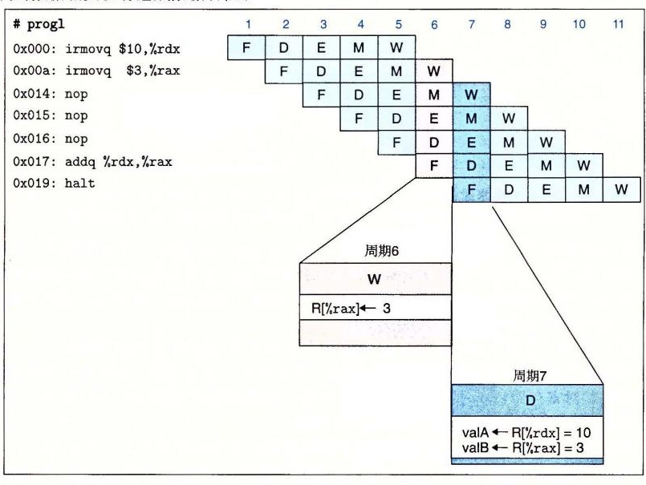
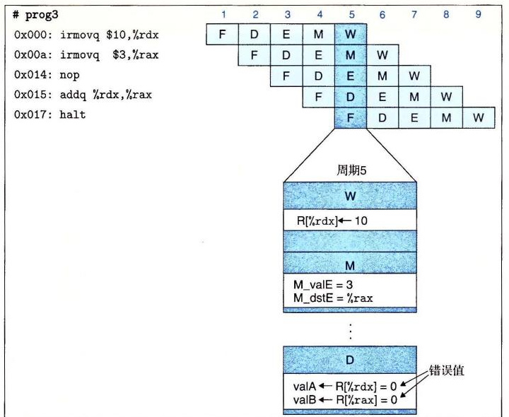
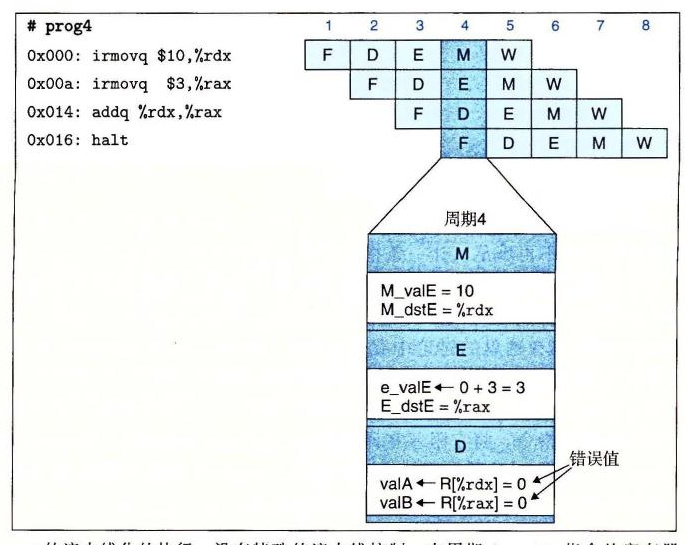
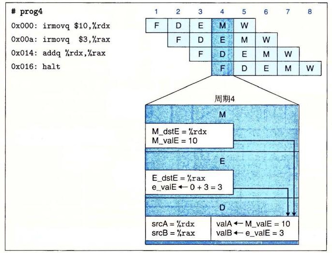
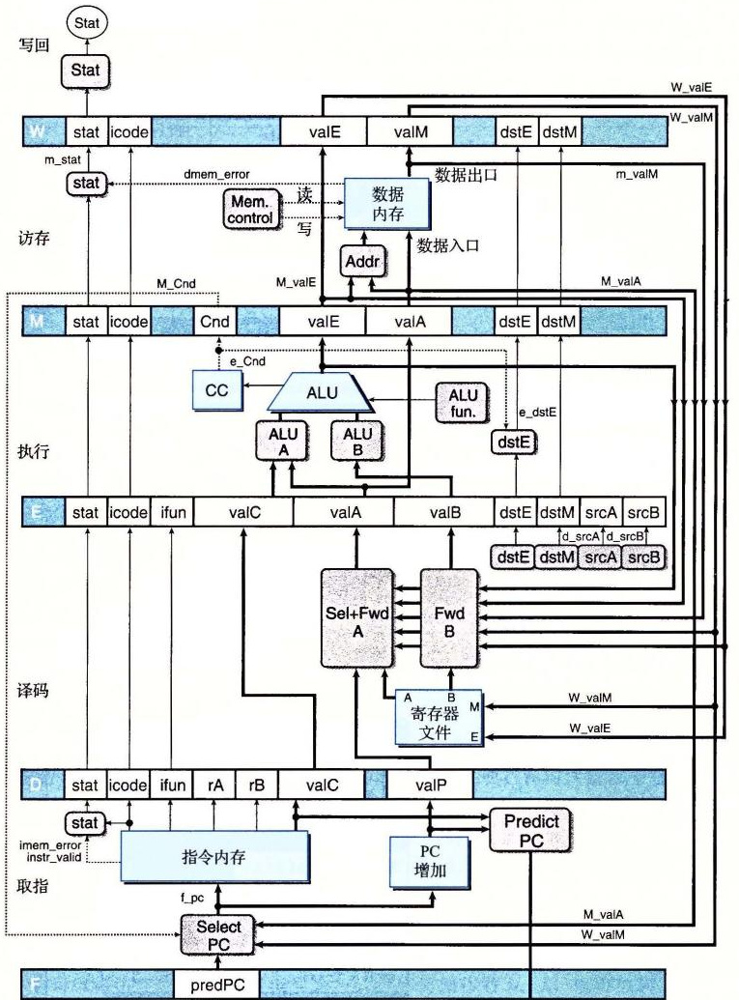
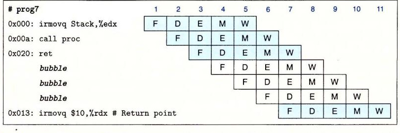

# 4.5.5 流水线冒险

PIPE− 结构是创建一个流水线化的 Y86-64 处理器的好开端。不过，回忆 4.4.4 节中的讨论，将流水线技术引入一个带反馈的系统，当相邻指令间存在相关时会导致出现问题。在完成我们的设计之前，必须解决这个问题。这些相关有两种形式：1）数据相关，下一条指令会用到这一条指令计算出的结果；2）控制相关，一条指令要确定下一条指令的位置，例如在执行跳转、调用或返回指令时。这些相关可能会导致流水线产生计算错误，称为冒险（hazard）。同相关一样，冒险也可以分为两类：数据冒险（data hazard）和控制冒险（control hazard）。我们首先关心的是数据冒险，然后再考虑控制冒险。

图 4-43 描述的是 PIPE− 处理器处理 `prog1` 指令序列的情况。假设在这个例子以及后面的例子中，程序寄存器初始时值都为 0。这段代码将值 10 和 3 放入程序寄存器 `%rdx` 和 `%rax`，执行三条 `nop` 指令，然后将寄存器 `%rdx` 加到 `%rax`。我们重点关注两条 `irmovq` 指令和 `addq` 指令之间的数据相关造成的可能数据冒险。图的右边是这个指令序列的流水线图。图中突出显示了周期 6 和 7 的流水线阶段。流水线图的下面是周期 6 中写回活动和周期 7 中译码活动的扩展说明。在周期 7 开始以后，两条 `irmovq` 都已经通过了写回阶段，所以寄存器文件保存着更新过的 `%rdx` 和 `%rax` 的值。因此，`addq` 指令在周期 7 经过译码阶段时，它可以读到源操作数的正确值。在此例中，两条 `irmovq` 指令和 `addq` 指令之间的数据相关没有造成数据冒险。



**图 4-43　`prog1` 的流水线化的执行，没有特殊的流水线控制。** 在周期 6 中，第二个 `irmovq` 将结果写入寄存器 `%rax`。`addq` 指令在周期 7 读源操作数，因此得到的是 `%rdx` 和 `%rax` 的正确值。

我们看到 `prog1` 通过流水线并得到正确的结果，因为 3 条 `nop` 指令在有数据相关的指令之间创造了一些延迟。让我们来看看如果去掉这些 `nop` 指令会发生些什么。图 4-44 描述的是 `prog2` 程序的流水线流程，在两条产生寄存器 `%rdx` 和 `%rax` 值的 `irmovq` 指令和以这两个寄存器作为操作数的 `addq` 指令之间有两条 `nop` 指令。在这种情况下，关键步骤发生在周期 6，此时 `addq` 指令从寄存器文件中读取它的操作数。该图底部是这个周期内流水线活动的扩展描述。第一条 `irmovq` 指令已经通过了写回阶段，因此程序寄存器 `%rdx` 已经在寄存器文件中更新过了。在该周期内，第二条 `irmovq` 指令处于写回阶段，因此对程序寄存器 `%rax` 的写要到周期 7 开始、时钟上升时，才会发生。结果，会读出 `%rax` 的错误值（回想一下，我们假设所有的寄存器的初始值为 0），因为对该寄存器的写还未发生。很明显，我们必须改进流水线让它能够正确处理这样的冒险。


**图 4-44　`prog2` 的流水线化的执行，没有特殊的流水线控制。** 直到周期 7 结束时，对寄存器 `%rax` 的写才发生，所以 `addq` 指令在译码阶段读出的是该寄存器的错误值。

图 4-45 是当 `irmovq` 指令和 `addq` 指令之间只有一条 `nop` 指令，即为程序 `prog3` 时，发生的情况。现在我们必须检查周期 5 内流水线的行为，此时 `addq` 指令通过译码阶段。不幸的是，对寄存器 `%rdx` 的写仍处在写回阶段，而对寄存器 `%rax` 的写还处在访存阶段。因此，`addq` 指令会得到两个错误的操作数。



**图 4-45　`prog3` 的流水线化的执行，没有特殊的流水线控制。** 在周期 5，`addq` 指令从寄存器文件中读源操作数。对寄存器 `%rdx` 的写仍处在写回阶段，而对寄存器 `%rax` 的写还在访存阶段。两个操作数 `valA` 和 `valB` 得到的都是错误值。

图 4-46 是当去掉 `irmovq` 指令和 `addq` 指令间的所有 `nop` 指令，即为程序 `prog4` 时，发生的情况。现在我们必须检查周期 4 内流水线的行为，此时 `addq` 指令通过译码阶段。不幸的是，对寄存器 `%rdx` 的写仍处在访存阶段，而执行阶段正在计算寄存器 `%rax` 的新值。因此，`addq` 指令的两个操作数都是不正确的。



**图 4-46　`prog4` 的流水线化的执行，没有特殊的流水线控制。** 在周期 4，`addq` 指令从寄存器文件中读源操作数。对寄存器 `%rdx` 的写仍处在访存阶段，而执行阶段正在计算寄存器 `%rax` 的新值。两个操作数 `valA` 和 `valB` 得到的都是错误值。

这些例子说明，如果一条指令的操作数被它前面三条指令中的任意一条改变的话，都会出现数据冒险。之所以会出现这些冒险，是因为我们的流水线化的处理器是在译码阶段从寄存器文件中读取指令的操作数，而要到三个周期以后，指令经过写回阶段时，才会将指令的结果写到寄存器文件。

> **旁注：列举数据冒险的类型**
>
> 当一条指令更新后面指令会读到的那些程序状态时，就有可能出现冒险。对于 Y86-64 来说，程序状态包括程序寄存器、程序计数器、内存、条件码寄存器和状态寄存器。让我们来看看在提出的设计中每类状态出现冒险的可能性。
>
> **程序寄存器：** 我们已经认识这种冒险了。出现这种冒险是因为寄存器文件的读写是在不同的阶段进行的，导致不同指令之间可能出现不希望的相互作用。
>
> **程序计数器：** 更新和读取程序计数器之间的冲突导致了控制冒险。当我们的取指阶段逻辑在取下一条指令之前，正确预测了程序计数器的新值时，就不会产生冒险。预测错误的分支和 `ret` 指令需要特殊的处理，会在 4.5.5 节中讨论。
>
> **内存：** 对数据内存的读和写都发生在访存阶段。在一条读内存的指令到达这个阶段之前，前面所有要写内存的指令都已经完成这个阶段了。另外，在访存阶段中写数据的指令和在取指阶段中读指令之间也有冲突，因为指令和数据内存访问的是同一个地址空间。只有包含自我修改代码的程序才会发生这种情况，在这样的程序中，指令写内存的一部分，过后会从中取出指令。有些系统有复杂的机制来检测和避免这种冒险，而有些系统只是简单地强制要求程序不应该使用自我修改代码。为了简便，假设程序不能修改自身，因此我们不需要采取特殊的措施，根据在程序执行过程中对数据内存的修改来修改指令内存。
>
> **条件码寄存器：** 在执行阶段中，整数操作会写这些寄存器。条件传送指令会在执行阶段以及条件转移会在访存阶段读这些寄存器。在条件传送或转移到执行阶段之前，前面所有的整数操作都已经完成这个阶段了。所以不会发生冒险。
>
> **状态寄存器：** 指令流经流水线的时候，会影响程序状态。我们采用流水线中的每条指令都与一个状态码相关联的机制，使得当异常发生时，处理器能够有条理地停止，就像在 4.5.6 节中会讲到的那样。
>
> 这些分析表明我们只需要处理寄存器数据冒险、控制冒险，以及确保能够正确处理异常。当设计一个复杂系统时，这样的分类分析是很重要的。这样做可以确认出系统实现中可能的困难，还可以指导生成用于检查系统正确性的测试程序。

## 1. 用暂停来避免数据冒险

暂停（stalling）是避免冒险的一种常用技术，暂停时，处理器会停止流水线中一条或多条指令，直到冒险条件不再满足。让一条指令停顿在译码阶段，直到产生它的源操作数的指令通过了写回阶段，这样我们的处理器就能避免数据冒险。这种机制的细节会在 4.5.8 节中讨论。它对流水线控制逻辑做了一些简单的加强。图 4-47（`prog2`）和图 4-48（`prog4`）中画出了暂停的效果。（在这里的讨论中我们省略了 `prog3`，因为它的运行类似于其他两个例子。）当指令 `addq` 处于译码阶段时，流水线控制逻辑发现执行、访存或写回阶段中至少有一条指令会更新寄存器 `%rdx` 或 `%rax`。处理器不会让 `addq` 指令带着不正确的结果通过这个阶段，而是会暂停指令，将它阻塞在译码阶段，时间为一个周期（对 `prog2` 来说）或者三个周期（对 `prog4` 来说）。对所有这三个程序来说，`addq` 指令最终都会在周期 7 中得到两个源操作数的正确值，然后继续沿着流水线进行下去。

将 `addq` 指令阻塞在译码阶段时，我们还必须将紧跟其后的 `halt` 指令阻塞在取指阶段。通过将程序计数器保持不变就能做到这一点，这样一来，会不断地对 `halt` 指令进行取指，直到暂停结束。

暂停技术就是让一组指令阻塞在它们所处的阶段，而允许其他指令继续通过流水线。那么在本该正常处理 `addq` 指令的阶段中，我们该做些什么呢？我们使用的处理方法是：每次要把一条指令阻塞在译码阶段，就在执行阶段插入一个气泡。气泡就像一个自动产生的 `nop` 指令——它不会改变寄存器、内存、条件码或程序状态。在图 4-47 和图 4-48 的流水线图中，白色方框表示的就是气泡。在这些图中，我们用一个 `addq` 指令的标号为“D”的方框到标号为“E”的方框之间的箭头来表示一个流水线气泡，这些箭头表明，在执行阶段中插入气泡是为了替代 `addq` 指令，它本来应该经过译码阶段进入执行阶段。在 4.5.8 节中，我们将看到使流水线暂停以及插入气泡的详细机制。


**图 4-47　`prog2` 使用暂停的流水线化的执行。** 在周期 6 中对 `addq` 指令译码之后，暂停控制逻辑发现一个数据冒险，它是由写回阶段中对寄存器 `%rax` 未进行的写造成的。它在执行阶段中插入一个气泡，并在周期 7 中重复对指令 `addq` 的译码。实际上，机器是动态地插入一条 `nop` 指令，得到的执行流类似于 `prog1` 的执行流（图 4-43）。


**图 4-48　`prog4` 使用暂停的流水线化的执行。** 在周期 4 中对 `addq` 指令译码之后，暂停控制逻辑发现了对两个源寄存器的数据冒险。它在执行阶段中插入一个气泡，并在周期 5 中重复对指令 `addq` 的译码。它再次发现对两个源寄存器的冒险，就在执行阶段中插入一个气泡，并在周期 6 中重复对指令 `addq` 的译码。它再次发现对寄存器 `%rax` 的冒险，就在执行阶段中插入一个气泡，并在周期 7 中重复对指令 `addq` 的译码。实际上，机器是动态地插入三条 `nop` 指令，得到的执行流类似于 `prog1` 的执行流（图 4-43）。

在使用暂停技术来解决数据冒险的过程中，我们通过动态地产生和 `prog1` 流（图 4-43）一样的流水线流，有效地执行了程序 `prog2` 和 `prog4`。为 `prog2` 插入 1 个气泡，为 `prog4` 插入 3 个气泡，与在第 2 条 `irmovq` 指令和 `addq` 指令之间有 3 条 `nop` 指令，有相同的效果。虽然实现这一机制相当容易（参考家庭作业 4.53），但是得到的性能并不很好。一条指令更新一个寄存器，紧跟其后的指令就使用被更新的寄存器，像这样的情况不胜枚举。这会导致流水线暂停长达三个周期，严重降低了整体的吞吐量。

## 2. 用转发来避免数据冒险

PIPE− 的设计是在译码阶段从寄存器文件中读入源操作数，但是对这些源寄存器的写有可能要在写回阶段才能进行。与其暂停直到写完成，不如简单地将要写的值传到流水线寄存器 E 作为源操作数。图 4-49 用 `prog2` 周期 6 的流水线图的扩展描述来说明了这一策略。译码阶段逻辑发现，寄存器 `%rax` 是操作数 `valB` 的源寄存器，而在写端口 E 上还有一个对 `%rax` 的未进行的写。它只要简单地将提供到端口 E 的数据字（信号 `W_valE`）作为操作数 `valB` 的值，就能避免暂停。这种将结果值直接从一个流水线阶段传到较早阶段的技术称为数据转发（data forwarding，或简称转发，有时称为旁路（bypassing））。它使得 `prog2` 的指令能通过流水线而不需要任何暂停。数据转发需要在基本的硬件结构中增加一些额外的数据连接和控制逻辑。


**图 4-49　`prog2` 使用转发的流水线化的执行。** 在周期 6 中，译码阶段逻辑发现在写回阶段中对寄存器 `%rax` 有未进行的写。它用这个值，而不是从寄存器文件中读出的值，作为源操作数 `valB`。

如图 4-50 所示，当访存阶段中有对寄存器未进行的写时，也可以使用数据转发，以避免程序 `prog3` 中的暂停。在周期 5 中，译码阶段逻辑发现，在写回阶段中端口 E 上有对寄存器 `%rdx` 未进行的写，以及在访存阶段中有会在端口 E 上对寄存器 `%rax` 未进行的写。它不会暂停直到这些写真正发生，而是用写回阶段中的值（信号 `W_valE`）作为操作数 `valA`，用访存阶段中的值（信号 `M_valE`）作为操作数 `valB`。


**图 4-50　`prog3` 使用转发的流水线化的执行。** 在周期 5 中，译码阶段逻辑发现在写回阶段中对寄存器 `%rdx` 有未进行的写，以及在访存阶段中对寄存器 `%rax` 有未进行的写。它用这些值，而不是从寄存器文件中读出的值，作为 `valA` 和 `valB` 的值。

为了充分利用数据转发技术，我们还可以将新计算出来的值从执行阶段传到译码阶段，以避免程序 `prog4` 所需要的暂停，如图 4-51 所示。在周期 4 中，译码阶段逻辑发现在访存阶段中有对寄存器 `%rdx` 未进行的写，而且执行阶段中 ALU 正在计算的值稍后也会写入寄存器 `%rax`。它可以将访存阶段中的值（信号 `M_valE`）作为操作数 `valA`，也可以将 ALU 的输出（信号 `e_valE`）作为操作数 `valB`。注意，使用 ALU 的输出不会造成任何时序问题。译码阶段只要在时钟周期结束之前产生信号 `valA` 和 `valB`，这样在时钟上升开始下一个周期时，流水线寄存器 E 就能装载来自译码阶段的值了。而在此之前 ALU 的输出已经是合法的了。



**图 4-51　`prog4` 使用转发的流水线化的执行。** 在周期 4 中，译码阶段逻辑发现在访存阶段中对寄存器 `%rdx` 有未进行的写，还发现在执行阶段中正在计算寄存器 `%rax` 的新值。它用这些值，而不是从寄存器文件中读出的值，作为 `valA` 和 `valB` 的值。

程序 `prog2`～`prog4` 中描述的转发技术的使用都是将 ALU 产生的以及其目标为写端口 E 的值进行转发，其实也可以转发从内存中读出的以及其目标为写端口 M 的值。从访存阶段，我们可以转发刚刚从数据内存中读出的值（信号 `m_valM`）。从写回阶段，我们可以转发对端口 M 未进行的写（信号 `W_valM`）。这样一共就有五个不同的转发源（`e_valE`、`m_valM`、`M_valE`、`W_valM` 和 `W_valE`），以及两个不同的转发目的（`valA` 和 `valB`）。



**图 4-52　流水线化的最终实现——PIPE 的硬件结构。** 添加的旁路路径能够转发前面三条指令的结果。这使得我们能够不暂停流水线就处理大多数形式的数据冒险。

图 4-49～图 4-51 的扩展图还表明译码阶段逻辑能够确定是使用来自寄存器文件的值，还是要用转发过来的值。与每个要写回寄存器文件的值相关的是目的寄存器 ID。逻辑会将这些 ID 与源寄存器 ID `srcA` 和 `srcB` 相比较，以此来检测是否需要转发。可能有多个目的寄存器 ID 与一个源 ID 相等。要解决这样的情况，我们必须在各个转发源中建立起优先级关系。在学习转发逻辑的详细设计时，我们会讨论这个内容。

图 4-52 给出的是 PIPE 的结构，它是 PIPE− 的扩展，能通过转发处理数据冒险。将这幅图与 PIPE− 的结构（图 4-41）相比，我们可以看到来自五个转发源的值反馈到译码阶段中两个标号为“Sel+Fwd A”和“Fwd B”的块。标号为“Sel+Fwd A”的块是 PIPE− 中标号为“Select A”的块的功能与转发逻辑的结合。它允许流水线寄存器 E 的 `valA` 为已增加的程序计数器值 `valP`，从寄存器文件 A 端口读出的值，或者某个转发过来的值。标号为“Fwd B”的块实现的是源操作数 `valB` 的转发逻辑。

## 3. 加载/使用数据冒险

有一类数据冒险不能单纯用转发来解决，因为内存读在流水线发生的比较晚。图 4-53 举例说明了加载/使用冒险（load/use hazard），其中一条指令（位于地址 `0x028` 的 `mrmovq`）从内存中读出寄存器 `%rax` 的值，而下一条指令（位于地址 `0x032` 的 `addq`）需要该值作为源操作数。图的下部是周期 7 和 8 的扩展说明，在此假设所有的程序寄存器都初始化为 0。`addq` 指令在周期 7 中需要该寄存器的值，但是 `mrmovq` 指令直到周期 8 才产生出这个值。为了从 `mrmovq`“转发到”`addq`，转发逻辑不得不将值送回到过去的时间！这显然是不可能的，我们必须找到其他机制来解决这种形式的数据冒险。（位于地址 `0x01e` 的 `irmovq` 指令产生的寄存器 `%rbx` 的值，会被位于地址 `0x032` 的 `addq` 指令使用，转发能够处理这种数据冒险。）


**图 4-53　加载/使用数据冒险的示例。** `addq` 指令在周期 7 译码阶段中需要寄存器 `%rax` 的值。前面的 `mrmovq` 指令在周期 8 访存阶段中读出这个寄存器的新值，这对于 `addq` 指令来说太迟了。

如图 4-54 所示，我们可以将暂停和转发结合起来，避免加载/使用数据冒险。这个需要修改控制逻辑，但是可以使用现有的旁路路径。当 `mrmovq` 指令通过执行阶段时，流水线控制逻辑发现译码阶段中的指令（`addq`）需要从内存中读出的结果。它会将译码阶段中的指令暂停一个周期，导致执行阶段中插入一个气泡。如周期 8 的扩展说明所示，从内存中读出的值可以从访存阶段转发到译码阶段中的 `addq` 指令。寄存器 `%rbx` 的值也可以从访存阶段转发到译码阶段。就像流水线图，从周期 7 中标号为“D”的方框到周期 8 中标号为“E”的方框的箭头表明的那样，插入的气泡代替了正常情况下本来应该继续通过流水线的 `addq` 指令。


**图 4-54　用暂停来处理加载/使用冒险。** 通过将 `addq` 指令在译码阶段暂停一个周期，就可以将 `valB` 的值从访存阶段中的 `mrmovq` 指令转发到译码阶段中的 `addq` 指令。

这种用暂停来处理加载/使用冒险的方法称为加载互锁（load interlock）。加载互锁和转发技术结合起来足以处理所有可能类型的数据冒险。因为只有加载互锁会降低流水线的吞吐量，我们几乎可以实现每个时钟周期发射一条新指令的吞吐量目标。

## 4. 避免控制冒险

当处理器无法根据处于取指阶段的当前指令来确定下一条指令的地址时，就会出现控制冒险。如同在 4.5.4 节讨论过的，在我们的流水线化处理器中，控制冒险只会发生在 `ret` 指令和跳转指令。而且，后一种情况只有在条件跳转方向预测错误时才会造成麻烦。在本小节中，我们概括介绍如何来处理这些冒险。作为对流水线控制更一般性讨论的一部分，其详细实现在 4.5.8 节给出。

对于 `ret` 指令，考虑下面的示例程序。这个程序是用汇编代码表示的，左边是各个指令的地址，以供参考：

```asm
0x000: irmovq stack,%rsp        # Initialize stack pointer
0x00a: call proc                # Procedure call
0x013: irmovq $10,%rdx          # Return point
0x01d: halt
0x020: .pos 0x20
0x020: proc:                    # proc:
0x020: ret                      # Return immediately
0x021: rrmovq %rdx,%rbx         # Not executed
0x030: .pos 0x30
0x030: stack:                   # stack: Stack pointer
```

图 4-55 给出了我们希望流水线如何来处理 `ret` 指令。同前面的流水线图一样，这幅图展示了流水线的活动，时间从左向右增加。与前面不同的是，指令列出的顺序与它们在程序中出现的顺序并不相同，这是因为这个程序的控制流中指令并不是按线性顺序执行的。看看指令的地址就能看出它们在程序中的位置。



**图 4-55　`ret` 指令处理的简化视图。** 当 `ret` 经过译码、执行和访存阶段时，流水线应该暂停，在处理过程中插入三个气泡。一旦 `ret` 指令到达写回阶段（周期 7），PC 选择逻辑就会选择返回地址作为指令的取指地址。

如这张图所示，在周期 3 中取出 `ret` 指令，并沿着流水线前进，在周期 7 进入写回阶段。在它经过译码、执行和访存阶段时，流水线不能做任何有用的活动。我们只能在流水线中插入三个气泡。一旦 `ret` 指令到达写回阶段，PC 选择逻辑就会将程序计数器设为返回地址，然后取指阶段就会取出位于返回点（地址 `0x013`）处的 `irmovq` 指令。

要处理预测错误的分支，考虑下面这个用汇编代码表示的程序，左边是各个指令的地址，以供参考：

```asm
0x000: xorq %rax,%rax
0x002: jne target               # Not taken
0x00b: irmovq $1,%rax           # Fall through
0x015: halt
0x016: target:
0x016: irmovq $2,%rdx           # Target
0x020: irmovq $3,%rbx           # Target+1
0x02a: halt
```

图 4-56 表明是如何处理这些指令的。同前面一样，指令是按照它们进入流水线的顺序列出的，而不是按照它们出现在程序中的顺序。因为预测跳转指令会选择分支，所以周期 3 中会取出位于跳转目标处的指令，而周期 4 中会取出该指令后的那条指令。在周期 4，分支逻辑发现不应该选择分支之前，已经取出了两条指令，它们不应该继续执行下去了。幸运的是，这两条指令都没有导致程序员可见的状态发生改变。只有到指令到达执行阶段时才会发生那种情况，在执行阶段中，指令会改变条件码。我们只要在下一个周期往译码和执行阶段中插入气泡，并同时取出跳转指令后面的指令，这样就能取消（有时也称为指令排除（instruction squashing））那两条预测错误的指令。这样一来，两条预测错误的指令就会简单地从流水线中消失，因此不会对程序员可见的状态产生影响。唯一的缺点是两个时钟周期的指令处理能力被浪费了。


**图 4-56　处理预测错误的分支指令。** 流水线预测会选择分支，所以开始取跳转目标处的指令。在周期 4 发现预测错误之前，已经取出了两条指令，此时，跳转指令正在通过执行阶段。在周期 5 中，流水线往译码和执行阶段中插入气泡，取消了两条目标指令，同时还取出跳转后面的那条指令。

对控制冒险的讨论表明，通过慎重考虑流水线的控制逻辑，控制冒险是可以被处理的。在出现特殊情况时，暂停和往流水线中插入气泡的技术可以动态调整流水线的流程。如同我们将在 4.5.8 节中讨论的一样，对基本时钟寄存器设计的简单扩展就可以让我们暂停流水段，并向作为流水线控制逻辑一部分的流水线寄存器中插入气泡。
