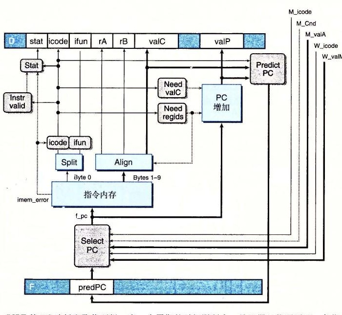
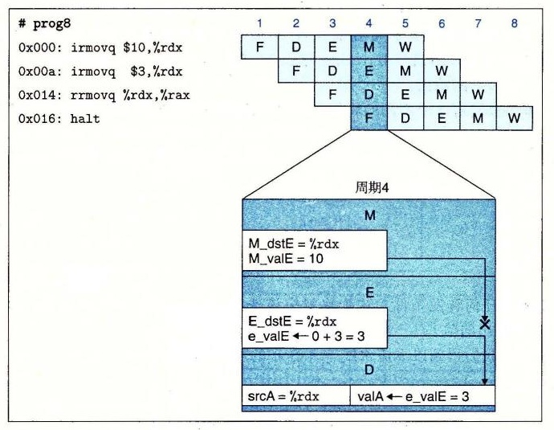
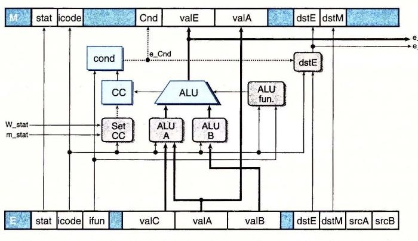
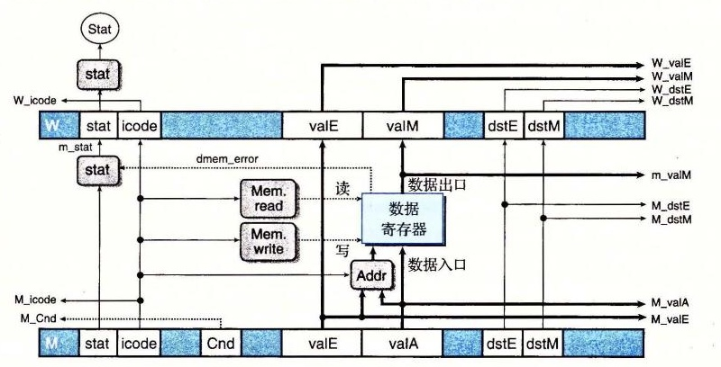

# 4.5.7 PIPE 各阶段的实现

现在我们已经创建了 PIPE 的整体结构，PIPE 是我们使用了转发技术的流水线化的 Y86-64 处理器。它使用了一组与前面顺序设计相同的硬件单元，另外增加了一些流水线寄存器、一些重新配置了的逻辑块，以及增加的流水线控制逻辑。在本节中，我们将浏览各个逻辑块的设计，而将流水线控制逻辑的设计放到下一节中介绍。许多逻辑块与 SEQ 和 SEQ+ 中相应部件完全相同，除了我们必须从来自不同流水线寄存器（用大写的流水线寄存器的名字作为前缀）或来自各个阶段计算（用小写的阶段名字的第一个字母作为前缀）的信号中选择适当的值。

作为一个示例，比较一下 SEQ 中产生 `srcA` 信号的逻辑的 HCL 代码与 PIPE 中相应的代码：

```text
# Code from SEQ
word srcA = [
    icode in { IRRMOVQ, IRMMOVQ, IOPQ, IPUSHQ } : rA;
    icode in { IPOPQ, IRET } : RRSP;
    1 : RNONE; # Don't need register
];

# Code from PIPE
word d_srcA = [
    D_icode in { IRRMOVQ, IRMMOVQ, IOPQ, IPUSHQ } : D_rA;
    D_icode in { IPOPQ, IRET } : RRSP;
    1 : RNONE; # Don't need register
];
```

它们的不同之处只在于 PIPE 信号都加上了前缀：“`D_`”表示源值，以表明信号是来自流水线寄存器 D，而“`d_`”表示结果值，以表明它是在译码阶段中产生的。为了避免重复，我们在此就不列出那些与 SEQ 中代码只有名字前缀不同的块的 HCL 代码。网络旁注 ARCH:HCL 中列出了完整的 PIPE 的 HCL 代码。

## 1. PC 选择和取指阶段

图 4-57 提供了 PIPE 取指阶段逻辑的一个详细描述。像前面讨论过的那样，这个阶段必须选择程序计数器的当前值，并且预测下一个 PC 值。用于从内存中读取指令和抽取不同指令字段的硬件单元与 SEQ 中考虑的那些一样（参见 4.3.4 节中的取指阶段）。



*图 4-57　PIPE 的 PC 选择和取指逻辑。在一个周期的时间限制内，处理器只能预测下一条指令的地址*

PC 选择逻辑从三个程序计数器源中进行选择。当一条预测错误的分支进入访存阶段时，会从流水线寄存器 M（信号 `M_valA`）中读出该指令 `valP` 的值（指明下一条指令的地址）。当 `ret` 指令进入写回阶段时，会从流水线寄存器 W（信号 `W_valM`）中读出返回地址。其他情况会使用存放在流水线寄存器 F（信号 `F_predPC`）中的 PC 的预测值：

```text
word f_pc = [
    # Mispredicted branch. Fetch at incremented PC
    M_icode == IJXX && !M_Cnd : M_valA;
    # Completion of RET instruction
    W_icode == IRET : W_valM;
    # Default: Use predicted value of PC
    1 : F_predPC;
];
```

当取出的指令为函数调用或跳转时，PC 预测逻辑会选择 `valC`，否则就会选择 `valP`：

```text
word f_predPC = [
    f_icode in { IJXX, ICALL } : f_valC;
    1 : f_valP;
];
```

标号为“Instr valid”、“Need regids”和“Need valC”的逻辑块和 SEQ 中的一样，使用了适当命名的源信号。

同 SEQ 中不一样，我们必须将指令状态的计算分成两个部分。在取指阶段，可以测试由于指令地址越界引起的内存错误，还可以发现非法指令或 `halt` 指令。必须推迟到访存阶段才能发现非法数据地址。

**练习题 4.30** 写出信号 `f_stat` 的 HCL 代码，提供取出的指令的临时状态。

## 2. 译码和写回阶段

图 4-58 是 PIPE 的译码和写回逻辑的详细说明。标号为“dstE”、“dstM”、“srcA”和“srcB”的块非常类似于它们在 SEQ 的实现中的相应部件。我们观察到，提供给写端口的寄存器 ID 来自于写回阶段（信号 `W_dstE` 和 `W_dstM`），而不是来自于译码阶段。这是因为我们希望进行写的目的寄存器是由写回阶段中的指令指定的。


*图 4-58　PIPE 的译码和写回阶段逻辑。没有指令既需要 `valP` 又需要来自寄存器端口 A 中读出的值，因此对后面的阶段来说，这两者可以合并为信号 `valA`。标号为“Sel+Fwd A”的块执行该任务，并实现源操作数 `valA` 的转发逻辑。标号为“Fwd B”的块实现源操作数 `valB` 的转发逻辑。寄存器写的位置是由来自写回阶段的 `dstE` 和 `dstM` 信号指定的，而不是来自于译码阶段，因为它要写的是当前正在写回阶段中的指令的结果*

**练习题 4.31** 译码阶段中标号为“dstE”的块根据来自流水线寄存器 D 中取出的指令的各个字段，产生寄存器文件 E 端口的寄存器 ID。在 PIPE 的 HCL 描述中，得到的信号命名为 `d_dstE`。根据 SEQ 信号 `dstE` 的 HCL 描述，写出这个信号的 HCL 代码。（参考 4.3.4 节中的译码阶段。）目前还不用关心实现条件传送的逻辑。

这个阶段的复杂性主要是跟转发逻辑相关。就像前面提到的那样，标号为“Sel+Fwd A”的块扮演两个角色。它为后面的阶段将 `valP` 信号合并到 `valA` 信号，这样可以减少流水线寄存器中状态的数量。它还实现了源操作数 `valA` 的转发逻辑。

合并信号 `valA` 和 `valP` 的依据是，只有 `call` 和跳转指令在后面的阶段中需要 `valP` 的值，而这些指令并不需要从寄存器文件 A 端口中读出的值。这个选择是由该阶段的 `icode` 信号来控制的。当信号 `D_icode` 与 `call` 或 `jXX` 的指令代码相匹配时，这个块就会选择 `D_valP` 作为它的输出。

4.5.5 节中提到有 5 个不同的转发源，每个都有一个数据字和一个目的寄存器 ID：

| 数据字 | 寄存器 ID | 源描述 |
| --- | --- | --- |
| `e_valE` | `e_dstE` | ALU 输出 |
| `m_valM` | `M_dstM` | 内存输出 |
| `M_valE` | `M_dstE` | 访存阶段中对端口 E 未进行的写 |
| `W_valM` | `W_dstM` | 写回阶段中对端口 M 未进行的写 |
| `W_valE` | `W_dstE` | 写回阶段中对端口 E 未进行的写 |

如果不满足任何转发条件，这个块就应该选择 `d_rvalA` 作为它的输出，也就是从寄存器端口 A 中读出的值。

综上所述，我们得到以下流水线寄存器 E 的 `valA` 新值的 HCL 描述：

```text
word d_valA = [
    D_icode in { ICALL, IJXX } : D_valP; # Use incremented PC
    d_srcA == e_dstE : e_valE;           # Forward valE from execute
    d_srcA == M_dstM : m_valM;           # Forward valM from memory
    d_srcA == M_dstE : M_valE;           # Forward valE from memory
    d_srcA == W_dstM : W_valM;           # Forward valM from write back
    d_srcA == W_dstE : W_valE;           # Forward valE from write back
    1 : d_rvalA;                          # Use value read from register file
];
```

上述 HCL 代码中赋予这 5 个转发源的优先级是非常重要的。这种优先级是由 HCL 代码中检测 5 个目的寄存器 ID 的顺序来确定的。如果选择了其他任何顺序，对某些程序来说，流水线就会出错。图 4-59 给出了一个程序示例，要求对执行和访存阶段中的转发源设置正确的优先级。在这个程序中，前两条指令写寄存器 `%rdx`，而第三条指令用这个寄存器作为它的源操作数。当指令 `rrmovq` 在周期 4 到达译码阶段时，转发逻辑必须在两个都以该源寄存器为目的的值中选择一个。它应该选择哪一个呢？为了设定优先级，我们必须考虑当一次执行一条指令时，机器语言程序的行为。第一条 `irmovq` 指令会将寄存器 `%rdx` 设为 10，第二条 `irmovq` 指令会将之设为 3，然后 `rrmovq` 指令会从 `%rdx` 中读出 3。为了模拟这种行为，流水线化的实现应该总是给处于最早流水线阶段中的转发源以较高的优先级，因为它保持着程序序列中设置该寄存器的最近的指令。因此，上述 HCL 代码中的逻辑首先会检测执行阶段中的转发源，然后是访存阶段，最后才是写回阶段。只有指令 `popq %rsp` 会关心在访存或写回阶段中的两个源之间的转发优先级，因为只有这条指令能同时写两个寄存器。

**练习题 4.32** 假设 `d_valA` 的 HCL 代码中第三和第四种情况（来自访存阶段的两个转发源）的顺序是反过来的。请描述下列程序中 `rrmovq` 指令（第 5 行）造成的行为：

```text
1  irmovq $5,%rdx
2  irmovq $0x100,%rsp
3  rmmovq %rdx,0(%rsp)
4  popq %rsp
5  rrmovq %rsp,%rax
```



*图 4-59　转发优先级的说明。在周期 4 中，`%rdx` 的值既可以从执行阶段也可以从访存阶段得到。转发逻辑应该选择执行阶段中的值，因为它代表最近产生的该寄存器的值*

**练习题 4.33** 假设 `d_valA` 的 HCL 代码中第五和第六种情况（来自写回阶段的两个转发源）的顺序是反过来的。写出一个会运行错误的 Y86-64 程序。请描述错误是如何发生的，以及它对程序行为的影响。

**练习题 4.34** 根据提供到流水线寄存器 E 的源操作数 `valB` 的值，写出信号 `d_valB` 的 HCL 代码。

写回阶段的一小部分是保持不变的。如图 4-52 所示，整个处理器的状态 `Stat` 是一个块根据流水线寄存器 W 中的状态值计算出来的。回想一下 4.1.1 节，状态码应该指明是正常操作（AOK），还是三种异常条件中的一种。由于流水线寄存器 W 保存着最近完成的指令的状态，很自然地要用这个值来表示整个处理器状态。唯一要考虑的特殊情况是当写回阶段有气泡时。这是正常操作的一部分，因此对于这种情况，我们也希望状态码是 AOK：

```text
word Stat = [
    W_stat == SBUB : SAOK;
    1 : W_stat;
];
```

## 3. 执行阶段

图 4-60 展现的是 PIPE 执行阶段的逻辑。这些硬件单元和逻辑块同 SEQ 中的相同，使用的信号做适当的重命名。我们可以看到信号 `e_valE` 和 `e_dstE` 作为转发源，指向译码阶段。一个区别是标号为“Set CC”的逻辑以信号 `m_stat` 和 `W_stat` 作为输入，这个逻辑决定了是否要更新条件码。这些信号被用来检查一条导致异常的指令正在通过后面的流水线阶段的情况，因此，任何对条件码的更新都会被禁止。这部分设计在 4.5.8 节中讨论。



*图 4-60　PIPE 的执行阶段逻辑。这一部分的设计与 SEQ 实现中的逻辑非常相似*

**练习题 4.35** `d_valA` 的 HCL 代码中的第二种情况使用了信号 `e_dstE`，来判断是否要选择 ALU 的输出 `e_valE` 作为转发源。假设我们用 `E_dstE`，也就是流水线寄存器 E 中的目的寄存器 ID，来作为这个选择。写出一个采用这个修改过的转发逻辑就会产生错误结果的 Y86-64 程序。

## 4. 访存阶段

图 4-61 是 PIPE 的访存阶段逻辑。将这个逻辑与 SEQ 的访存阶段（图 4-30）相比较，我们看到，正如前面提到的那样，PIPE 中没有 SEQ 中标号为“Data”的块。这个块是用来在数据源 `valP`（对 `call` 指令来说）和 `valA` 中进行选择的，但是这个选择现在由译码阶段中标号为“Sel+Fwd A”的块来执行。这个阶段中的其他块都和 SEQ 中相应的部件相同，采用的信号做适当的重命名。在图中，你还可以看到许多流水线寄存器 M 和 W 中的值作为转发和流水线控制逻辑的一部分，提供给电路中其他部分。



*图 4-61　PIPE 的访存阶段逻辑。许多从流水线寄存器 M 和 W 来的信号被传递到较早的阶段，以提供写回的结果、指令地址以及转发的结果*

**练习题 4.36** 在这个阶段中，通过检查数据内存的非法地址情况，我们能够完成状态码 `Stat` 的计算。写出信号 `m_stat` 的 HCL 代码。
