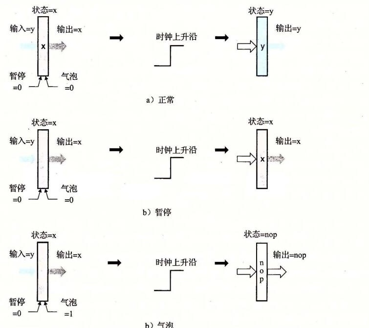
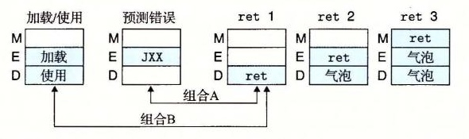
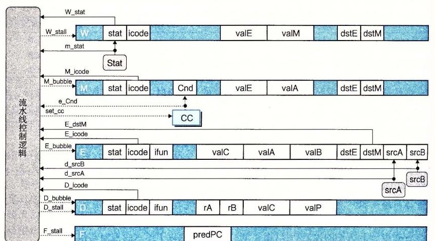

# 4.5.8 流水线控制逻辑

现在准备创建流水线控制逻辑，完成我们的 PIPE 设计。这个逻辑必须处理下面 4 种控制情况，这些情况是其他机制（例如数据转发和分支预测）不能处理的：

**加载/使用冒险：** 在一条从内存中读出一个值的指令和一条使用该值的指令之间，流水线必须暂停一个周期。

**处理 `ret`：** 流水线必须暂停直到 `ret` 指令到达写回阶段。

**预测错误的分支：** 在分支逻辑发现不应该选择分支之前，分支目标处的几条指令已经进入流水线了。必须取消这些指令，并从跳转指令后面的那条指令开始取指。

**异常：** 当一条指令导致异常，我们想要禁止后面的指令更新程序员可见的状态，并且在异常指令到达写回阶段时，停止执行。

我们先浏览每种情况所期望的行为，然后再设计处理这些情况的控制逻辑。

## 1. 特殊控制情况所期望的处理

在 4.5.5 节中，我们已经描述了对加载/使用冒险所期望的流水线操作，如图 4-54 所示。只有 `mrmovq` 和 `popq` 指令会从内存中读数据。当这两条指令中的任一条处于执行阶段，并且需要该目的寄存器的指令正处在译码阶段时，我们要将第二条指令阻塞在译码阶段，并在下一个周期往执行阶段中插入一个气泡。此后，转发逻辑会解决这个数据冒险。可以将流水线寄存器 D 保持为固定状态，从而将一个指令阻塞在译码阶段。这样做还可以保证流水线寄存器 F 保持为固定状态，由此下一条指令会被再取一次。总之，实现这个流水线流需要发现冒险的情况，保持流水线寄存器 F 和 D 固定不变，并且在执行阶段中插入气泡。

对 `ret` 指令的处理，我们已经在 4.5.5 节中描述了所需的流水线操作。流水线要停顿 3 个时钟周期，直到 `ret` 指令经过访存阶段，读出返回地址。通过图 4-55 中下面程序的处理的简化流水线图，说明了这种情况：

```text
0x000: irmovq stack,%rsp    # Initialize stack pointer
0x00a: call proc            # Procedure call
0x013: irmovq $10,%rdx      # Return point
0x01d: halt
0x020: .pos 0x20
0x020: proc:                # proc:
0x020: ret                  # Return immediately
0x021: rrmovq %rdx,%rbx     # Not executed
0x030: .pos 0x30
0x030: stack:               # stack: Stack pointer
```

图 4-62 是示例程序中 `ret` 指令的实际处理过程。在此可以看到，没有办法在流水线的取指阶段中插入气泡。每个周期，取指阶段从指令内存中读出一条指令。看看 4.5.7 节中实现 PC 预测逻辑的 HCL 代码，我们可以看到，对 `ret` 指令来说，PC 的新值被预测成 `valP`，也就是下一条指令的地址。在我们的示例程序中，这个地址会是 `0x021`，即 `ret` 后面 `rrmovq` 指令的地址。对这个例子来说，这种预测是不对的，即使对大部分情况来说，也是不对的，但是在设计中，我们并不试图正确预测返回地址。取指阶段会暂停 3 个时钟周期，导致取出 `rrmovq` 指令，但是在译码阶段就被替换成了气泡。这个过程在图 4-62 中的表示为，3 个取指用箭头指向下面的气泡，气泡会经过剩下的流水线阶段。最后，在周期 7 取出 `irmovq` 指令。比较图 4-62 和图 4-55，可以看到，我们的实现达到了期望的效果，只不过连续 3 个周期取出了不正确的指令。


*图 4-62　`ret` 指令的详细处理过程。取指阶段反复取出 `ret` 指令后面的 `rrmovq` 指令，但是流水线控制逻辑在译码阶段中插入气泡，而不是让 `rrmovq` 指令继续下去。由此得到的行为与图 4-55 所示的等价*

当分支预测错误发生时，我们已经在 4.5.5 节中描述了所需的流水线操作，并用图 4-56 进行了说明。当跳转指令到达执行阶段时就可以检测到预测错误。然后在下一个时钟周期，控制逻辑就会在译码和执行段插入气泡，取消两条不正确的已取指令。在同一个时钟周期，流水线将正确的指令读取到取指阶段。

对于导致异常的指令，我们必须使流水线化的实现符合期望的 ISA 行为，也就是在前面所有的指令结束前，后面的指令不能影响程序的状态。一些因素会使得想达到这些效果比较麻烦：1）异常在程序执行的两个不同阶段（取指和访存）被发现的，2）程序状态在三个不同阶段（执行、访存和写回）被更新。

在我们的阶段设计中，每个流水线寄存器中会包含一个状态码 `stat`，随着每条指令经过流水线阶段，它会记录指令的状态。当异常发生时，我们将这个信息作为指令状态的一部分记录下来，并且继续取指、译码和执行指令，就好像什么都没有出错似的。当异常指令到达访存阶段时，我们会采取措施防止后面的指令修改程序员可见的状态：1）禁止执行阶段中的指令设置条件码，2）向内存阶段中插入气泡，以禁止向数据内存中写入，3）当写回阶段中有异常指令时，暂停写回阶段，因而暂停了流水线。

图 4-63 中的流水线图说明了我们的流水线控制如何处理导致异常的指令后面跟着一条会改变条件码的指令的情况。在周期 6，`pushq` 指令到达访存阶段，产生一个内存错误。在同一个周期，执行阶段中的 `addq` 指令产生新的条件码的值。当访存或者写回阶段中有异常指令时（通过检查信号 `m_stat` 和 `W_stat`，然后将信号 `set_cc` 设置为 0），禁止设置条件码。在图 4-63 的例子中，我们还可以看到既向访存阶段插入了气泡，也在写回阶段暂停了异常指令——`pushq` 指令在写回阶段保持暂停，后面的指令都没有通过执行阶段。

对状态信号流水线化，控制条件码的设置，以及控制流水线阶段——将这些结合起来，我们实现了对异常的期望的行为：异常指令之前的指令都完成了，而后面的指令对程序员可见的状态都没有影响。


*图 4-63　处理非法内存引用异常。在周期 6，`pushq` 指令的非法内存引用导致禁止更新条件码。流水线开始往访存阶段插入气泡，并在写回阶段暂停异常指令*

## 2. 发现特殊控制条件

图 4-64 总结了需要特殊流水线控制的条件。它给出的表达式描述了在哪些条件下会出现这三种特殊情况。一些简单的组合逻辑块实现了这些表达式，为了在时钟上升开始下一个周期时控制流水线寄存器的活动，这些块必须在时钟周期结束之前产生出结果。在一个时钟周期内，流水线寄存器 D、E 和 M 分别保持着处于译码、执行和访存阶段中的指令的状态。在到达时钟周期末尾时，信号 `d_srcA` 和 `d_srcB` 会被设置为译码阶段中指令的源操作数的寄存器 ID。当 `ret` 指令通过流水线时，要想发现它，只要检查译码、执行和访存阶段中指令的指令码。发现加载/使用冒险要检查执行阶段中的指令类型（`mrmovq` 或 `popq`），并把它的目的寄存器与译码阶段中指令的源寄存器相比较。当跳转指令在执行阶段时，流水线控制逻辑应该能发现预测错误的分支，这样当指令进入访存阶段时，它就能设置从错误预测中恢复所需要的条件。当跳转指令处于执行阶段时，信号 `e_Cnd` 指明是否要选择分支。通过检查访存和写回阶段中的指令状态值，就能发现异常指令。对于访存阶段，我们使用在这个阶段中计算出来的信号 `m_stat`，而不是使用流水线寄存器的 `M_stat`。这个内部信号包含着可能的数据内存地址错误。

| 条件 | 触发条件 |
| --- | --- |
| 处理 `ret` | `IRET ∈ { D_icode, E_icode, M_icode }` |
| 加载/使用冒险 | `E_icode ∈ { IMRMOVQ, IPOPQ } && E_dstM ∈ { d_srcA, d_srcB }` |
| 预测错误的分支 | `E_icode == IJXX && !e_Cnd` |
| 异常 | `m_stat ∈ { SADR, SINS, SHLT } \|\| W_stat ∈ { SADR, SINS, SHLT }` |

*图 4-64　流水线控制逻辑的检查条件。四种不同的条件要求改变流水线，暂停流水线或者取消已经部分执行的指令*

## 3. 流水线控制机制

图 4-65 是一些低级机制，它们使得流水线控制逻辑能将指令阻塞在流水线寄存器中，或是往流水线中插入一个气泡。这些机制包括对 4.2.5 节中描述的基本时钟寄存器的小扩展。假设每个流水线寄存器有两个控制输入：暂停（stall）和气泡（bubble）。这些信号的设置决定了当时钟上升时该如何更新流水线寄存器。在正常操作下（图 4-65a），这两个输入都设为 0，使得寄存器加载它的输入作为新的状态。当暂停信号设为 1 时（图 4-65b），禁止更新状态。相反，寄存器会保持它以前的状态。这使得它可以将指令阻塞在某个流水线阶段中。当气泡信号设置为 1 时（图 4-65c），寄存器状态会设置成某个固定的复位配置（reset configuration），得到一个等效于 `nop` 指令的状态。一个流水线寄存器的复位配置的 0、1 模式是由流水线寄存器中字段的集合决定的。例如，要往流水线寄存器 D 中插入一个气泡，我们要将 `icode` 字段设置为常数值 `INOP`（图 4-26）。要往流水线寄存器 E 中插入一个气泡，我们要将 `icode` 字段设为 `INOP`，并将 `dstE`、`dstM`、`srcA` 和 `srcB` 字段设为常数 `RNONE`。确定复位配置是硬件设计师在设计流水线寄存器时的任务之一。在此我们不讨论细节。我们会将气泡和暂停信号都设为 1 看成是出错。



*图 4-65　附加的流水线寄存器操作。a）在正常条件下，当时钟上升时，寄存器的状态和输出被设置成输入的值；b）当运行在暂停模式中时，状态保持为先前的值不变；c）当运行在气泡模式中时，会用 `nop` 操作的状态覆盖当前状态*

图 4-66 中的表给出了各个流水线寄存器在三种特殊情况下应该采取的行动。对每种情况的处理都是对流水线寄存器正常、暂停和气泡操作的某个组合。在时序方面，流水线寄存器的暂停和气泡控制信号是由组合逻辑块产生的。当时钟上升时，这些值必须是合法的，使得当下一个时钟周期开始时，每个流水线寄存器要么加载，要么暂停，要么产生气泡。有了这个对流水线寄存器设计的小扩展，我们就能用组合逻辑、时钟寄存器和随机访问存储器这样的基本构建块，来实现一个完整的、包括所有控制的流水线。

| 条件 | F | D | E | M | W |
| --- | --- | --- | --- | --- | --- |
| 处理 `ret` | 暂停 | 气泡 | 正常 | 正常 | 正常 |
| 加载/使用冒险 | 暂停 | 暂停 | 气泡 | 正常 | 正常 |
| 预测错误的分支 | 正常 | 气泡 | 气泡 | 正常 | 正常 |

*图 4-66　流水线控制逻辑的动作。不同的条件需要改变流水线流，或者会暂停流水线，或者会取消部分已执行的指令*

## 4. 控制条件的组合

到目前为止，在我们对特殊流水线控制条件的讨论中，假设在任意一个时钟周期内，最多只能出现一个特殊情况。在设计系统时，一个常见的缺陷是不能处理同时出现多个特殊情况的情形。现在来分析这些可能性。我们不需要担心多个程序异常的组合情况，因为已经很小心地设计了异常处理机制，它能够考虑流水线中其他指令的情况。图 4-67 画出了导致其他三种特殊控制条件的流水线状态。图中所示的是译码、执行和访存阶段的块。暗色的方框代表要出现这种条件必须要满足的特别限制。加载/使用冒险要求执行阶段中的指令将一个值从内存读到寄存器中，同时译码阶段中的指令要以该寄存器作为源操作数。预测错误的分支要求执行阶段中的指令是一个跳转指令。对 `ret` 来说有三种可能的情况——指令可以处在译码、执行或访存阶段。当 `ret` 指令通过流水线时，前面的流水线阶段都是气泡。



*图 4-67　特殊控制条件的流水线状态。图中标明的两对情况可能同时出现*

从这些图中我们可以看出，大多数控制条件是互斥的。例如，不可能同时既有加载/使用冒险又有预测错误的分支，因为加载/使用冒险要求执行阶段中是加载指令（`mrmovq` 或 `popq`），而预测错误的分支要求执行阶段中是一条跳转指令。类似地，第二个和第三个 `ret` 组合也不可能与加载/使用冒险或预测错误的分支同时出现。只有用箭头标明的两种组合可能同时出现。

组合 A 中执行阶段中有一条不选择分支的跳转指令，而译码阶段中有一条 `ret` 指令。出现这种组合要求 `ret` 位于不选择分支的目标处。流水线控制逻辑应该发现分支预测错误，因此要取消 `ret` 指令。

**练习题 4.37** 写一个 Y86-64 汇编语言程序，它能导致出现组合 A 的情况，并判断控制逻辑是否处理正确。

合并组合 A 条件的控制动作（图 4-66），我们得到以下流水线控制动作（假设气泡或暂停会覆盖正常的情况）：

| 条件 | F | D | E | M | W |
| --- | --- | --- | --- | --- | --- |
| 处理 `ret` | 暂停 | 气泡 | 正常 | 正常 | 正常 |
| 预测错误的分支 | 正常 | 气泡 | 气泡 | 正常 | 正常 |
| 组合 | 暂停 | 气泡 | 气泡 | 正常 | 正常 |

也就是说，组合情况 A 的处理与预测错误的分支相似，只不过在取指阶段是暂停。幸运的是，在下一个周期，PC 选择逻辑会选择跳转后面那条指令的地址，而不是预测的程序计数器值，所以流水线寄存器 F 发生了什么是没有关系的。因此我们得出结论，流水线能正确处理这种组合情况。

组合 B 包括一个加载/使用冒险，其中加载指令设置寄存器 `%rsp`，然后 `ret` 指令用这个寄存器作为源操作数，因为它必须从栈中弹出返回地址。流水线控制逻辑应该将 `ret` 指令阻塞在译码阶段。

**练习题 4.38** 写一个 Y86-64 汇编语言程序，它能导致出现组合 B 的情况，如果流水线运行正确，以 `halt` 指令结束。

合并组合 B 条件的控制动作（图 4-66），我们得到以下流水线控制动作：

| 条件 | F | D | E | M | W |
| --- | --- | --- | --- | --- | --- |
| 处理 `ret` | 暂停 | 气泡 | 正常 | 正常 | 正常 |
| 加载/使用冒险 | 暂停 | 暂停 | 气泡 | 正常 | 正常 |
| 组合 | 暂停 | 气泡+暂停 | 气泡 | 正常 | 正常 |
| 期望的情况 | 暂停 | 暂停 | 气泡 | 正常 | 正常 |

如果同时触发两组动作，控制逻辑会试图暂停 `ret` 指令来避免加载/使用冒险，同时又会因为 `ret` 指令而在译码阶段中插入一个气泡。显然，我们不希望流水线同时执行这两组动作。相反，我们希望它只采取针对加载/使用冒险的动作。处理 `ret` 指令的动作应该推迟一个周期。

这些分析表明组合 B 需要特殊处理。实际上，PIPE 控制逻辑原来的实现并没有正确处理这种组合情况。即使设计已经通过了许多模拟测试，它还是有细节问题，只有通过刚才那样的分析才能发现。当执行一个含有组合 B 的程序时，控制逻辑会将流水线寄存器 D 的气泡和暂停信号都置为 1。这个例子表明了系统分析的重要性。只运行正常的程序是很难发现这个问题的。如果没有发现这个问题，流水线就不能忠实地实现 ISA 的行为。

## 5. 控制逻辑实现

图 4-68 是流水线控制逻辑的整体结构。根据来自流水线寄存器和流水线阶段的信号，控制逻辑产生流水线寄存器的暂停和气泡控制信号，同时也决定是否要更新条件码寄存器。我们可以将图 4-64 的发现条件和图 4-66 的动作结合起来，产生各个流水线控制信号的 HCL 描述。

遇到加载/使用冒险或 `ret` 指令，流水线寄存器 F 必须暂停：

```text
bool F_stall =
    # Conditions for a load/use hazard
    E_icode in { IMRMOVQ, IPOPQ } &&
    E_dstM in { d_srcA, d_srcB } ||
    # Stalling at fetch while ret passes through pipeline
    IRET in { D_icode, E_icode, M_icode };
```



*图 4-68　PIPE 流水线控制逻辑。这个逻辑覆盖了通过流水线的正常指令流，以处理特殊条件，例如过程返回、预测错误的分支、加载/使用冒险和程序异常*

**练习题 4.39** 写出 PIPE 实现中信号 `D_stall` 的 HCL 代码。

遇到预测错误的分支或 `ret` 指令，流水线寄存器 D 必须设置为气泡。不过，正如前面一节中的分析所示，当遇到加载/使用冒险和 `ret` 指令组合时，不应该插入气泡：

```text
bool D_bubble =
    # Mispredicted branch
    (E_icode == IJXX && !e_Cnd) ||
    # Stalling at fetch while ret passes through pipeline
    # but not condition for a load/use hazard
    !(E_icode in { IMRMOVQ, IPOPQ } &&
      E_dstM in { d_srcA, d_srcB }) &&
    IRET in { D_icode, E_icode, M_icode };
```

**练习题 4.40** 写出 PIPE 实现中信号 `E_bubble` 的 HCL 代码。

**练习题 4.41** 写出 PIPE 实现中信号 `set_cc` 的 HCL 代码。该信号只有对 `OPq` 指令才出现，应该考虑程序异常的影响。

**练习题 4.42** 写出 PIPE 实现中信号 `M_bubble` 和 `W_stall` 的 HCL 代码。后一个信号需要修改图 4-64 中列出的异常条件。

现在我们讲完了所有的特殊流水线控制信号的值。在 PIPE 的完整 HCL 代码中，所有其他的流水线控制信号都设为 0。

> **旁注　测试设计**
>
> 正如我们看到的，即使是对于一个很简单的微处理器，设计中还是有很多地方会出现问题。使用流水线，处于不同流水线阶段的指令之间有许多不易察觉的交互。我们看到一些设计上的挑战来自于不常见的指令（例如弹出值到栈指针），或是不常见的指令组合（例如不选择分支的跳转指令后面跟一条 `ret` 指令）。还看到异常处理增加了一类全新的可能的流水线行为。那么怎样确定我们的设计是正确的呢？对于硬件制造者来说，这是主要关心的问题，因为他们不能简单地报告一个错误，让用户通过 Internet 下载代码补丁。即使是简单的逻辑设计错误都可能有很严重的后果，特别是随着微处理器越来越多地用于对我们的生命和健康至关重要的系统的运行中，例如汽车防抱死制动系统、心脏起搏器以及航空控制系统。
>
> 简单地模拟设计，运行一些“典型的”程序，不足以用来测试一个系统。相反，全面的测试需要设计一些方法，系统地产生许多测试尽可能多地使用不同指令和指令组合。在创建 Y86-64 处理器的过程中，我们还设计了很多测试脚本，每个脚本都产生出很多不同的测试，运行处理器模拟，并且比较得到的寄存器和内存值和我们 YIS 指令集模拟器产生的值。以下是这些脚本的简要介绍：
>
> `optest`：运行 49 个不同的 Y86-64 指令测试，具有不同的源和目的寄存器。  
> `jtest`：运行 64 个不同的跳转和函数调用指令的测试，具有不同的是否选择分支的组合。  
> `cmtest`：运行 28 个不同的条件传送指令的测试，具有不同的控制组合。  
> `htest`：运行 600 个不同的数据冒险可能性的测试，具有不同的源和目的的指令的组合，在这些指令对之间有不同数量的 `nop` 指令。  
> `ctest`：测试 22 个不同的控制组合，基于类似 4.5.8 节中我们做的那样的分析。  
> `etest`：测试 12 种不同的导致异常的指令和跟在后面可能改变程序员可见状态的指令组合。
>
> 这种测试方法的关键思想是我们想要尽量的系统化，生成的测试会创建出不同的可能导致流水线错误的条件。

> **旁注　形式化地验证我们的设计**
>
> 即使一个设计通过了广泛的测试，我们也不能保证对于所有可能的程序，它都能正确运行。即使只考虑由短的代码段组成的测试，可以测试的可能的程序的数量也大得难以想象。不过，形式化验证（formal verification）的新方法能够保证有工具能够严格地考虑一个系统所有可能的行为，并确定是否有设计错误。
>
> 我们能够形式化验证 Y86-64 处理器较早的一个版本 [13]。建立一个框架，比较流水线化的设计 PIPE 和非流水线化的版本 SEQ。也就是，它能够证明对于任意 Y86-64 程序，两个处理器对程序员可见的状态有完全一样的影响。当然，我们的验证器不可能真的运行所有可能的程序，因为这样的程序的数量是无穷大的。相反，它使用了归纳法来证明，表明两个处理器之间在一个周期到一个周期的基础上都是一致的。进行这种分析要求用符号方法（symbolic methods）来推导硬件，在符号方法中，我们认为所有的程序值都是任意的整数，将 ALU 抽象成某种“黑盒子”，根据它的参数计算某个未指定的函数。我们只假设 SEQ 和 PIPE 的 ALU 计算相同的函数。
>
> 用控制逻辑的 HCL 描述来产生符号处理器模型的控制逻辑，因此我们能发现 HCL 代码中的问题。能够证明 SEQ 和 PIPE 是完全相同的，也不能保证它们忠实地实现了 Y86-64 指令集体系结构。不过，它能够发现任何由于不正确的流水线设计导致的错误，这是设计错误的主要来源。
>
> 在实验中，我们不仅验证了在本章中考虑的 PIPE 版本，还验证了作为家庭作业的几个变种，其中，我们增加了更多的指令，修改了硬件的能力，或是使用了不同的分支预测策略。有趣的是，在所有的设计中，只发现了一个错误，涉及家庭作业 4.58 中描述的变种的答案中的控制组合 B（在 4.5.8 节中讲述的）。这暴露出测试体制中的一个弱点，导致我们在 `ctest` 测试脚本中增加了附加的情况。
>
> 形式化验证仍然处在发展的早期阶段。工具往往很难使用，而且还不能验证大规模的设计。我们能够验证 Y86-64 处理器的部分原因就是因为它们相对比较简单。即使如此，也需要几周的时间和精力，多次运行那些工具，每次最多需要 8 个小时的计算机时间。这是一个活跃的研究领域，有些工具成为可用的商业版本，有些在 Intel、AMD 和 IBM 这样的公司使用。

> **网络旁注 ARCH:VLOG　流水线化的 Y86-64 处理器的 Verilog 实现**
>
> 正如我们提到过的，现代的逻辑设计包括用硬件描述语言书写硬件设计的文本表示。然后，可以通过模拟和各种形式化验证工具来测试设计。一旦对设计有了信心，我们就可以使用逻辑合成（logic synthesis）工具将设计翻译成实际的逻辑电路。
>
> 我们用 Verilog 硬件描述语言开发了 Y86-64 处理器设计的模型。这些设计将实现处理器基本构造块的模块和直接从 HCL 描述产生出来的控制逻辑结合了起来。我们能够合成这些设计的一些，将逻辑电路描述下载到字段可编程的门阵列（FPGA）硬件上，可以在这些处理器上运行实际的 Y86-64 程序。
