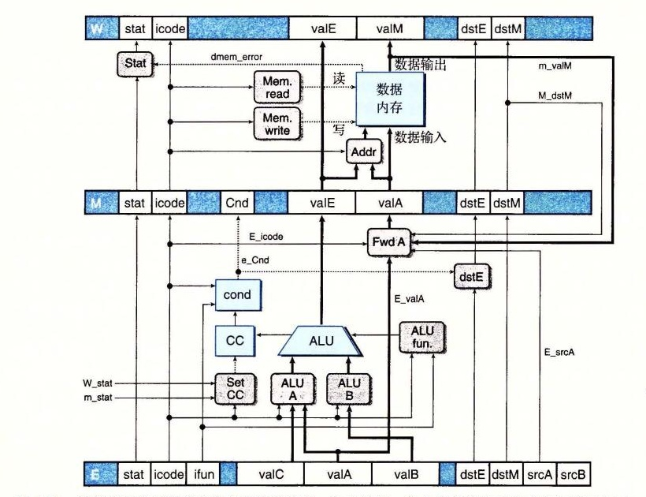

# 第 4 章家庭作业：4.51～4.57

**家庭作业 4.51**（★）练习题 4.3 介绍了 `iaddq` 指令，即将立即数与寄存器相加。描述实现该指令所执行的计算。参考 `irmovq` 和 `OPq` 指令的计算（图 4-18）。

**家庭作业 4.52**（★★）文件 `seq-full.hcl` 包含 SEQ 的 HCL 描述，并将常数 `IIADDQ` 声明为十六进制值 `C`，也就是 `iaddq` 的指令代码。修改实现 `iaddq` 指令的控制逻辑块的 HCL 描述，就像练习题 4.3 和家庭作业 4.51 中描述的那样。可以参考实验资料获得如何为你的解答生成模拟器以及如何测试模拟器的指导。

**家庭作业 4.53**（★★★）假设要创建一个较低成本的、基于我们为 PIPE− 设计的结构（图 4-41）的流水线化的处理器，不使用旁路技术。这个设计用暂停来处理所有的数据相关，直到产生所需值的指令已经通过了写回阶段。

文件 `pipe-stall.hcl` 包含一个对 PIPE 的 HCL 代码的修改版，其中禁止了旁路逻辑。也就是，信号 `e_valA` 和 `e_valB` 只是简单地声明如下：

```hcl
## DO NOT MODIFY THE FOLLOWING CODE.
## No forwarding. valA is either valP or value from register file
word d_valA = [
    D_icode in { ICALL, IJXX } : D_valP;  # Use incremented PC
    1 : d_rvalA;                          # Use value read from register file
];

## No forwarding. valB is value from register file
word d_valB = d_rvalB;
```

修改文件结尾处的流水线控制逻辑，使之能正确处理所有可能的控制和数据冒险。作为设计工作的一部分，你应该分析各种控制情况的组合，就像我们在 PIPE 的流水线控制逻辑设计中做的那样。你会发现有许多不同的组合，因为有更多的情况需要流水线暂停。要确保你的控制逻辑能正确处理每种组合情况。可以参考实验资料指导你如何为解答生成模拟器以及如何测试模拟器的。

**家庭作业 4.54**（★★）文件 `pipe-full.hcl` 包含一份 PIPE 的 HCL 描述，以及常数值 `IIADDQ` 的声明。修改该文件以实现指令 `iaddq`，就像练习题 4.3 和家庭作业 4.51 中描述的那样。可以参考实验资料获得如何为你的解答生成模拟器以及如何测试模拟器的指导。

**家庭作业 4.55**（★★★）文件 `pipe-nt.hcl` 包含一份 PIPE 的 HCL 描述，并将常数 `J_YES` 声明为值 0，即无条件转移指令的功能码。修改分支预测逻辑，使之对条件转移预测为不选择分支，而对无条件转移和 `call` 预测为选择分支。你需要设计一种方法来得到跳转目标地址 `valC`，并送到流水线寄存器 M，以便从错误的分支预测中恢复。可以参考实验资料获得如何为你的解答生成模拟器以及如何测试模拟器的指导。

**家庭作业 4.56**（★★★）文件 `pipe-btfnt.hcl` 包含一份 PIPE 的 HCL 描述，并将常数 `J_YES` 声明为值 0，即无条件转移指令的功能码。修改分支预测逻辑，使得当 `valC<valP` 时（后向分支），就预测条件转移为选择分支，当 `valC>=valP` 时（前向分支），就预测为不选择分支。（由于 Y86-64 不支持无符号运算，你应该使用有符号比较来实现这个测试。）并且将无条件转移和 `call` 预测为选择分支。你需要设计一种方法来得到 `valC` 和 `valP`，并送到流水线寄存器 M，以便从错误的分支预测中恢复。可以参考实验资料获得如何为你的解答生成模拟器以及如何测试模拟器的指导。

**家庭作业 4.57**（★★★）在我们的 PIPE 的设计中，只要一条指令执行了 `load` 操作，从内存中读一个值到寄存器，并且下一条指令要用这个寄存器作为源操作数，就会产生一个暂停。如果要在执行阶段中使用这个源操作数，暂停是避免冒险的唯一方法。对于第二条指令将源操作数存储到内存的情况，例如 `rmmovq` 或 `pushq` 指令，是不需要这样的暂停的。考虑下面这段代码示例：

```asm
1  mrmovq 0(%rcx),%rdx        # Load 1
2  pushq %rdx                 # Store 1
3  nop
4  popq %rdx                  # Load 2
5  rmmovq %rax,0(%rdx)        # Store 2
```

在第 1 行和第 2 行，`mrmovq` 指令从内存读一个值到 `%rdx`，然后 `pushq` 指令将这个值压入栈中。我们的 PIPE 设计会让 `pushq` 指令暂停，以避免加载/使用冒险。不过，可以看到，`pushq` 指令要到访存阶段才会需要 `%rdx` 的值。我们可以再添加一条旁路通路，如图 4-70 所示，将内存输出（信号 `m_valM`）转发到流水线寄存器 M 中的 `valA` 字段。在下一个时钟周期，被传送的值就能写入内存了。这种技术称为加载转发（load forwarding）。

注意，上述代码序列中的第二个例子（第 4 行和第 5 行）不能利用加载转发。`popq` 指令加载的值是作为下一条指令地址计算的一部分的，而在执行阶段而非访存阶段就需要这个值了。

A. 写出描述发现加载/使用冒险条件的逻辑公式，类似于图 4-64 所示，除了能用加载转发时不会导致暂停以外。

B. 文件 `pipe-lf.hcl` 包含一个 PIPE 控制逻辑的修改版。它含有信号 `e_valA` 的定义，用来实现图 4-70 中标号为 “Fwd A” 的块。它还将流水线控制逻辑中的加载/使用冒险的条件设置为 0，因此流水线控制逻辑将不会发现任何形式的加载/使用冒险。修改这个 HCL 描述以实现加载转发。可以参考实验资料获得如何为你的解答生成模拟器以及如何测试模拟器的指导。



**图 4-70** 能够进行加载转发的执行和访存阶段。通过添加一条从内存输出到流水线寄存器 M 中 `valA` 的源的旁路通路，对于这种形式的加载/使用冒险，我们可以使用转发而不必暂停。这是家庭作业 4.57 的主旨。
