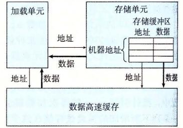
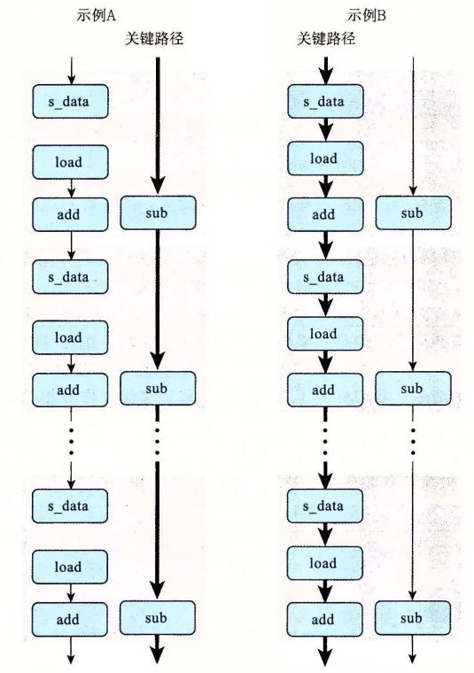

# 5.12.2 存储的性能

在迄今为止所有的示例中，我们只分析了大部分内存引用都是加载操作的函数，也就是从内存位置读到寄存器中。与之对应的是存储（store）操作，它将一个寄存器值写到内存。这个操作的性能，尤其是与加载操作的相互关系，包括一些很细微的问题。

与加载操作一样，在大多数情况中，存储操作能够在完全流水线化的模式中工作，每个周期开始一条新的存储。例如，考虑图 5-32 中所示的函数，它们将一个长度为 *n* 的数组 `dest` 的元素设置为 0。我们测试结果为 CPE 等于 1.00。对于只具有单个存储功能单元的机器，这已经达到了最佳情况。

```c
/* Set elements of array to 0 */
void clear_array(long *dest, long n)
{
    long i;
    for (i = 0; i < n; i++)
        dest[i] = 0;
}
```

**图 5-32** 将数组元素设置为 0 的函数。该代码 CPE 达到 1.0。

与到目前为止我们已经考虑过的其他操作不同，存储操作并不影响任何寄存器值。因此，就其本性来说，一系列存储操作不会产生数据相关。只有加载操作会受存储操作结果的影响，因为只有加载操作能从由存储操作写的那个位置读回值。图 5-33 所示的函数 `write_read` 说明了加载和存储操作之间可能的相互影响。这幅图也展示了该函数的两个示例执行，是对两元素数组 `a` 调用的，该数组的初始内容为 -10 和 17，参数 `cnt` 等于 3。这些执行说明了加载和存储操作的一些细微之处。

```c
/* Write to dest, read from src */
void write_read(long *src, long *dst, long n)
{
    long cnt = n;
    long val = 0;

    while (cnt) {
        *dst = val;
        val = (*src) + 1;
        cnt--;
    }
}
```

示例 A：`write_read(&a[0], &a[1], 3)`

| 状态 | `cnt` | `a[0]` | `a[1]` | `val` |
| --- | ---: | ---: | ---: | ---: |
| Initial | 3 | -10 | 17 | 0 |
| Iter. 1 | 2 | -10 | 0 | -9 |
| Iter. 2 | 1 | -10 | -9 | -9 |
| Iter. 3 | 0 | -10 | -9 | -9 |

示例 B：`write_read(&a[0], &a[0], 3)`

| 状态 | `cnt` | `a[0]` | `a[1]` | `val` |
| --- | ---: | ---: | ---: | ---: |
| Initial | 3 | -10 | 17 | 0 |
| Iter. 1 | 2 | 0 | 17 | 1 |
| Iter. 2 | 1 | 1 | 17 | 2 |
| Iter. 3 | 0 | 2 | 17 | 3 |

**图 5-33** 写和读内存位置的代码，以及示例执行。这个函数突出的是当参数 `src` 和 `dest` 相等时，存储和加载之间的相互影响。

在图 5-33 的示例 A 中，参数 `src` 是一个指向数组元素 `a[0]` 的指针，而 `dest` 是一个指向数组元素 `a[1]` 的指针。在此种情况中，指针引用 `*src` 的每次加载都会得到值 -10。因此，在两次迭代之后，数组元素就会分别保持固定为 -10 和 -9。从 `src` 读出的结果不受对 `dest` 的写的影响。在较大次数的迭代上测试这个示例得到 CPE 等于 1.3。

在图 5-33 的示例 B 中，参数 `src` 和 `dest` 都是指向数组元素 `a[0]` 的指针。在这种情况中，指针引用 `*src` 的每次加载都会得到指针引用 `*dest` 的前次执行存储的值。因而，一系列不断增加的值会被存储在这个位置。通常，如果调用函数 `write_read` 时参数 `src` 和 `dest` 指向同一个内存位置，而参数 `cnt` 的值为 *n*>0，那么净效果是将这个位置设置为 *n*-1。这个示例说明了一个现象，我们称之为写/读相关（write/read dependency）——一个内存读的结果依赖于一个最近的内存写。我们的性能测试表明示例 B 的 CPE 为 7.3。写/读相关导致处理速度下降约 6 个时钟周期。

为了了解处理器如何区别这两种情况，以及为什么一种情况比另一种运行得慢，我们必须更加仔细地看看加载和存储执行单元，如图 5-34 所示。存储单元包含一个存储缓冲区，它包含已经被发射到存储单元而又还没有完成的存储操作的地址和数据，这里的完成包括更新数据高速缓存。提供这样一个缓冲区，使得一系列存储操作不必等待每个操作都更新高速缓存就能够执行。当一个加载操作发生时，它必须检查存储缓冲区中的条目，看有没有地址相匹配。如果有地址相匹配（意味着在写的字节与在读的字节有相同的地址），它就取出相应的数据条目作为加载操作的结果。



**图 5-34** 加载和存储单元的细节。存储单元包含一个未执行的写的缓冲区。加载单元必须检查它的地址是否与存储单元中的地址相符，以发现写/读相关。

GCC 生成的 `write_read` 内循环代码如下：

```asm
# Inner loop of write_read
# src in %rdi, dst in %rsi, val in %rax
.L3:                       # loop:
    movq %rax, (%rsi)      # Write val to dst
    movq (%rdi), %rax      # t = *src
    addq $1, %rax          # val = t+1
    subq $1, %rdx          # cnt--
    jne  .L3               # If != 0, goto loop
```

图 5-35 给出了这个循环代码的数据流表示。指令 `movq %rax, (%rsi)` 被翻译成两个操作：`s_addr` 指令计算存储操作的地址，在存储缓冲区创建一个条目，并且设置该条目的地址字段。`s_data` 操作设置该条目的数据字段。正如我们会看到的，两个计算是独立执行的，这对程序的性能来说很重要。这使得参考机中不同的功能单元来执行这些操作。


**图 5-35** `write_read` 内循环代码的图形化表示。第一个 `movq` 指令被译码成两个独立的操作，计算存储地址和将数据存储到内存。

除了由于写和读寄存器造成的操作之间的数据相关，操作符右边的弧线表示这些操作隐含的相关。特别地，`s_addr` 操作的地址计算必须在 `s_data` 操作之前。此外，对指令 `movq (%rdi), %rax` 译码得到的 `load` 操作必须检查所有未完成的存储操作的地址，在这个操作和 `s_addr` 操作之间创建一个数据相关。这张图中 `s_data` 和 `load` 操作之间有虚弧线。这个数据相关是有条件的：如果两个地址相同，`load` 操作必须等待直到 `s_data` 将它的结果存放到存储缓冲区中，但是如果两个地址不同，两个操作就可以独立地进行。

图 5-36 说明了 `write_read` 内循环操作之间的数据相关。在图 5-36a 中，重新排列了操作，让相关显得更清楚。我们标出了三个涉及加载和存储操作的相关，希望引起大家特别的注意。标号为（1）的弧线表示存储地址必须在数据被存储之前计算出来。标号为（2）的弧线表示需要 `load` 操作将它的地址与所有未完成的存储操作的地址进行比较。最后，标号为（3）的虚弧线表示条件数据相关，当加载和存储地址相同时会出现。


**图 5-36** 抽象 `write_read` 的操作。我们首先重新排列图 5-35 的操作（a），然后只显示那些使用一次迭代中的值为下一次迭代产生新值的操作（b）。

图 5-36b 说明了当移走那些不直接影响迭代与迭代之间数据流的操作之后，会发生什么。这个数据流图给出两个相关链：左边的一条，存储、加载和增加数据值（只对地址相同的情况有效），右边的一条，减小变量 `cnt`。

现在我们可以理解函数 `write_read` 的性能特征了。图 5-37 说明的是内循环的多次迭代形成的数据相关。对于图 5-33 示例 A 的情况，有不同的源和目的地址，加载和存储操作可以独立进行，因此唯一的关键路径是由减少变量 `cnt` 形成的，这使得 CPE 等于 1.0。对于图 5-33 示例 B 的情况，源地址和目的地址相同，`s_data` 和 `load` 指令之间的数据相关使得关键路径的形成包括了存储、加载和增加数据。我们发现顺序执行这三个操作一共需要 7 个时钟周期。



**图 5-37** 函数 `write_read` 的数据流表示。当两个地址不同时，唯一的关键路径是减少 `cnt`（示例 A）。当两个地址相同时，存储、加载和增加数据的链形成了关键路径（示例 B）。

这两个例子说明，内存操作的实现包括许多细微之处。对于寄存器操作，在指令被译码成操作的时候，处理器就可以确定哪些指令会影响其他哪些指令。另一方面，对于内存操作，只有到计算出加载和存储的地址被计算出来以后，处理器才能确定哪些指令会影响其他的哪些。高效地处理内存操作对许多程序的性能来说至关重要。内存子系统使用了很多优化，例如当操作可以独立地进行时，就利用这种潜在的并行性。

> **练习题 5.10**
>
> 作为另一个具有潜在的加载—存储相互影响的代码，考虑下面的函数，它将一个数组的内容复制到另一个数组：
>
> ```c
> void copy_array(long *src, long *dest, long n)
> {
>     long i;
>     for (i = 0; i < n; i++)
>         dest[i] = src[i];
> }
> ```
>
> 假设 `a` 是一个长度为 1000 的数组，被初始化为每个元素 `a[i]` 等于 1。
>
> A. 调用 `copy_array(a+1, a, 999)` 的效果是什么？
>
> B. 调用 `copy_array(a, a+1, 999)` 的效果是什么？
>
> C. 我们的性能测试表明问题 A 调用的 CPE 为 1.2（循环展开因子为 4 时，该值下降到 1.0），而问题 B 调用的 CPE 为 5.0。你认为是什么因素造成了这样的性能差异？
>
> D. 你预计调用 `copy_array(a, a, 999)` 的性能会是怎样的？

> **练习题 5.11**
>
> 我们测量出前置和函数 `psum1`（图 5-1）的 CPE 为 9.00，在测试机器上，要执行的基本操作——浮点加法的延迟只是 3 个时钟周期。试着理解为什么我们的函数执行效果这么差。
>
> 下面是这个函数内循环的汇编代码：
>
> ```asm
> # Inner loop of psum1
> # a in %rdi, i in %rax, cnt in %rdx
> .L5:                                      # loop:
>     vmovss -4(%rsi,%rax,4), %xmm0         # Get p[i-1]
>     vaddss (%rdi,%rax,4), %xmm0, %xmm0    # Add a[i]
>     vmovss %xmm0, (%rsi,%rax,4)           # Store at p[i]
>     addq   $1, %rax                       # Increment i
>     cmpq   %rdx, %rax                     # Compare i:cnt
>     jne    .L5                            # If !=, goto loop
> ```
>
> 参考对 `combine3`（图 5-14）和 `write_read`（图 5-36）的分析，画出这个循环生成的数据相关图，再画出计算进行时由此形成的关键路径。解释为什么 CPE 如此之高。

> **练习题 5.12**
>
> 重写 `psum1`（图 5-1）的代码，使之不需要反复地从内存中读取 `p[i]` 的值。不需要使用循环展开。得到的代码测试出的 CPE 等于 3.00，受浮点加法延迟的限制。
