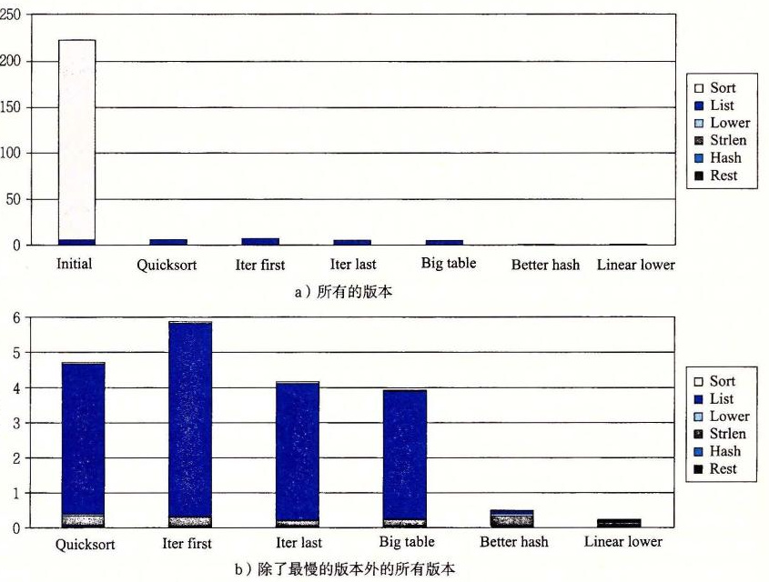

# 5.14.2 使用剖析程序来指导优化

作为一个用剖析程序来指导程序优化的示例，我们创建了一个包括几个不同任务和数据结构的应用。这个应用分析一个文本文档的 *n*-gram 统计信息，这里 *n*-gram 是一个出现在文档中 *n* 个单词的序列。对于 *n*=1，我们收集每个单词的统计信息，对于 *n*=2，收集每对单词的统计信息，以此类推。对于一个给定的 *n* 值，程序读一个文本文件，创建一张互不相同的 *n*-gram 的表，指出每个 *n*-gram 出现了多少次，然后按照出现次数的降序对单词排序。

作为基准程序，我们在一个由《莎士比亚全集》组成的文件上运行这个程序，一共有 965 028 个单词，其中 23 706 个是互不相同的。我们发现，对于 *n*=1，即使是一个写得很烂的分析程序也能在 1 秒以内处理完整个文件，所以我们设置 *n*=2，使得事情更加有挑战。对于 *n*=2 的情况，*n*-gram 被称为 bigram（读作“bye-gram”）。我们确定《莎士比亚全集》包含 363 039 个互不相同的 bigram。最常见的是“I am”，出现了 1892 次。词组“to be”出现了 1020 次。bigram 中有 266 018 个只出现了一次。

程序是由下列部分组成的。我们创建了多个版本，从各部分简单的算法开始，然后再换成更成熟完善的算法：

1. 从文件中读出每个单词，并转换成小写字母。我们最初的版本使用的是函数 `lower1`（图 5-7），我们知道由于反复地调用 `strlen`，它的时间复杂度是二次的。
2. 对字符串应用一个哈希函数，为一个有 *s* 个桶（bucket）的哈希表产生一个 0～*s*-1 之间的数。最初的函数只是简单地对字符的 ASCII 代码求和，再对 *s* 求模。
3. 每个哈希桶都组织成一个链表。程序沿着这个链表扫描，寻找一个匹配的条目。如果找到了，这个 *n*-gram 的频度就加 1。否则，就创建一个新的链表元素。最初的版本递归地完成这个操作，将新元素插在链表尾部。
4. 一旦已经生成了这张表，我们就根据频度对所有的元素排序。最初的版本使用插入排序。

图 5-38 是 *n*-gram 频度分析程序 6 个不同版本的剖析结果。对于每个版本，我们将时间分为下面的 6 类。

- **Sort**：按照频度对 *n*-gram 进行排序
- **List**：为匹配 *n*-gram 扫描链表，如果需要，插入一个新的元素
- **Lower**：将字符串转换为小写字母
- **Strlen**：计算字符串的长度
- **Hash**：计算哈希函数
- **Rest**：其他所有函数的和

**图 5-38** bigram 频度计数程序的各个版本的剖析结果。时间是根据程序中不同的主要操作划分的。

如图 5-38a 所示，最初的版本需要 3.5 分钟，大多数时间花在了排序上。这并不奇怪，因为插入排序有二次的运行时间，而程序对 363 039 个值进行排序。

在下一个版本中，我们用库函数 `qsort` 进行排序，这个函数是基于快速排序算法的 [98]，其预期运行时间为 *O*（*n* log *n*）。在图中这个版本称为“Quicksort”。更有效的排序算法使花在排序上的时间降低到可以忽略不计，而整个运行时间降低到大约 5.4 秒。图 5-38b 是剩下各个版本的时间，所用的比例能使我们看得更清楚。

改进了排序，现在发现链表扫描变成了瓶颈。想想这个低效率是由于函数的递归结构引起的，我们用一个迭代的结构替换它，显示为“Iter first”。令人奇怪的是，运行时间增加到了大约 7.5 秒。根据更进一步的研究，我们发现两个链表函数之间有一个细微的差别。递归版本将新元素插入到链表尾部，而迭代版本把它们插到链表头部。为了使性能最大化，我们希望频率最高的 *n*-gram 出现在链表的开始处。这样一来，函数就能快速地定位常见的情况。假设 *n*-gram 在文档中是均匀分布的，我们期望频度高的单词的第一次出现在频度低的单词之前。通过将新的 *n*-gram 插入尾部，第一个函数倾向于按照频度的降序排序，而第二个函数则相反。因此我们创建第三个链表扫描函数，它使用迭代，但是将新元素插入到链表的尾部。使用这个版本，显示为“Iter last”，时间降到了大约 5.3 秒，比递归版本稍微好一点。这些测量展示了对程序做实验作为优化工作一部分的重要性。开始时，我们假设将递归代码转换成迭代代码会改进程序的性能，而没有考虑添加元素到链表末尾和开头的差别。

接下来，我们考虑哈希表的结构。最初的版本只有 1021 个桶（通常会选择桶的个数为质数，以增强哈希函数将关键字均匀分布在桶中的能力）。对于一个有 363 039 个条目的表来说，这就意味着平均负载（load）是 363 039/1021=355.6。这就解释了为什么有那么多时间花在了执行链表操作上了——搜索包括测试大量的候选 *n*-gram。它还解释了为什么性能对链表的排序这么敏感。然后，我们将桶的数量增加到了 199 999，平均负载降低到了 1.8。不过，很奇怪的是，整体运行时间只下降到 5.1 秒，差距只有 0.2 秒。

进一步观察，我们可以看到，表变大了但是性能提高很小，这是由于哈希函数选择的不好。简单地对字符串的字符编码求和不能产生一个大范围的值。特别是，一个字母最大的编码值是 122，因而 *n* 个字符产生的和最多是 122*n*。在文档中，最长的 bigram（“honorificabilitudinitatibus thou”）的和也不过是 3371，所以，我们哈希表中大多数桶都是不会被使用的。此外，可交换的哈希函数，例如加法，不能对一个字符串中不同的可能的字符顺序做出区分。例如，单词“rat”和“tar”会产生同样的和。

我们换成一个使用移位和异或操作的哈希函数。使用这个版本，显示为“Better Hash”，时间下降到了 0.6 秒。一个更加系统化的方法是更加仔细地研究关键字在桶中的分布，如果哈希函数的输出分布是均匀的，那么确保这个分布接近于人们期望的那样。

最后，我们把运行时间降到了大部分时间是花在 `strlen` 上，而大多数对 `strlen` 的调用是作为小写字母转换的一部分。我们已经看到了函数 `lower1` 有二次的性能，特别是对长字符串来说。这篇文档中的单词足够短，能避免二次性能的灾难性的结果；最长的 bigram 只有 32 个字符。不过换成使用 `lower2`，显示为“Linear Lower”，得到很好的性能，整个时间降到了 0.2 秒。

通过这个练习，我们展示了代码剖析能够帮助将一个简单应用程序所需的时间从约 3.5 分钟降低到 0.2 秒，得到的性能提升约为 1000 倍。剖析程序帮助我们把注意力集中在程序最耗时的部分上，同时还提供了关于过程调用结构的有用信息。代码中的一些瓶颈，例如二次的排序函数，很容易看出来；而其他的，例如插入到链表的开始还是结尾，只有通过仔细的分析才能看出。

我们可以看到，剖析是工具箱中一个很有用的工具，但是它不应该是唯一一个。计时测量不是很准确，特别是对较短的运行时间（小于 1 秒）来说。更重要的是，结果只适用于被测试的那些特殊的数据。例如，如果在由较少数量的较长字符串组成的数据上运行最初的函数，我们会发现小写字母转换函数才是主要的性能瓶颈。更糟糕的是，如果它只剖析包含短单词的文档，我们可能永远不会发现隐藏着的性能瓶颈，例如 `lower1` 的二次性能。通常，假设在有代表性的数据上运行程序，剖析能帮助我们对典型的情况进行优化，但是我们还应该确保对所有可能的情况，程序都有相当的性能。这主要包括避免得到糟糕的渐近性能（asymptotic performance）的算法（例如插入算法）和坏的编程实践（例如 `lower1`）。

1.9.1 中讨论了 Amdahl 定律，它为通过有针对性的优化来获取性能提升提供了一些其他的见解。对于 *n*-gram 代码来说，当用 `quicksort` 代替了插入排序后，我们看到总的执行时间从 209.0 秒下降到 5.4 秒。初始版本的 209.0 秒中的 203.7 秒用于执行插入排序，得到 α=0.974，被此次优化加速的时间比例。使用 `quicksort`，花在排序上的时间变得微不足道，得到预计的加速比为 209/5.4=39.0，接近于测量加速比 38.5。我们之所以能获得大的加速比，是因为排序在整个执行时间中占了非常大的比例。然而，当一个瓶颈消除，而新的瓶颈出现时，就需要关注程序的其他部分以获得更多的加速比。
