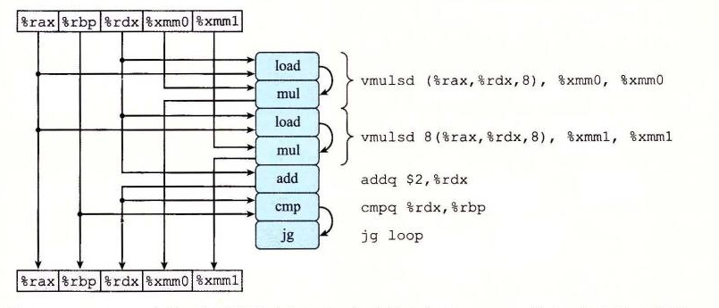
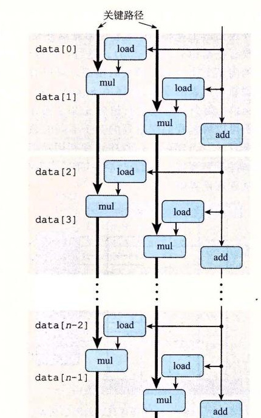
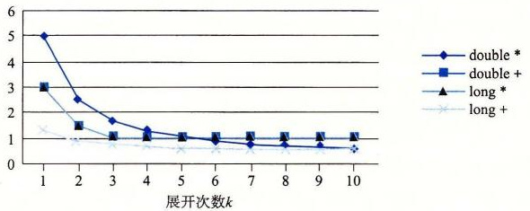

# 5.9.1 多个累积变量

对于一个可结合和可交换的合并运算来说，比如说整数加法或乘法，我们可以通过将一组合并运算分割成两个或更多的部分，并在最后合并结果来提高性能。例如，*P*<sub>*n*</sub> 表示元素 *a*<sub>0</sub>, *a*<sub>1</sub>, …, *a*<sub>*n*-1</sub> 的乘积：

*P*<sub>*n*</sub> = ∏<sub>*i*=0</sub><sup>*n*-1</sup> *a*<sub>*i*</sub>

假设 *n* 为偶数，我们还可以把它写成

*P*<sub>*n*</sub> = *PE*<sub>*n*</sub> × *PO*<sub>*n*</sub>

这里 *PE*<sub>*n*</sub> 是索引值为偶数的元素的乘积，而 *PO*<sub>*n*</sub> 是索引值为奇数的元素的乘积：

*PE*<sub>*n*</sub> = ∏<sub>*i*=0</sub><sup>*n*/2-1</sup> *a*<sub>2*i*</sub>

*PO*<sub>*n*</sub> = ∏<sub>*i*=0</sub><sup>*n*/2-1</sup> *a*<sub>2*i*+1</sub>

图 5-21 展示的是使用这种方法的代码。它既使用了两次循环展开，以使每次迭代合并更多的元素，也使用了两路并行，将索引值为偶数的元素累积在变量 `acc0` 中，而索引值为奇数的元素累积在变量 `acc1` 中。因此，我们将其称为“2×2 循环展开”。同前面一样，我们还包括了第二个循环，对于向量长度不为 2 的倍数时，这个循环要累积所有剩下的数组元素。然后，我们对 `acc0` 和 `acc1` 应用合并运算，计算最终的结果。

```c
/* 2 x 2 loop unrolling */
void combine6(vec_ptr v, data_t *dest)
{
    long i;
    long length = vec_length(v);
    long limit = length-1;
    data_t *data = get_vec_start(v);
    data_t acc0 = IDENT;
    data_t acc1 = IDENT;

    /* Combine 2 elements at a time */
    for (i = 0; i < limit; i += 2) {
        acc0 = acc0 OP data[i];
        acc1 = acc1 OP data[i+1];
    }

    /* Finish any remaining elements */
    for (; i < length; i++) {
        acc0 = acc0 OP data[i];
    }
    *dest = acc0 OP acc1;
}
```

**图 5-21** 运用 2×2 循环展开。通过维护多个累积变量，这种方法利用了多个功能单元以及它们的流水线能力。

比较只做循环展开和既做循环展开同时也使用两路并行这两种方法，我们得到下面的性能：

| 函数/界限 | 方法 | 整数 `+` | 整数 `*` | 浮点数 `+` | 浮点数 `*` |
| --- | --- | ---: | ---: | ---: | ---: |
| `combine4` | 在临时变量中累积 | 1.27 | 3.01 | 3.01 | 5.01 |
| `combine5` | 2×1 展开 | 1.01 | 3.01 | 3.01 | 5.01 |
| `combine6` | 2×2 展开 | 0.81 | 1.51 | 1.51 | 2.51 |
| 延迟界限 |  | 1.00 | 3.00 | 3.00 | 5.00 |
| 吞吐量界限 |  | 0.50 | 1.00 | 1.00 | 0.50 |

我们看到所有情况都得到了改进，整数乘、浮点加、浮点乘改进了约 2 倍，而整数加也有所改进。最棒的是，我们打破了由延迟界限设下的限制。处理器不再需要延迟一个加法或乘法操作以待前一个操作完成。

要理解 `combine6` 的性能，我们从图 5-22 所示的代码和操作序列开始。通过图 5-23 所示的过程，可以推导出一个模板，给出迭代之间的数据相关。同 `combine5` 一样，这个内循环包括两个 `vmulsd` 运算，但是这些指令被翻译成读写不同寄存器的 `mul` 操作，它们之间没有数据相关（图 5-23b）。



**图 5-22** `combine6` 内循环代码的图形化表示。每次循环有两条 `vmulsd` 指令，每条指令被翻译成一个 `load` 和一个 `mul` 操作。

然后，把这个模板复制 *n*/2 次（图 5-24），就是在一个长度为 *n* 的向量上执行这个函数的模型。可以看到，现在有两条关键路径，一条对应于计算索引为偶数的元素的乘积（程序值 `acc0`），另一条对应于计算索引为奇数的元素的乘积（程序值 `acc1`）。每条关键路径只包含 *n*/2 个操作，因此导致 CPE 大约为 5.00/2=2.50。相似的分析可以解释我们观察到的对于不同的数据类型和合并运算的组合，延迟为 *L* 的操作的 CPE 等于 *L*/2。实际上，程序正在利用功能单元的流水线能力，将利用率提高到 2 倍。唯一的例外是整数加。我们已将 CPE 降低到 1.0 以下，但是还是有太多的循环开销，而无法达到理论界限 0.50。


**图 5-23** 将 `combine6` 的运算抽象成数据流图。a）重新排列、简化和抽象图 5-22 的表示，给出连续迭代之间的数据相关。b）两个 `mul` 操作之间没有相关。



**图 5-24** `combine6` 对一个长度为 *n* 的向量进行操作的数据流表示。现在有两条关键路径，每条关键路径包含 *n*/2 个操作。

我们可以将多个累积变量变换归纳为将循环展开 *k* 次，以及并行累积 *k* 个值，得到 *k*×*k* 循环展开。图 5-25 显示了当数值达到 *k*=10 时，应用这种变换的效果。可以看到，当 *k* 值足够大时，程序在所有情况下几乎都能达到吞吐量界限。整数加在 *k*=7 时达到的 CPE 为 0.54，接近由两个加载单元导致的吞吐量界限 0.50。整数乘和浮点加在 *k*≥3 时达到的 CPE 为 1.01，接近由它们的功能单元设置的吞吐量界限 1.00。浮点乘在 *k*≥10 时达到的 CPE 为 0.51，接近由两个浮点乘法器和两个加载单元设置的吞吐量界限 0.50。值得注意的是，即使乘法是更加复杂的操作，我们的代码在浮点乘上达到的吞吐量几乎是浮点加可以达到的两倍。



**图 5-25** *k*×*k* 循环展开的 CPE 性能。使用这种变换后，所有的 CPE 都有所改进，接近或达到其吞吐量界限。

通常，只有保持能够执行该操作的所有功能单元的流水线都是满的，程序才能达到这个操作的吞吐量界限。对延迟为 *L*、容量为 *C* 的操作而言，这就要求循环展开因子 *k*≥*C*·*L*。比如，浮点乘有 *C*=2，*L*=5，循环展开因子就必须为 *k*≥10。浮点加有 *C*=1，*L*=3，则在 *k*≥3 时达到最大吞吐量。

在执行 *k*×*k* 循环展开变换时，我们必须考虑是否要保留原始函数的功能。在第 2 章已经看到，补码运算是可交换和可结合的，甚至是当溢出时也是如此。因此，对于整数数据类型，在所有可能的情况下，`combine6` 计算出的结果都和 `combine5` 计算出的相同。因此，优化编译器潜在地能够将 `combine4` 中所示的代码首先转换成 `combine5` 的二路循环展开的版本，然后再通过引入并行性，将之转换成 `combine6` 的版本。有些编译器可以做这种或与之类似的变换来提高整数数据的性能。

另一方面，浮点乘法和加法不是可结合的。因此，由于四舍五入或溢出，`combine5` 和 `combine6` 可能产生不同的结果。例如，假想这样一种情况，所有索引值为偶数的元素都是绝对值非常大的数，而索引值为奇数的元素都非常接近于 0.0。那么，即使最终的乘积 *P*<sub>*n*</sub> 不会溢出，乘积 *PE*<sub>*n*</sub> 也可能上溢，或者 *PO*<sub>*n*</sub> 也可能下溢。不过在大多数现实的程序中，不太可能出现这样的情况。因为大多数物理现象是连续的，所以数值数据也趋向于相当平滑，不会出什么问题。即使有不连续的时候，它们通常也不会导致前面描述的条件那样的周期性模式。按照严格顺序对元素求积的准确性不太可能从根本上比“分成两组独立求积，然后再将这两个积相乘”更好。对大多数应用程序来说，使性能翻倍要比冒对奇怪的数据模式产生不同的结果的风险更重要。但是，程序开发人员应该与潜在的用户协商，看看是否有特殊的条件，可能会导致修改后的算法不能接受。大多数编译器并不会尝试对浮点数代码进行这种变换，因为它们没有办法判断引入这种会改变程序行为的转换所带来的风险，不论这种改变是多么小。
