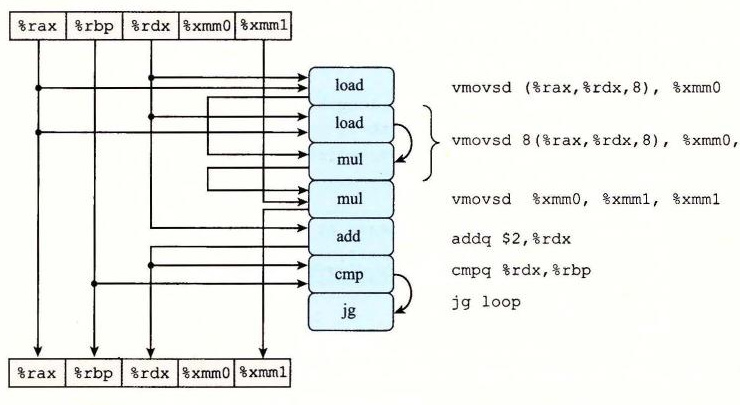
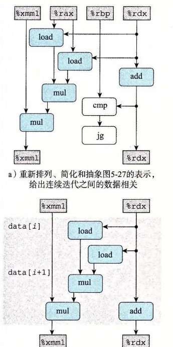
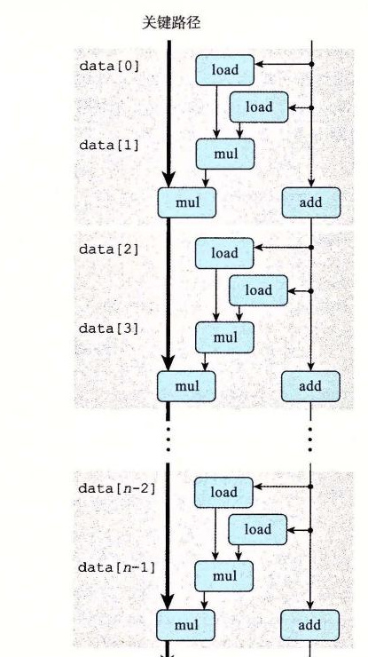
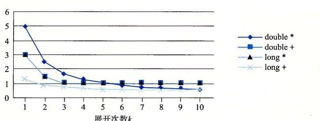

# 5.9.2 重新结合变换

现在来探讨另一种打破顺序相关从而使性能提高到延迟界限之外的方法。我们看到过做 *k*×1 循环展开的 `combine5` 没有改变合并向量元素形成和或者乘积中执行的操作。不过，对代码做很小的改动，我们可以从根本上改变合并执行的方式，也极大地提高程序的性能。

图 5-26 给出了一个函数 `combine7`，它与 `combine5` 的展开代码（图 5-16）的唯一区别在于内循环中元素合并的方式。在 `combine5` 中，合并是以下面这条语句来实现的：

```c
acc = (acc OP data[i]) OP data[i+1];
```

而在 `combine7` 中，合并是以这条语句来实现的：

```c
acc = acc OP (data[i] OP data[i+1]);
```

差别仅在于两个括号是如何放置的。我们称之为重新结合变换（reassociation transformation），因为括号改变了向量元素与累积值 `acc` 的合并顺序，产生了我们称为“2×1a”的循环展开形式。

```c
/* 2 x 1a loop unrolling */
void combine7(vec_ptr v, data_t *dest)
{
    long i;
    long length = vec_length(v);
    long limit = length-1;
    data_t *data = get_vec_start(v);
    data_t acc = IDENT;

    /* Combine 2 elements at a time */
    for (i = 0; i < limit; i += 2) {
        acc = acc OP (data[i] OP data[i+1]);
    }

    /* Finish any remaining elements */
    for (; i < length; i++) {
        acc = acc OP data[i];
    }
    *dest = acc;
}
```

**图 5-26** 运用 2×1a 循环展开，重新结合合并操作。这种方法增加了可以并行执行的操作数量。

对于未经训练的人来说，这两个语句可能看上去本质上是一样的，但是当我们测量 CPE 的时候，得到令人吃惊的结果：

| 函数/界限 | 方法 | 整数 `+` | 整数 `*` | 浮点数 `+` | 浮点数 `*` |
| --- | --- | ---: | ---: | ---: | ---: |
| `combine4` | 累积在临时变量中 | 1.27 | 3.01 | 3.01 | 5.01 |
| `combine5` | 2×1 展开 | 1.01 | 3.01 | 3.01 | 5.01 |
| `combine6` | 2×2 展开 | 0.81 | 1.51 | 1.51 | 2.51 |
| `combine7` | 2×1a 展开 | 1.01 | 1.51 | 1.51 | 2.51 |
| 延迟界限 |  | 1.00 | 3.00 | 3.00 | 5.00 |
| 吞吐量界限 |  | 0.50 | 1.00 | 1.00 | 0.50 |

整数加的性能几乎与使用 *k*×1 展开的版本（`combine5`）的性能相同，而其他三种情况则与使用并行累积变量的版本（`combine6`）相同，是 *k*×1 展开的性能的两倍。这些情况已经突破了延迟界限造成的限制。

图 5-27 说明了 `combine7` 内循环的代码（对于合并操作为乘法，数据类型为 `double` 的情况）是如何被译码成操作，以及由此得到的数据相关。我们看到，来自于 `vmovsd` 和第一个 `vmulsd` 指令的 `load` 操作从内存中加载向量元素 *i* 和 *i*+1，第一个 `mul` 操作把它们乘起来。然后，第二个 `mul` 操作把这个结果乘以累积值 `acc`。



**图 5-27** `combine7` 内循环代码的图形化表示。每次迭代被译码成与 `combine5` 或 `combine6` 类似的操作，但是数据相关不同。

图 5-28a 给出了我们如何对图 5-27 的操作进行重新排列、优化和抽象，得到表示一次迭代中数据相关的模板（图 5-28b）。对于 `combine5` 和 `combine7` 的模板，有两个 `load` 和两个 `mul` 操作，但是只有一个 `mul` 操作形成了循环寄存器间的数据相关链。



**图 5-28** 将 `combine7` 的操作抽象成数据流图。a）重新排列、简化和抽象图 5-27 的表示，给出连续迭代之间的数据相关。b）上面的 `mul` 操作让两个向量元素相乘，而下面的 `mul` 操作将前面的结果乘以循环变量 `acc`。

然后，把这个模板复制 *n*/2 次，给出了 *n* 个向量元素相乘所执行的计算（图 5-29），我们可以看到关键路径上只有 *n*/2 个操作。每次迭代内的第一个乘法都不需要等待前一次迭代的累积值就可以执行。因此，最小可能的 CPE 减少了 2 倍。



**图 5-29** `combine7` 对一个长度为 *n* 的向量进行操作的数据流表示。我们只有一条关键路径，它只包含 *n*/2 个操作。

图 5-30 展示了当数值达到 *k*=10 时，实现 *k*×1a 循环展开并重新结合变换的效果。可以看到，这种变换带来的性能结果与 *k*×*k* 循环展开中保持 *k* 个累积变量的结果相似。对所有的情况来说，我们都接近了由功能单元造成的吞吐量界限。



**图 5-30** *k*×1a 循环展开的 CPE 性能。在这种变换下，所有的 CPE 都有所改进，几乎达到了它们的吞吐量界限。

在执行重新结合变换时，我们又一次改变向量元素合并的顺序。对于整数加法和乘法，这些运算是可结合的，这表示这种重新变换顺序对结果没有影响。对于浮点数情况，必须再次评估这种重新结合是否有可能严重影响结果。我们会说对大多数应用来说，这种差别不重要。

总的来说，重新结合变换能够减少计算中关键路径上操作的数量，通过更好地利用功能单元的流水线能力得到更好的性能。大多数编译器不会尝试对浮点运算做重新结合，因为这些运算不保证是可结合的。当前的 GCC 版本会对整数运算执行重新结合，但不是总有好的效果。通常，我们发现循环展开和并行地累积在多个值中，是提高程序性能的更可靠的方法。

> **练习题 5.8**
>
> 考虑下面的计算 *n* 个双精度数组成的数组乘积的函数。我们 3 次展开这个循环。
>
> ```c
> double aprod(double a[], long n)
> {
>     long i;
>     double x, y, z;
>     double r = 1;
>
>     for (i = 0; i < n-2; i += 3) {
>         x = a[i]; y = a[i+1]; z = a[i+2];
>         r = r * x * y * z;  /* Product computation */
>     }
>     for (; i < n; i++)
>         r *= a[i];
>     return r;
> }
> ```
>
> 对于标记为 `Product computation` 的行，可以用括号得到该计算的五种不同的结合，如下所示：
>
> ```c
> r = ((r * x) * y) * z;  /* A1 */
> r = (r * (x * y)) * z;  /* A2 */
> r = r * ((x * y) * z);  /* A3 */
> r = r * (x * (y * z));  /* A4 */
> r = (r * x) * (y * z);  /* A5 */
> ```
>
> 假设在一台浮点数乘法延迟为 5 个时钟周期的机器上运行这些函数。确定由乘法的数据相关限定的 CPE 的下界。（提示：画出每次迭代如何计算 `r` 的图形化表示会有帮助。）

> **旁注 用向量指令达到更高的并行度**
>
> 就像在 3.1 节中讲述的，Intel 在 1999 年引入了 SSE 指令，SSE 是“Streaming SIMD Extensions（流 SIMD 扩展）”的缩写，而 SIMD（读作“sim-dee”）是“Single-Instruction, Multiple-Data（单指令多数据）”的缩写。SSE 功能历经几代，最新的版本为高级向量扩展（advanced vector extension）或 AVX。SIMD 执行模型是用单条指令对整个向量数据进行操作。这些向量保存在一组特殊的向量寄存器（vector register）中，名字为 `%ymm0`～`%ymm15`。目前的 AVX 向量寄存器长为 32 字节，因此每一个都可以存放 8 个 32 位数或 4 个 64 位数，这些数据既可以是整数也可以是浮点数。AVX 指令可以对这些寄存器执行向量操作，比如并行执行 8 组数值或 4 组数值的加法或乘法。例如，如果 YMM 寄存器 `%ymm0` 包含 8 个单精度浮点数，用 *a*<sub>0</sub>, …, *a*<sub>7</sub> 表示，而 `%rcx` 包含 8 个单精度浮点数的内存地址，用 *b*<sub>0</sub>, …, *b*<sub>7</sub> 表示，那么指令
>
> ```asm
> vmulps (%rcx), %ymm0, %ymm1
> ```
>
> 会从内存中读出 8 个值，并行地执行 8 个乘法，计算 *a*<sub>*i*</sub>·*b*<sub>*i*</sub>，0≤*i*≤7，并将得到的 8 个乘积保存到向量寄存器 `%ymm1`。我们看到，一条指令能够产生对多个数据值的计算，因此称为“SIMD”。
>
> GCC 支持对 C 语言的扩展，能够让程序员在程序中使用向量操作，这些操作能够被编译成 AVX 的向量指令（以及基于早前的 SSE 指令的代码）。这种代码风格比直接用汇编语言写代码要好，因为 GCC 还可以为其他处理器上的向量指令产生代码。
>
> 使用 GCC 指令、循环展开和多个累积变量的组合，我们的合并函数能够达到下面的性能：
>
> | 方法 | 整数 `int +` | 整数 `int *` | 整数 `long +` | 整数 `long *` | 浮点 `float +` | 浮点 `float *` | 浮点 `double +` | 浮点 `double *` |
> | --- | ---: | ---: | ---: | ---: | ---: | ---: | ---: | ---: |
> | 标量 10×10 | 0.54 | 1.01 | 0.55 | 1.00 | 1.01 | 0.51 | 1.01 | 0.52 |
> | 标量吞吐量界限 | 0.50 | 1.00 | 0.50 | 1.00 | 1.00 | 0.50 | 1.00 | 0.50 |
> | 向量 8×8 | 0.05 | 0.24 | 0.13 | 1.51 | 0.12 | 0.08 | 0.25 | 0.16 |
> | 向量吞吐量界限 | 0.06 | 0.12 | 0.12 | — | 0.12 | 0.06 | 0.25 | 0.12 |
>
> 上表中，第一组数字对应的是按照 `combine6` 的风格编写的传统标量代码，循环展开因子为 10，并维护 10 个累积变量。第二组数字对应的代码编写形式可以被 GCC 编译成 AVX 向量代码。除了使用向量操作外，这个版本也进行了循环展开，展开因子为 8，并维护 8 个不同的向量累积变量。我们给出了 32 位和 64 位数字的结果，因为向量指令在第一种情况中达到 8 路并行，而在第二种情况中只能达到 4 路并行。
>
> 可以看到，向量代码在 32 位的 4 种情况下几乎都获得了 8 倍的提升，对于 64 位来说，在其中的 3 种情况下获得了 4 倍的提升。只有长整数乘法代码在我们尝试将其表示为向量代码时性能不佳。AVX 指令集不包括 64 位整数的并行乘法指令，因此 GCC 无法为此种情况生成向量代码。使用向量指令对合并操作产生了新的吞吐量界限。与标量界限相比，32 位操作的新界限小了 8 倍，64 位操作的新界限小了 4 倍。我们的代码在几种数据类型和操作的组合上接近了这些界限。
