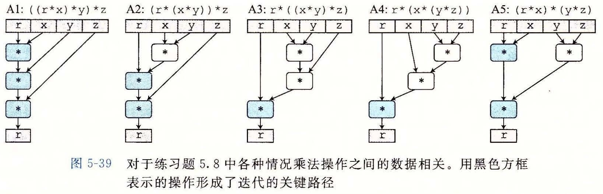

# 练习题答案

## 练习题 5.1

这个问题说明了内存别名使用的某些细微的影响。

正如下面加了注释的代码所示，结果会是将 `xp` 处的值设置为 0：

```c
4     *xp = *xp + *xp; /* 2x */
5     *xp = *xp - *xp; /* 2x-2x = 0 */
6     *xp = *xp - *xp; /* 0-0 = 0 */
```

这个示例说明我们关于程序行为的直觉往往会是错误的。我们自然地会认为 `xp` 和 `yp` 是不同的情况，却忽略了它们相等的可能性。错误通常源自程序员没想到的情况。

## 练习题 5.2

这个问题说明了 CPE 和绝对性能之间的关系。可以用初等代数解决这个问题。我们发现对于 n ≤ 2，版本 1 最快。对于 3 ≤ n ≤ 7，版本 2 最快，而对于 n ≥ 8，版本 3 最快。

## 练习题 5.3

这是个简单的练习，但是认识到一个 `for` 循环的 4 个语句（初始化、测试、更新和循环体）执行的次数是不同的很重要。

| 代码 | min | max | incr | square |
| --- | --- | --- | --- | --- |
| A. | 1 | 91 | 90 | 90 |
| B. | 91 | 1 | 90 | 90 |
| C. | 1 | 1 | 90 | 90 |

## 练习题 5.4

这段汇编代码展示了 GCC 发现的一个很聪明的优化机会。要更好地理解代码优化的细微之处，仔细研究这段代码是很值得的。

A. 在没经过优化的代码中，寄存器 `%xmm0` 简单地被用作临时值，每次循环迭代中都会设置和使用。在经过更多优化的代码中，它被使用的方式更像 `combine4` 中的变量 `x`，累积向量元素的乘积。不过，与 `combine4` 的区别在于每次迭代第二条 `vmovsd` 指令都会更新位置 `dest`。

我们可以看到，这个优化过的版本运行起来很像下面的 C 代码：

```c
 1 /* Make sure dest updated on each iteration */
 2 void combine3w(vec_ptr v, data_t *dest)
 3 {
 4     long i;
 5     long length = vec_length(v);
 6     data_t *data = get_vec_start(v);
 7     data_t acc = IDENT;
 8
 9     /* Initialize in event length <= 0 */
10     *dest = acc;
11
12     for (i = 0; i < length; i++) {
13         acc = acc OP data[i];
14         *dest = acc;
15     }
16 }
```

B. `combine3` 的两个版本有相同的功能，甚至于相同的内存别名使用。

C. 这个变换可以不改变程序的行为，因为，除了第一次迭代，每次迭代开始时从 `dest` 读出的值和前一次迭代最后写入到这个寄存器的值是相同的。因此，合并指令可以简单地使用在循环开始时就已经在 `%xmm0` 中的值。

## 练习题 5.5

多项式求值是解决许多问题的核心技术。例如，多项式函数常常用作对数学库中三角函数求近似值。

A. 这个函数执行 2n 个乘法和 n 个加法。

B. 我们可以看到，这里限制性能的计算是反复地计算表达式 `xpwr=x*xpwr`。这需要一个浮点数乘法（5 个时钟周期），并且直到前一次迭代完成，下一次迭代的计算才能开始。两次连续的迭代之间，对 `result` 的更新只需要一个浮点加法（3 个时钟周期）。

## 练习题 5.6

这道题说明了最小化一个计算中的操作数量不一定会提高它的性能。

A. 这个函数执行 n 个乘法和 n 个加法，是原始函数 `poly` 中乘法数量的一半。

B. 我们可以看到，这里的性能限制计算是反复地计算表达式 `result=a[i]+x*result`。从来自上一次迭代的 `result` 的值开始，我们必须先把它乘以 x（5 个时钟周期），然后把它加上 `a[i]`（3 个时钟周期），然后得到本次迭代的值。因此，每次迭代造成了最小延迟时间 8 个周期，正好等于我们测量到的 CPE。

C. 虽然函数 `poly` 中每次迭代需要两个乘法，而不是一个，但是只有一条乘法是在每次迭代的关键路径上出现。

## 练习题 5.7

下面的代码直接遵循了我们对 k 次展开一个循环所阐述的规则：

```c
 1 void unroll5(vec_ptr v, data_t *dest)
 2 {
 3     long i;
 4     long length = vec_length(v);
 5     long limit = length-4;
 6     data_t *data = get_vec_start(v);
 7     data_t acc = IDENT;
 8
 9     /* Combine 5 elements at a time */
10     for (i = 0; i < limit; i+=5) {
11         acc = acc OP data[i]   OP data[i+1];
12         acc = acc OP data[i+2] OP data[i+3];
13         acc = acc OP data[i+4];
14     }
15
16     /* Finish any remaining elements */
17     for (; i < length; i++) {
18         acc = acc OP data[i];
19     }
20     *dest = acc;
21 }
```

## 练习题 5.8

这道题目说明了程序中小小的改动可能会造成很大的性能不同，特别是在乱序执行的机器上。图 5-39 画出了该函数一次迭代的 3 个乘法操作。在这张图中，关键路径上的操作用黑色方框表示——它们需要按照顺序计算，计算出循环变量 r 的新值。浅色方框表示的操作可以与关键路径操作并行地计算。对于一个关键路径上有 P 个操作的循环，每次迭代需要最少 5P 个时钟周期，会计算出 3 个元素的乘积，得到 CPE 的下界 5P/3。也就是说，A1 的下界为 5.00，A2 和 A5 的为 3.33，而 A3 和 A4 的为 1.67。我们在 Intel Core i7 Haswell 处理器上运行这些函数，发现得到的 CPE 值与前述一致。



## 练习题 5.9

这道题又说明了编码风格上的小变化能够让编译器更容易地察觉到使用条件传送的机会：

```c
while (i1 < n && i2 < n) {
    long v1 = src1[i1];
    long v2 = src2[i2];
    long take1 = v1 < v2;
    dest[id++] = take1 ? v1 : v2;
    i1 += take1;
    i2 += (1-take1);
}
```

对于这个版本的代码，我们测量到 CPE 大约为 12.0，比原始的 CPE 15.0 有了明显的提高。

## 练习题 5.10

这道题要求你分析一个程序中潜在的加载-存储相互影响。

A. 对于 0 ≤ i ≤ 998，它要将每个元素 `a[i]` 设置为 i+1。

B. 对于 1 ≤ i ≤ 999，它要将每个元素 `a[i]` 设置为 0。

C. 在第二种情况中，每次迭代的加载都依赖于前一次迭代的存储结果。因此，在连续的迭代之间有写/读相关。

D. 得到的 CPE 等于 1.2，与示例 A 的相同，这是因为存储和后续的加载之间没有相关。

## 练习题 5.11

我们可以看到，这个函数在连续的迭代之间有写/读相关——一次迭代中的目的值 `p[i]` 与下一次迭代中的源值 `p[i-1]` 相同。因此，每次迭代形成的关键路径就包括：一次存储（来自前一次迭代），一次加载和一次浮点加。当存在数据相关时，测量得到的 CPE 值为 9.0，与 `write_read` 的 CPE 测量值 7.3 是一致的，因为 `write_read` 包括一个整数加（1 时钟周期延迟），而 `psum1` 包括一个浮点加（3 时钟周期延迟）。

## 练习题 5.12

下面是对这个函数的一个修改版本：

```c
 1 void psum1a(float a[], float p[], long n)
 2 {
 3     long i;
 4     /* last_val holds p[i-1]; val holds p[i] */
 5     float last_val, val;
 6     last_val = p[0] = a[0];
 7     for (i = 1; i < n; i++) {
 8         val = last_val + a[i];
 9         p[i] = val;
10         last_val = val;
11     }
12 }
```

我们引入了局部变量 `last_val`。在迭代 i 的开始，`last_val` 保存着 `p[i-1]` 的值。然后我们计算 `val` 为 `p[i]` 的值，也是 `last_val` 的新值。

这个版本编译得到如下汇编代码：

```asm
  # Inner loop of psum1a
  # a in %rdi, i in %rax, cnt in %rdx, last_val in %xmm0
1 .L16:                                  # loop:
2     vaddss (%rdi,%rax,4), %xmm0, %xmm0 # last_val = val = last_val + a[i]
3     vmovss %xmm0, (%rsi,%rax,4)         # Store val in p[i]
4     addq $1, %rax                       # Increment i
5     cmpq %rdx, %rax                     # Compare i:cnt
6     jne .L16                            # If !=, goto loop
```

这段代码将 `last_val` 保存在 `%xmm0` 中，避免了需要从内存中读出 `p[i-1]`，因而消除了 `psum1` 中看到的写/读相关。
