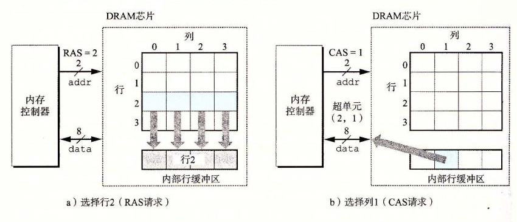
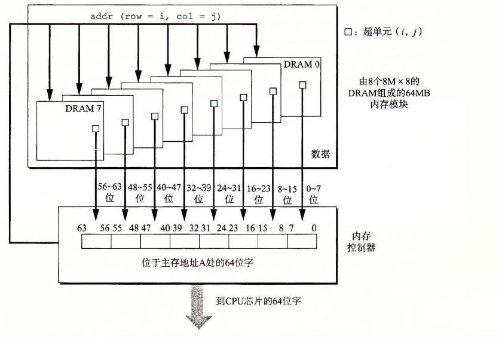
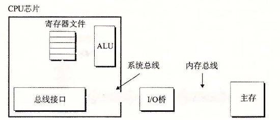
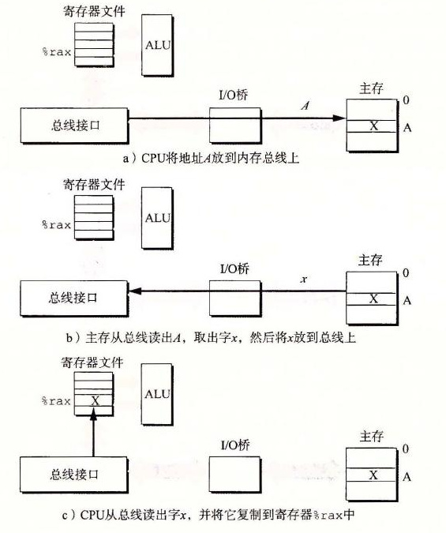

# 6.1.1 随机访问存储器

随机访问存储器（Random-Access Memory，RAM）分为两类：静态的和动态的。静态 RAM（SRAM）比动态 RAM（DRAM）更快，但也贵得多。SRAM 用来作为高速缓存存储器，既可以在 CPU 芯片上，也可以在片下。DRAM 用来作为主存以及图形系统的帧缓冲区。典型地，一个桌面系统的 SRAM 不会超过几兆字节，但是 DRAM 却有几百或几千兆字节。

## 1. 静态 RAM

SRAM 将每个位存储在一个双稳态的（bistable）存储器单元里。每个单元是用一个六晶体管电路来实现的。这个电路有这样一个属性，它可以无限期地保持在两个不同的电压配置（configuration）或状态（state）之一。其他任何状态都是不稳定的——从不稳定状态开始，电路会迅速地转移到两个稳定状态中的一个。这样一个存储器单元类似于图 6-1 中画出的倒转的钟摆。


**图 6-1** 倒转的钟摆。同 SRAM 单元一样，钟摆只有两个稳定的配置或状态

当钟摆倾斜到最左边或最右边时，它是稳定的。从其他任何位置，钟摆都会倒向一边或另一边。原则上，钟摆也能在垂直的位置无限期地保持平衡，但是这个状态是亚稳态的（metastable）——最细微的扰动也能使它倒下，而且一旦倒下就永远不会再恢复到垂直的位置。

由于 SRAM 存储器单元的双稳态特性，只要有电，它就会永远地保持它的值。即使有干扰（例如电子噪音）来扰乱电压，当干扰消除时，电路就会恢复到稳定值。

## 2. 动态 RAM

DRAM 将每个位存储为对一个电容的充电。这个电容非常小，通常只有大约 30 毫微微法拉（femtofarad）——30×10<sup>−15</sup> 法拉。不过，回想一下法拉是一个非常大的计量单位。DRAM 存储器可以制造得非常密集——每个单元由一个电容和一个访问晶体管组成。但是，与 SRAM 不同，DRAM 存储器单元对干扰非常敏感。当电容的电压被扰乱之后，它就永远不会恢复了。暴露在光线下会导致电容电压改变。实际上，数码照相机和摄像机中的传感器本质上就是 DRAM 单元的阵列。

很多原因会导致漏电，使得 DRAM 单元在 10～100 毫秒时间内失去电荷。幸运的是，计算机运行的时钟周期是以纳秒来衡量的，所以相对而言这个保持时间是比较长的。内存系统必须周期性地通过读出，然后重写来刷新内存每一位。有些系统也使用纠错码，其中计算机的字会被多编码几个位（例如 64 位的字可能用 72 位来编码），这样一来，电路可以发现并纠正一个字中任何单个的错误位。

图 6-2 总结了 SRAM 和 DRAM 存储器的特性。只要有供电，SRAM 就会保持不变。与 DRAM 不同，它不需要刷新。SRAM 的存取比 DRAM 快。SRAM 对诸如光和电噪声这样的干扰不敏感。代价是 SRAM 单元比 DRAM 单元使用更多的晶体管，因而密集度低，而且更贵，功耗更大。

|      | 每位晶体管数 | 相对访问时间 | 持续的？ | 敏感的？ | 相对花费 | 应用 |
| --- | ---: | ---: | :---: | :---: | ---: | --- |
| SRAM | 6 | 1× | 是 | 否 | 1000× | 高速缓存存储器 |
| DRAM | 1 | 10× | 否 | 是 | 1× | 主存，帧缓冲区 |

**图 6-2** DRAM 和 SRAM 存储器的特性

## 3. 传统的 DRAM

DRAM 芯片中的单元（位）被分成 *d* 个超单元（supercell），每个超单元都由 *w* 个 DRAM 单元组成。一个 *d*×*w* 的 DRAM 总共存储了 *dw* 位信息。超单元被组织成一个 *r* 行 *c* 列的长方形阵列，这里 *rc*＝*d*。每个超单元有形如（*i*，*j*）的地址，这里 *i* 表示行，而 *j* 表示列。

例如，图 6-3 展示的是一个 16×8 的 DRAM 芯片的组织，有 *d*＝16 个超单元，每个超单元有 *w*＝8 位，*r*＝4 行，*c*＝4 列。带阴影的方框表示地址（2，1）处的超单元。信息通过称为引脚（pin）的外部连接器流入和流出芯片。每个引脚携带一个 1 位的信号。图 6-3 给出了两组引脚：8 个 `data` 引脚，它们能传送一个字节到芯片或从芯片传出一个字节，以及 2 个 `addr` 引脚，它们携带 2 位的行和列超单元地址。其他携带控制信息的引脚没有显示出来。


**图 6-3** 一个 128 位 16×8 的 DRAM 芯片的高级视图

> **旁注 关于术语的注释**
>
> 存储领域从来没有为 DRAM 的阵列元素确定一个标准的名字。计算机架构师倾向于称之为“单元”，使这个术语具有 DRAM 存储单元之意。电路设计者倾向于称之为“字”，使之具有主存一个字之意。为了避免混淆，我们采用了无歧义的术语“超单元”。

每个 DRAM 芯片被连接到某个称为内存控制器（memory controller）的电路，这个电路可以一次传送 *w* 位到每个 DRAM 芯片或一次从每个 DRAM 芯片传出 *w* 位。为了读出超单元（*i*，*j*）的内容，内存控制器将行地址 *i* 发送到 DRAM，然后是列地址 *j*。DRAM 把超单元（*i*，*j*）的内容发回给控制器作为响应。行地址 *i* 称为 RAS（Row Access Strobe，行访问选通脉冲）请求。列地址 *j* 称为 CAS（Column Access Strobe，列访问选通脉冲）请求。注意，RAS 和 CAS 请求共享相同的 DRAM 地址引脚。

例如，要从图 6-3 中 16×8 的 DRAM 中读出超单元（2，1），内存控制器发送行地址 2，如图 6-4a 所示。DRAM 的响应是将行 2 的整个内容都复制到一个内部行缓冲区。接下来，内存控制器发送列地址 1，如图 6-4b 所示。DRAM 的响应是从行缓冲区复制出超单元（2，1）中的 8 位，并把它们发送到内存控制器。



**图 6-4** 读一个 DRAM 超单元的内容

电路设计者将 DRAM 组织成二维阵列而不是线性数组的一个原因是降低芯片上地址引脚的数量。例如，如果示例的 128 位 DRAM 被组织成一个 16 个超单元的线性数组，地址为 0～15，那么芯片会需要 4 个地址引脚而不是 2 个。二维阵列组织的缺点是必须分两步发送地址，这增加了访问时间。

## 4. 内存模块

DRAM 芯片封装在内存模块（memory module）中，它插到主板的扩展槽上。Core i7 系统使用的 240 个引脚的双列直插内存模块（Dual Inline Memory Module，DIMM），它以 64 位为块传送数据到内存控制器和从内存控制器传出数据。

图 6-5 展示了一个内存模块的基本思想。示例模块用 8 个 64 Mbit 的 8M×8 的 DRAM 芯片，总共存储 64MB（兆字节），这 8 个芯片编号为 0～7。每个超单元存储主存的一个字节，而用相应超单元地址为（*i*，*j*）的 8 个超单元来表示主存中地址 *A* 处的 64 位字。在图 6-5 的示例中，DRAM 0 存储第一个（低位）字节，DRAM 1 存储下一个字节，依此类推。

要取出内存地址 *A* 处的一个字，内存控制器将 *A* 转换成一个超单元地址（*i*，*j*），并将它发送到内存模块，然后内存模块再将 *i* 和 *j* 广播到每个 DRAM。作为响应，每个 DRAM 输出它的（*i*，*j*）超单元的 8 位内容。模块中的电路收集这些输出，并把它们合并成一个 64 位字，再返回给内存控制器。

通过将多个内存模块连接到内存控制器，能够聚合成主存。在这种情况中，当控制器收到一个地址 *A* 时，控制器选择包含 *A* 的模块 *k*，将 *A* 转换成它的（*i*，*j*）的形式，并将（*i*，*j*）发送到模块 *k*。



**图 6-5** 读一个内存模块的内容

> **练习题 6.1**
>
> 接下来，设 *r* 表示一个 DRAM 阵列中的行数，*c* 表示列数，*b*<sub>r</sub> 表示行寻址所需的位数，*b*<sub>c</sub> 表示列寻址所需的位数。对于下面每个 DRAM，确定 2 的幂数的阵列维数，使得 max（*b*<sub>r</sub>，*b*<sub>c</sub>）最小，max（*b*<sub>r</sub>，*b*<sub>c</sub>）是对阵列的行或列寻址所需的位数中较大的值。
>
> | 组织 | *r* | *c* | *b*<sub>r</sub> | *b*<sub>c</sub> | max（*b*<sub>r</sub>，*b*<sub>c</sub>） |
> | --- | --- | --- | --- | --- | --- |
> | 16×1 |  |  |  |  |  |
> | 16×4 |  |  |  |  |  |
> | 128×8 |  |  |  |  |  |
> | 512×4 |  |  |  |  |  |
> | 1024×4 |  |  |  |  |  |

## 5. 增强的 DRAM

有许多种 DRAM 存储器，而生产厂商试图跟上迅速增长的处理器速度，市场上就会定期推出新的种类。每种都是基于传统的 DRAM 单元，并进行一些优化，提高访问基本 DRAM 单元的速度。

- **快页模式 DRAM（Fast Page Mode DRAM，FPM DRAM）。** 传统的 DRAM 将超单元的一整行复制到它的内部行缓冲区中，使用一个，然后丢弃剩余的。FPM DRAM 允许对同一行连续地访问可以直接从行缓冲区得到服务，从而改进了这一点。例如，要从一个传统的 DRAM 的行 *i* 中读 4 个超单元，内存控制器必须发送 4 个 RAS/CAS 请求，即使是行地址 *i* 在每个情况中都是一样的。要从一个 FPM DRAM 的同一行中读取 4 个超单元，内存控制器发送第一个 RAS/CAS 请求，后面跟三个 CAS 请求。初始的 RAS/CAS 请求将行 *i* 复制到行缓冲区，并返回 CAS 寻址的那个超单元。接下来三个超单元直接从行缓冲区获得，因此返回得比初始的超单元更快。
- **扩展数据输出 DRAM（Extended Data Out DRAM，EDO DRAM）。** FPM DRAM 的一个增强的形式，它允许各个 CAS 信号在时间上靠得更紧密一点。
- **同步 DRAM（Synchronous DRAM，SDRAM）。** 就它们与内存控制器通信使用一组显式的控制信号来说，常规的、FPM 和 EDO DRAM 都是异步的。SDRAM 用与驱动内存控制器相同的外部时钟信号的上升沿来代替许多这样的控制信号。我们不会深入讨论细节，最终效果就是 SDRAM 能够比那些异步的存储器更快地输出它的超单元的内容。
- **双倍数据速率同步 DRAM（Double Data-Rate Synchronous DRAM，DDR SDRAM）。** DDR SDRAM 是对 SDRAM 的一种增强，它通过使用两个时钟沿作为控制信号，从而使 DRAM 的速度翻倍。不同类型的 DDR SDRAM 是用提高有效带宽的很小的预取缓冲区的大小来划分的：DDR（2 位）、DDR2（4 位）和 DDR3（8 位）。
- **视频 RAM（Video RAM，VRAM）。** 它用在图形系统的帧缓冲区中。VRAM 的思想与 FPM DRAM 类似。两个主要区别是：1）VRAM 的输出是通过依次对内部缓冲区的整个内容进行移位得到的；2）VRAM 允许对内存并行地读和写。因此，系统可以在写下一次更新的新值（写）的同时，用帧缓冲区中的像素刷屏幕（读）。

> **旁注 DRAM 技术流行的历史**
>
> 直到 1995 年，大多数 PC 都是用 FPM DRAM 构造的。1996～1999 年，EDO DRAM 在市场上占据了主导，而 FPM DRAM 几乎销声匿迹了。SDRAM 最早出现在 1995 年的高端系统中，到 2002 年，大多数 PC 都是用 SDRAM 和 DDR SDRAM 制造的。到 2010 年之前，大多数服务器和桌面系统都是用 DDR3 SDRAM 构造的。实际上，Intel Core i7 只支持 DDR3 SDRAM。

## 6. 非易失性存储器

如果断电，DRAM 和 SRAM 会丢失它们的信息，从这个意义上说，它们是易失的（volatile）。另一方面，非易失性存储器（nonvolatile memory）即使是在关电后，仍然保存着它们的信息。现在有很多种非易失性存储器。由于历史原因，虽然 ROM 中有的类型既可以读也可以写，但是它们整体上都被称为只读存储器（Read-Only Memory，ROM）。ROM 是以它们能够被重编程（写）的次数和对它们进行重编程所用的机制来区分的。

PROM（Programmable ROM，可编程 ROM）只能被编程一次。PROM 的每个存储器单元有一种熔丝（fuse），只能用高电流熔断一次。

可擦写可编程 ROM（Erasable Programmable ROM，EPROM）有一个透明的石英窗口，允许光到达存储单元。紫外线光照射过窗口，EPROM 单元就被清除为 0。对 EPROM 编程是通过使用一种把 1 写入 EPROM 的特殊设备来完成的。EPROM 能够被擦除和重编程的次数的数量级可以达到 1000 次。电子可擦除 PROM（Electrically Erasable PROM，EEPROM）类似于 EPROM，但是它不需要一个物理上独立的编程设备，因此可以直接在印制电路卡上编程。EEPROM 能够被编程的次数的数量级可以达到 10<sup>5</sup> 次。

闪存（flash memory）是一类非易失性存储器，基于 EEPROM，它已经成为了一种重要的存储技术。闪存无处不在，为大量的电子设备提供快速而持久的非易失性存储，包括数码相机、手机、音乐播放器、PDA 和笔记本、台式机和服务器计算机系统。在 6.1.3 节中，我们会仔细研究一种新型的基于闪存的磁盘驱动器，称为固态硬盘（Solid State Disk，SSD），它能提供相对于传统旋转磁盘的一种更快速、更强健和更低能耗的选择。

存储在 ROM 设备中的程序通常被称为固件（firmware）。当一个计算机系统通电以后，它会运行存储在 ROM 中的固件。一些系统在固件中提供了少量基本的输入和输出函数——例如 PC 的 BIOS（基本输入/输出系统）例程。复杂的设备，像图形卡和磁盘驱动控制器，也依赖固件翻译来自 CPU 的 I/O（输入/输出）请求。

## 7. 访问主存

数据流通过称为总线（bus）的共享电子电路在处理器和 DRAM 主存之间来来回回。每次 CPU 和主存之间的数据传送都是通过一系列步骤来完成的，这些步骤称为总线事务（bus transaction）。读事务（read transaction）从主存传送数据到 CPU。写事务（write transaction）从 CPU 传送数据到主存。

总线是一组并行的导线，能携带地址、数据和控制信号。取决于总线的设计，数据和地址信号可以共享同一组导线，也可以使用不同的。同时，两个以上的设备也能共享同一总线。控制线携带的信号会同步事务，并标识出当前正在被执行的事务的类型。例如，当前关注的这个事务是到主存的吗？还是到诸如磁盘控制器这样的其他 I/O 设备？这个事务是读还是写？总线上的信息是地址还是数据项？

图 6-6 展示了一个示例计算机系统的配置。主要部件是 CPU 芯片、我们将称为 I/O 桥接器（I/O bridge）的芯片组（其中包括内存控制器），以及组成主存的 DRAM 内存模块。这些部件由一对总线连接起来，其中一条总线是系统总线（system bus），它连接 CPU 和 I/O 桥接器，另一条总线是内存总线（memory bus），它连接 I/O 桥接器和主存。I/O 桥接器将系统总线的电子信号翻译成内存总线的电子信号。正如我们看到的那样，I/O 桥也将系统总线和内存总线连接到 I/O 总线，像磁盘和图形卡这样的 I/O 设备共享 I/O 总线。不过现在，我们将注意力集中在内存总线上。



**图 6-6** 连接 CPU 和主存的总线结构示例

> **旁注 关于总线设计的注释**
>
> 总线设计是计算机系统一个复杂而且变化迅速的方面。不同的厂商提出了不同的总线体系结构，作为产品差异化的一种方法。例如，Intel 系统使用称为北桥（northbridge）和南桥（southbridge）的芯片组分别将 CPU 连接到内存和 I/O 设备。在比较老的 Pentium 和 Core 2 系统中，前端总线（Front Side Bus，FSB）将 CPU 连接到北桥。来自 AMD 的系统将 FSB 替换为超传输（HyperTransport）互联，而更新一些的 Intel Core i7 系统使用的是快速通道（QuickPath）互联。这些不同总线体系结构的细节超出了本书的范围。反之，我们会使用图 6-6 中的高级总线体系结构作为一个运行示例贯穿本书。这是一个简单但是有用的抽象，使得我们可以很具体，并且可以掌握主要思想而不必与任何私有设计的细节绑得太紧。

考虑当 CPU 执行一个如下加载操作时会发生什么：

```asm
movq A,%rax
```

这里，地址 *A* 的内容被加载到寄存器 `%rax` 中。CPU 芯片上称为总线接口（bus interface）的电路在总线上发起读事务。读事务是由三个步骤组成的。首先，CPU 将地址 *A* 放到系统总线上。I/O 桥将信号传递到内存总线（图 6-7a）。接下来，主存感觉到内存总线上的地址信号，从内存总线读地址，从 DRAM 取出数据字，并将数据写到内存总线。I/O 桥将内存总线信号翻译成系统总线信号，然后沿着系统总线传递（图 6-7b）。最后，CPU 感觉到系统总线上的数据，从总线上读数据，并将数据复制到寄存器 `%rax`（图 6-7c）。



**图 6-7** 加载操作 `movq A,%rax` 的内存读事务

反过来，当 CPU 执行一个像下面这样的存储操作时：

```asm
movq %rax,A
```

这里，寄存器 `%rax` 的内容被写到地址 *A*，CPU 发起写事务。同样，有三个基本步骤。首先，CPU 将地址放到系统总线上。内存从内存总线读出地址，并等待数据到达（图 6-8a）。接下来，CPU 将 `%rax` 中的数据字复制到系统总线（图 6-8b）。最后，主存从内存总线读出数据字，并且将这些位存储到 DRAM 中（图 6-8c）。


**图 6-8** 存储操作 `movq %rax,A` 的内存写事务
