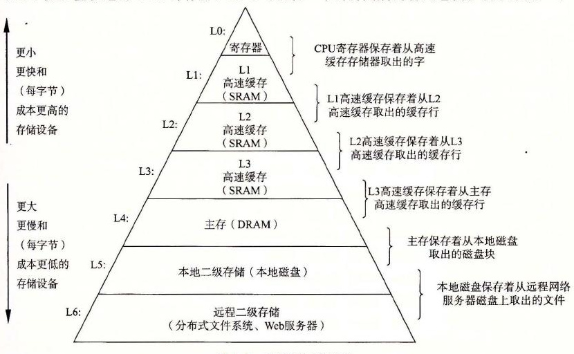

# 6.3 存储器层次结构

6.1 节和 6.2 节描述了存储技术和计算机软件的一些基本的和持久的属性：

- **存储技术：**不同存储技术的访问时间差异很大。速度较快的技术每字节的成本要比速度较慢的技术高，而且容量较小。CPU 和主存之间的速度差距在增大。
- **计算机软件：**一个编写良好的程序倾向于展示出良好的局部性。

计算中一个喜人的巧合是，硬件和软件的这些基本属性互相补充得很完美。它们这种相互补充的性质使人想到一种组织存储器系统的方法，称为存储器层次结构（memory hierarchy），所有的现代计算机系统中都使用了这种方法。图 6-21 展示了一个典型的存储器层次结构。一般而言，从高层往底层走，存储设备变得更慢、更便宜和更大。在最高层（L0），是少量快速的 CPU 寄存器，CPU 可以在一个时钟周期内访问它们。接下来是一个或多个小型到中型的基于 SRAM 的高速缓存存储器，可以在几个 CPU 时钟周期内访问它们。然后是一个大的基于 DRAM 的主存，可以在几十到几百个时钟周期内访问它们。接下来是慢速但是容量很大的本地磁盘。最后，有些系统甚至包括了一层附加的远程服务器上的磁盘，要通过网络来访问它们。例如，像安德鲁文件系统（Andrew File System，AFS）或者网络文件系统（Network File System，NFS）这样的分布式文件系统，允许程序访问存储在远程的网络服务器上的文件。类似地，万维网允许程序访问存储在世界上任何地方的 Web 服务器上的远程文件。

**图 6-21** 存储器层次结构

> **旁注：其他的存储器层次结构**
>
> 我们向你展示了一个存储器层次结构的示例，但是其他的组合也是可能的，而且确实也很常见。例如，许多站点（包括谷歌的数据中心）将本地磁盘备份到存档的磁带上。其中有些站点，在需要时由人工装好磁带。而其他站点则是由磁带机器人自动地完成这项任务。无论在哪种情况中，磁带都是存储器层次结构中的一层，在本地磁盘层下面，本书中提到的通用原则也同样适用于它。磁带每字节比磁盘更便宜，它允许站点将本地磁盘的多个快照存档。代价是磁带的访问时间要比磁盘的更长。来看另一个例子，固态硬盘在存储器层次结构中扮演着越来越重要的角色，连接起 DRAM 和旋转磁盘之间的鸿沟。
