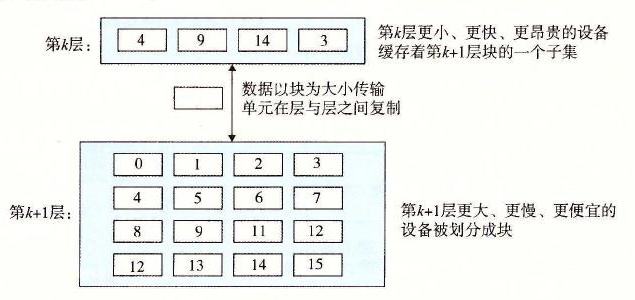

# 6.3.1 存储器层次结构中的缓存

一般而言，高速缓存（cache，读作“cash”）是一个小而快速的存储设备，它作为存储在更大、也更慢的设备中的数据对象的缓冲区域。使用高速缓存的过程称为缓存（caching，读作“cashing”）。

存储器层次结构的中心思想是，对于每个 *k*，位于 *k* 层的更快更小的存储设备作为位于 *k* + 1 层的更大更慢的存储设备的缓存。换句话说，层次结构中的每一层都缓存来自较低一层的数据对象。例如，本地磁盘作为通过网络从远程磁盘取出的文件（例如 Web 页面）的缓存，主存作为本地磁盘上数据的缓存，依此类推，直到最小的缓存——CPU 寄存器组。

图 6-22 展示了存储器层次结构中缓存的一般性概念。第 *k* + 1 层的存储器被划分成连续的数据对象组块（chunk），称为块（block）。每个块都有一个唯一的地址或名字，使之区别于其他的块。块可以是固定大小的（通常是这样的），也可以是可变大小的（例如存储在 Web 服务器上的远程 HTML 文件）。例如，图 6-22 中第 *k* + 1 层存储器被划分成 16 个大小固定的块，编号为 0～15。

**图 6-22** 存储器层次结构中基本的缓存原理

类似地，第 *k* 层的存储器被划分成较少的块的集合，每个块的大小与 *k* + 1 层的块的大小一样。在任何时刻，第 *k* 层的缓存包含第 *k* + 1 层块的一个子集的副本。例如，在图 6-22 中，第 *k* 层的缓存有 4 个块的空间，当前包含块 4、9、14 和 3 的副本。

数据总是以块大小为传送单元（transfer unit）在第 *k* 层和第 *k* + 1 层之间来回复制的。虽然在层次结构中任何一对相邻的层次之间块大小是固定的，但是其他的层次对之间可以有不同的块大小。例如，在图 6-21 中，L1 和 L0 之间的传送通常使用的是 1 个字大小的块。L2 和 L1 之间（以及 L3 和 L2 之间、L4 和 L3 之间）的传送通常使用的是几十个字节的块。而 L5 和 L4 之间的传送用的是大小为几百或几千字节的块。一般而言，层次结构中较低层（离 CPU 较远）的设备的访问时间较长，因此为了补偿这些较长的访问时间，倾向于使用较大的块。

## 1. 缓存命中

当程序需要第 *k* + 1 层的某个数据对象 *d* 时，它首先在当前存储在第 *k* 层的一个块中查找 *d*。如果 *d* 刚好缓存在第 *k* 层中，那么就是我们所说的缓存命中（cache hit）。该程序直接从第 *k* 层读取 *d*，根据存储器层次结构的性质，这要比从第 *k* + 1 层读取 *d* 更快。例如，一个有良好时间局部性的程序可以从块 14 中读出一个数据对象，得到一个对第 *k* 层的缓存命中。

## 2. 缓存不命中

另一方面，如果第 *k* 层中没有缓存数据对象 *d*，那么就是我们所说的缓存不命中（cache miss）。当发生缓存不命中时，第 *k* 层的缓存从第 *k* + 1 层缓存中取出包含 *d* 的那个块，如果第 *k* 层的缓存已经满了，可能就会覆盖现存的一个块。

覆盖一个现存的块的过程称为替换（replacing）或驱逐（evicting）这个块。被驱逐的这个块有时也称为牺牲块（victim block）。决定该替换哪个块是由缓存的替换策略（replacement policy）来控制的。例如，一个具有随机替换策略的缓存会随机选择一个牺牲块。一个具有最近最少被使用（LRU）替换策略的缓存会选择那个最后被访问的时间距现在最远的块。

在第 *k* 层缓存从第 *k* + 1 层取出那个块之后，程序就能像前面一样从第 *k* 层读出 *d* 了。例如，在图 6-22 中，在第 *k* 层中读块 12 中的一个数据对象，会导致一个缓存不命中，因为块 12 当前不在第 *k* 层缓存中。一旦把块 12 从第 *k* + 1 层复制到第 *k* 层之后，它就会保持在那里，等待稍后的访问。

## 3. 缓存不命中的种类

区分不同种类的缓存不命中有时候是很有帮助的。如果第 *k* 层的缓存是空的，那么对任何数据对象的访问都会不命中。一个空的缓存有时被称为冷缓存（cold cache），此类不命中称为强制性不命中（compulsory miss）或冷不命中（cold miss）。冷不命中很重要，因为它们通常是短暂的事件，不会在反复访问存储器使得缓存暖身（warmed up）之后的稳定状态中出现。

只要发生了不命中，第 *k* 层的缓存就必须执行某个放置策略（placement policy），确定把它从第 *k* + 1 层中取出的块放在哪里。最灵活的替换策略是允许来自第 *k* + 1 层的任何块放在第 *k* 层的任何块中。对于存储器层次结构中高层的缓存（靠近 CPU），它们是用硬件来实现的，而且速度是最优的，这个策略实现起来通常很昂贵，因为随机地放置块，定位起来代价很高。

因此，硬件缓存通常使用的是更严格的放置策略，这个策略将第 *k* + 1 层的某个块限制放置在第 *k* 层块的一个小的子集中（有时只是一个块）。例如，在图 6-22 中，我们可以确定第 *k* + 1 层的块 *i* 必须放置在第 *k* 层的块（*i* mod 4）中。例如，第 *k* + 1 层的块 0、4、8 和 12 会映射到第 *k* 层的块 0；块 1、5、9 和 13 会映射到块 1；依此类推。注意，图 6-22 中的示例缓存使用的就是这个策略。

这种限制性的放置策略会引起一种不命中，称为冲突不命中（conflict miss），在这种情况中，缓存足够大，能够保存被引用的数据对象，但是因为这些对象会映射到同一个缓存块，缓存会一直不命中。例如，在图 6-22 中，如果程序请求块 0，然后块 8，然后块 0，然后块 8，依此类推，在第 *k* 层的缓存中，对这两个块的每次引用都会不命中，即使这个缓存总共可以容纳 4 个块。

程序通常是按照一系列阶段（如循环）来运行的，每个阶段访问缓存块的某个相对稳定不变的集合。例如，一个嵌套的循环可能会反复地访问同一个数组的元素。这个块的集合称为这个阶段的工作集（working set）。当工作集的大小超过缓存的大小时，缓存会经历容量不命中（capacity miss）。换句话说就是，缓存太小了，不能处理这个工作集。

## 4. 缓存管理

正如我们提到过的，存储器层次结构的本质是，每一层存储设备都是较低一层的缓存。在每一层上，某种形式的逻辑必须管理缓存。这里，我们的意思是指某个东西要将缓存划分成块，在不同的层之间传送块，判定是命中还是不命中，并处理它们。管理缓存的逻辑可以是硬件、软件，或是两者的结合。

例如，编译器管理寄存器文件，缓存层次结构的最高层。它决定当发生不命中时何时发射加载，以及确定哪个寄存器来存放数据。L1、L2 和 L3 层的缓存完全是由内置在缓存中的硬件逻辑来管理的。在一个有虚拟内存的系统中，DRAM 主存作为存储在磁盘上的数据块的缓存，是由操作系统软件和 CPU 上的地址翻译硬件共同管理的。对于一个具有像 AFS 这样的分布式文件系统的机器来说，本地磁盘作为缓存，它是由运行在本地机器上的 AFS 客户端进程管理的。在大多数时候，缓存都是自动运行的，不需要程序采取特殊的或显式的行动。
