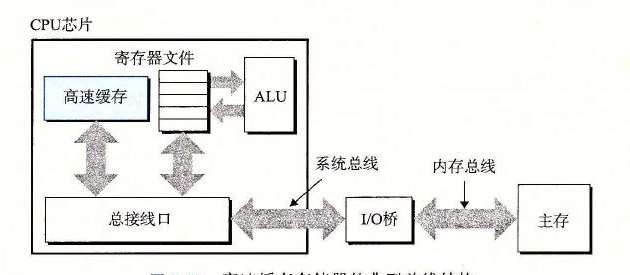

# 6.4 高速缓存存储器

早期计算机系统的存储器层次结构只有三层：CPU 寄存器、DRAM 主存储器和磁盘存储。不过，由于 CPU 和主存之间逐渐增大的差距，系统设计者被迫在 CPU 寄存器文件和主存之间插入了一个小的 SRAM 高速缓存存储器，称为 L1 高速缓存（一级缓存），如图 6-24 所示。L1 高速缓存的访问速度几乎和寄存器一样快，典型地是大约 4 个时钟周期。

**图 6-24** 高速缓存存储器的典型总线结构

随着 CPU 和主存之间的性能差距不断增大，系统设计者在 L1 高速缓存和主存之间又插入了一个更大的高速缓存，称为 L2 高速缓存，可以在大约 10 个时钟周期内访问到它。有些现代系统还包括有一个更大的高速缓存，称为 L3 高速缓存，在存储器层次结构中，它位于 L2 高速缓存和主存之间，可以在大约 50 个周期内访问到它。虽然安排上有相当多的变化，但是通用原则是一样的。对于下一节中的讨论，我们会假设一个简单的存储器层次结构，CPU 和主存之间只有一个 L1 高速缓存。
