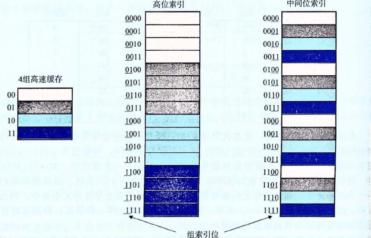

# 6.4.2 直接映射高速缓存

根据每个组的高速缓存行数 E，高速缓存被分为不同的类。每个组只有一行（E=1）的高速缓存称为直接映射高速缓存（direct-mapped cache）（见图 6-27）。直接映射高速缓存是最容易实现和理解的，所以我们会以它为例来说明一些高速缓存工作方式的通用概念。


**图 6-27** 直接映射高速缓存（E=1）。每个组只有一行

假设我们有这样一个系统，它有一个 CPU、一个寄存器文件、一个 L1 高速缓存和一个主存。当 CPU 执行一条读内存字 w 的指令，它向 L1 高速缓存请求这个字。如果 L1 高速缓存有 w 的一个缓存的副本，那么就得到 L1 高速缓存命中，高速缓存会很快抽取出 w，并将它返回给 CPU。否则就是缓存不命中，当 L1 高速缓存向主存请求包含 w 的块的一个副本时，CPU 必须等待。当被请求的块最终从内存到达时，L1 高速缓存将这个块存放在它的一个高速缓存行里，从被存储的块中抽取出字 w，然后将它返回给 CPU。高速缓存确定一个请求是否命中，然后抽取出被请求的字的过程，分为三步：1）组选择；2）行匹配；3）字抽取。

## 1. 直接映射高速缓存中的组选择

在这一步中，高速缓存从 w 的地址中间抽取出 s 个组索引位。这些位被解释成一个对应于一个组号的无符号整数。换句话来说，如果我们把高速缓存看成是一个关于组的一维数组，那么这些组索引位就是一个到这个数组的索引。图 6-28 展示了直接映射高速缓存的组选择是如何工作的。在这个例子中，组索引位 00001<sub>2</sub> 被解释为一个选择组 1 的整数索引。


**图 6-28** 直接映射高速缓存中的组选择

## 2. 直接映射高速缓存中的行匹配

在上一步中我们已经选择了某个组 i，接下来的一步就要确定是否有字 w 的一个副本存储在组 i 包含的一个高速缓存行中。在直接映射高速缓存中这很容易，而且很快，这是因为每个组只有一行。当且仅当设置了有效位，而且高速缓存行中的标记与 w 的地址中的标记相匹配时，这一行中包含 w 的一个副本。

图 6-29 展示了直接映射高速缓存中行匹配是如何工作的。在这个例子中，选中的组中只有一个高速缓存行。这个行的有效位设置了，所以我们知道标记和块中的位是有意义的。因为这个高速缓存行中的标记位与地址中的标记位相匹配，所以我们知道我们想要的那个字的一个副本确实存储在这个行中。换句话说，我们得到一个缓存命中。另一方面，如果有效位没有设置，或者标记不相匹配，那么我们就得到一个缓存不命中。


**图 6-29** 直接映射高速缓存中的行匹配和字选择。在高速缓存块中，w<sub>0</sub> 表示字 w 的低位字节，w<sub>1</sub> 是下一个字节，依此类推

## 3. 直接映射高速缓存中的字选择

一旦命中，我们知道 w 就在这个块中的某个地方。最后一步确定所需要的字在块中是从哪里开始的。如图 6-29 所示，块偏移位提供了所需要的字的第一个字节的偏移。就像我们把高速缓存看成一个行的数组一样，我们把块看成一个字节的数组，而字节偏移是到这个数组的一个索引。在这个示例中，块偏移位是 100<sub>2</sub>，它表明 w 的副本是从块中的字节 4 开始的（我们假设字长为 4 字节）。

## 4. 直接映射高速缓存中不命中时的行替换

如果缓存不命中，那么它需要从存储器层次结构中的下一层取出被请求的块，然后将新的块存储在组索引位指示的组中的一个高速缓存行中。一般而言，如果组中都是有效高速缓存行了，那么必须要驱逐出一个现存的行。对于直接映射高速缓存来说，每个组只包含有一行，替换策略非常简单：用新取出的行替换当前的行。

## 5. 综合：运行中的直接映射高速缓存

高速缓存用来选择组和标识行的机制极其简单，因为硬件必须在几个纳秒的时间内完成这些工作。不过，用这种方式来处理位是很令人困惑的。一个具体的例子能帮助解释清楚这个过程。假设我们有一个直接映射高速缓存，描述如下

```text
(S, E, B, m) = (4, 1, 2, 4)
```

换句话说，高速缓存有 4 个组，每个组一行，每个块 2 个字节，而地址是 4 位的。我们还假设每个字都是单字节的。当然，这样一些假设完全是不现实的，但是它们能使示例保持简单。

当你初学高速缓存时，列举出整个地址空间并划分好位是很有帮助的，就像我们在图 6-30 对 4 位的示例所做的那样。关于这个列举出的空间，有一些有趣的事情值得注意：

| 地址（十进制） | 标记位（t=1） | 索引位（s=2） | 偏移位（b=1） | 块号（十进制） |
| ---: | ---: | :---: | ---: | ---: |
| 0 | 0 | 00 | 0 | 0 |
| 1 | 0 | 00 | 1 | 0 |
| 2 | 0 | 01 | 0 | 1 |
| 3 | 0 | 01 | 1 | 1 |
| 4 | 0 | 10 | 0 | 2 |
| 5 | 0 | 10 | 1 | 2 |
| 6 | 0 | 11 | 0 | 3 |
| 7 | 0 | 11 | 1 | 3 |
| 8 | 1 | 00 | 0 | 4 |
| 9 | 1 | 00 | 1 | 4 |
| 10 | 1 | 01 | 0 | 5 |
| 11 | 1 | 01 | 1 | 5 |
| 12 | 1 | 10 | 0 | 6 |
| 13 | 1 | 10 | 1 | 6 |
| 14 | 1 | 11 | 0 | 7 |
| 15 | 1 | 11 | 1 | 7 |

**图 6-30** 示例直接映射高速缓存的 4 位地址空间

- 标记位和索引位连起来唯一地标识了内存中的每个块。例如，块 0 是由地址 0 和 1 组成的，块 1 是由地址 2 和 3 组成的，块 2 是由地址 4 和 5 组成的，依此类推。
- 因为有 8 个内存块，但是只有 4 个高速缓存组，所以多个块会映射到同一个高速缓存组（即它们有相同的组索引）。例如，块 0 和 4 都映射到组 0，块 1 和 5 都映射到组 1，等等。
- 映射到同一个高速缓存组的块由标记位唯一地标识。例如，块 0 的标记位为 0，而块 4 的标记位为 1，块 1 的标记位为 0，而块 5 的标记位为 1，以此类推。

让我们来模拟一下当 CPU 执行一系列读的时候，高速缓存的执行情况。记住对于这个示例，我们假设 CPU 读 1 字节的字。虽然这种手工的模拟很乏味，你可能想要跳过它，但是根据我们的经验，在学生们做过几个这样的练习之前，他们是不能真正理解高速缓存是如何工作的。

初始时，高速缓存是空的（即每个有效位都是 0）：

| 组 | 有效位 | 标记位 | 块[0] | 块[1] |
| ---: | ---: | --- | --- | --- |
| 0 | 0 |  |  |  |
| 1 | 0 |  |  |  |
| 2 | 0 |  |  |  |
| 3 | 0 |  |  |  |

表中的每一行都代表一个高速缓存行。第一列指明该行所属的组，但是请记住提供这个位只是为了方便，实际上它并不真是高速缓存的一部分。后面四列代表每个高速缓存行的实际的位。现在，让我们来看看当 CPU 执行一系列读时，都发生了什么：

1）**读地址 0 的字。** 因为组 0 的有效位是 0，是缓存不命中。高速缓存从内存（或低一层的高速缓存）取出块 0，并把这个块存储在组 0 中。然后，高速缓存返回新取出的高速缓存行的块[0]的 m[0]（内存位置 0 的内容）。

| 组 | 有效位 | 标记位 | 块[0] | 块[1] |
| ---: | ---: | ---: | --- | --- |
| 0 | 1 | 0 | m[0] | m[1] |
| 1 | 0 |  |  |  |
| 2 | 0 |  |  |  |
| 3 | 0 |  |  |  |

2）**读地址 1 的字。** 这次会是高速缓存命中。高速缓存立即从高速缓存行的块[1]中返回 m[1]。高速缓存的状态没有变化。

3）**读地址 13 的字。** 由于组 2 中的高速缓存行不是有效的，所以有缓存不命中。高速缓存把块 6 加载到组 2 中，然后从新的高速缓存行的块[1]中返回 m[13]。

| 组 | 有效位 | 标记位 | 块[0] | 块[1] |
| ---: | ---: | ---: | --- | --- |
| 0 | 1 | 0 | m[0] | m[1] |
| 1 | 0 |  |  |  |
| 2 | 1 | 1 | m[12] | m[13] |
| 3 | 0 |  |  |  |

4）**读地址 8 的字。** 这会发生缓存不命中。组 0 中的高速缓存行确实是有效的，但是标记不匹配。高速缓存将块 4 加载到组 0 中（替换读地址 0 时装入的那一行），然后从新的高速缓存行的块[0]中返回 m[8]。

| 组 | 有效位 | 标记位 | 块[0] | 块[1] |
| ---: | ---: | ---: | --- | --- |
| 0 | 1 | 1 | m[8] | m[9] |
| 1 | 0 |  |  |  |
| 2 | 1 | 1 | m[12] | m[13] |
| 3 | 0 |  |  |  |

5）**读地址 0 的字。** 又会发生缓存不命中，因为在前面引用地址 8 时，我们刚好替换了块 0。这就是冲突不命中的一个例子，也就是我们有足够的高速缓存空间，但是却交替地引用映射到同一个组的块。

| 组 | 有效位 | 标记位 | 块[0] | 块[1] |
| ---: | ---: | ---: | --- | --- |
| 0 | 1 | 0 | m[0] | m[1] |
| 1 | 0 |  |  |  |
| 2 | 1 | 1 | m[12] | m[13] |
| 3 | 0 |  |  |  |

## 6. 直接映射高速缓存中的冲突不命中

冲突不命中在真实的程序中很常见，会导致令人困惑的性能问题。当程序访问大小为 2 的幂的数组时，直接映射高速缓存中通常会发生冲突不命中。例如，考虑一个计算两个向量点积的函数：

```c
float dotprod(float x[8], float y[8])
{
    float sum = 0.0;
    int i;

    for (i = 0; i < 8; i++)
        sum += x[i] * y[i];
    return sum;
}
```

对于 x 和 y 来说，这个函数有良好的空间局部性，因此我们期望它的命中率会比较高。不幸的是，并不总是如此。

假设浮点数是 4 个字节，x 被加载到从地址 0 开始的 32 字节连续内存中，而 y 紧跟在 x 之后，从地址 32 开始。为了简便，假设一个块是 16 个字节（足够容纳 4 个浮点数），高速缓存由两个组组成，高速缓存的整个大小为 32 字节。我们会假设变量 `sum` 实际上存放在一个 CPU 寄存器中，因此不需要内存引用。根据这些假设每个 x[i] 和 y[i] 会映射到相同的高速缓存组：

| 元素 | 地址 | 组索引 | 元素 | 地址 | 组索引 |
| --- | ---: | ---: | --- | ---: | ---: |
| x[0] | 0 | 0 | y[0] | 32 | 0 |
| x[1] | 4 | 0 | y[1] | 36 | 0 |
| x[2] | 8 | 0 | y[2] | 40 | 0 |
| x[3] | 12 | 0 | y[3] | 44 | 0 |
| x[4] | 16 | 1 | y[4] | 48 | 1 |
| x[5] | 20 | 1 | y[5] | 52 | 1 |
| x[6] | 24 | 1 | y[6] | 56 | 1 |
| x[7] | 28 | 1 | y[7] | 60 | 1 |

在运行时，循环的第一次迭代引用 x[0]，缓存不命中会导致包含 x[0]～x[3] 的块被加载到组 0。接下来是对 y[0] 的引用，又一次缓存不命中，导致包含 y[0]～y[3] 的块被复制到组 0，覆盖前一次引用复制进来的 x 的值。在下一次迭代中，对 x[1] 的引用不命中，导致 x[0]～x[3] 的块被加载回组 0，覆盖掉 y[0]～y[3] 的块。因而现在我们就有了一个冲突不命中，而且实际上后面每次对 x 和 y 的引用都会导致冲突不命中，因为我们在 x 和 y 的块之间抖动（thrash）。术语“抖动”描述的是这样一种情况，即高速缓存反复地加载和驱逐相同的高速缓存块的组。

简要来说就是，即使程序有良好的空间局部性，而且我们的高速缓存中也有足够的空间来存放 x[i] 和 y[i] 的块，每次引用还是会导致冲突不命中，这是因为这些块被映射到了同一个高速缓存组。这种抖动导致速度下降 2 或 3 倍并不稀奇。另外，还要注意虽然我们的示例极其简单，但是对于更大、更现实的直接映射高速缓存来说，这个问题也是很真实的。

幸运的是，一旦程序员意识到了正在发生什么，就很容易修正抖动问题。一个很简单的方法是在每个数组的结尾放 B 字节的填充。例如，不是将 x 定义为 `float x[8]`，而是定义成 `float x[12]`。假设在内存中 y 紧跟在 x 后面，我们有下面这样的从数组元素到组的映射：

| 元素 | 地址 | 组索引 | 元素 | 地址 | 组索引 |
| --- | ---: | ---: | --- | ---: | ---: |
| x[0] | 0 | 0 | y[0] | 48 | 1 |
| x[1] | 4 | 0 | y[1] | 52 | 1 |
| x[2] | 8 | 0 | y[2] | 56 | 1 |
| x[3] | 12 | 0 | y[3] | 60 | 1 |
| x[4] | 16 | 1 | y[4] | 64 | 0 |
| x[5] | 20 | 1 | y[5] | 68 | 0 |
| x[6] | 24 | 1 | y[6] | 72 | 0 |
| x[7] | 28 | 1 | y[7] | 76 | 0 |

在 x 结尾加了填充，x[i] 和 y[i] 现在就映射到了不同的组，消除了抖动冲突不命中。

> **练习题 6.10**
>
> 在前面 `dotprod` 的例子中，在我们对数组 x 做了填充之后，所有对 x 和 y 的引用的命中率是多少？

> **旁注 为什么用中间的位来做索引**
>
> 你也许会奇怪，为什么高速缓存用中间的位来作为组索引，而不是用高位。为什么用中间的位更好，是有很好的原因的。图 6-31 说明了原因。如果高位用做索引，那么一些连续的内存块就会映射到相同的高速缓存块。例如，在图中，头四个块映射到第一个高速缓存组，第二个四个块映射到第二个组，依此类推。如果一个程序有良好的空间局部性，顺序扫描一个数组的元素，那么在任何时刻，高速缓存都只保存着一个块大小的数组内容。
>
> 
>
> **图 6-31** 为什么用中间位来作为高速缓存的索引
>
> 这样对高速缓存的使用效率很低。相比较而言，以中间位作为索引，相邻的块总是映射到不同的高速缓存行。在这里的情况中，高速缓存能够存放整个大小为 C 的数组片，这里 C 是高速缓存的大小。

> **练习题 6.11**
>
> 假想一个高速缓存，用地址的高 s 位做组索引，那么内存块连续的片（chunk）会被映射到同一个高速缓存组。
>
> A. 每个这样的连续的数组片中有多少个块？
>
> B. 考虑下面的代码，它运行在一个高速缓存形式为 (S, E, B, m)=(512, 1, 32, 32) 的系统上：
>
> ```c
> int array[4096];
>
> for (i = 0; i < 4096; i++)
>     sum += array[i];
> ```
>
> 在任意时刻，存储在高速缓存中的数组块的最大数量为多少？
