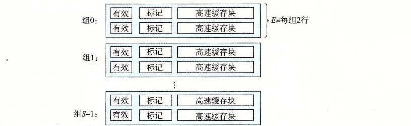
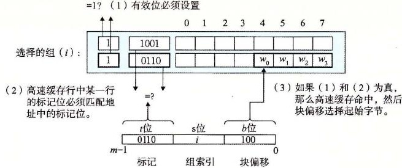

# 6.4.3 组相联高速缓存

直接映射高速缓存中冲突不命中造成的问题源于每个组只有一行（或者，按照我们的术语来描述就是 E=1）这个限制。组相联高速缓存（set associative cache）放松了这条限制，所以每个组都保存有多于一个的高速缓存行。一个 1<E<C/B 的高速缓存通常称为 E 路组相联高速缓存。在下一节中，我们会讨论 E=C/B 这种特殊情况。图 6-32 展示了一个 2 路组相联高速缓存的结构。

**图 6-32** 组相联高速缓存（1<E<C/B）。在一个组相联高速缓存中，每个组包含多于一个行。这里的特例是一个 2 路组相联高速缓存

## 1. 组相联高速缓存中的组选择

它的组选择与直接映射高速缓存的组选择一样，组索引位标识组。图 6-33 总结了这个原理。

**图 6-33** 组相联高速缓存中的组选择

## 2. 组相联高速缓存中的行匹配和字选择

组相联高速缓存中的行匹配比直接映射高速缓存中的更复杂，因为它必须检查多个行的标记位和有效位，以确定所请求的字是否在集合中。传统的内存是一个值的数组，以地址作为输入，并返回存储在那个地址的值。另一方面，相联存储器是一个 (key, value) 对的数组，以 key 为输入，返回与输入的 key 相匹配的 (key, value) 对中的 value 值。因此，我们可以把组相联高速缓存中的每个组都看成一个小的相联存储器，key 是标记和有效位，而 value 就是块的内容。

图 6-34 展示了相联高速缓存中行匹配的基本思想。这里的一个重要思想就是组中的任何一行都可以包含任何映射到这个组的内存块。所以高速缓存必须搜索组中的每一行，寻找一个有效的行，其标记与地址中的标记相匹配。如果高速缓存找到了这样一行，那么我们就命中，块偏移从这个块中选择一个字，和前面一样。

**图 6-34** 组相联高速缓存中的行匹配和字选择

## 3. 组相联高速缓存中不命中时的行替换

如果 CPU 请求的字不在组的任何一行中，那么就是缓存不命中，高速缓存必须从内存中取出包含这个字的块。不过，一旦高速缓存取出了这个块，该替换哪个行呢？当然，如果有一个空行，那它就是个很好的候选。但是如果该组中没有空行，那么我们必须从中选择一个非空的行，希望 CPU 不会很快引用这个被替换的行。

程序员很难在代码中利用高速缓存替换策略，所以在此我们不会过多地讲述其细节。最简单的替换策略是随机选择要替换的行。其他更复杂的策略利用了局部性原理，以使在比较近的将来引用被替换的行的概率最小。例如，最不常使用（Least-Frequently-Used，LFU）策略会替换在过去某个时间窗口内引用次数最少的那一行。最近最少使用（Least-Recently-Used，LRU）策略会替换最后一次访问时间最久远的那一行。所有这些策略都需要额外的时间和硬件。但是，越往存储器层次结构下面走，远离 CPU，一次不命中的开销就会更加昂贵，用更好的替换策略使得不命中最少也变得更加值得了。
