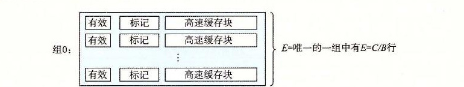
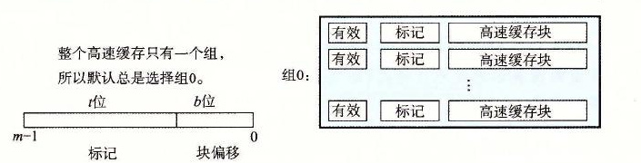
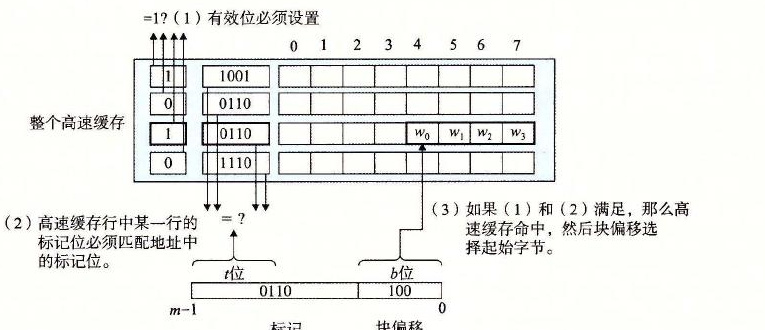

# 6.4.4 全相联高速缓存

全相联高速缓存（fully associative cache）是由一个包含所有高速缓存行的组（即 E=C/B）组成的。图 6-35 给出了基本结构。

**图 6-35** 全相联高速缓存（E=C/B）。在全相联高速缓存中，一个组包含所有的行

## 1. 全相联高速缓存中的组选择

全相联高速缓存中的组选择非常简单，因为只有一个组，图 6-36 做了个小结。注意地址中没有组索引位，地址只被划分成了一个标记和一个块偏移。

**图 6-36** 全相联高速缓存中的组选择。注意没有组索引位

## 2. 全相联高速缓存中的行匹配和字选择

全相联高速缓存中的行匹配和字选择与组相联高速缓存中的是一样的，如图 6-37 所示。它们之间的区别主要是规模大小的问题。

**图 6-37** 全相联高速缓存中的行匹配和字选择

因为高速缓存电路必须并行地搜索许多相匹配的标记，构造一个又大又快的相联高速缓存很困难，而且很昂贵。因此，全相联高速缓存只适合做小的高速缓存，例如虚拟内存系统中的翻译后备缓冲器（TLB），它缓存页表项（见 9.6.2 节）。

> **练习题 6.12**
>
> 下面的问题能帮助你加强理解高速缓存是如何工作的。有如下假设：
>
> - 内存是字节寻址的。
> - 内存访问的是 1 字节的字（不是 4 字节的字）。
> - 地址的宽度为 13 位。
> - 高速缓存是 2 路组相联的（E=2），块大小为 4 字节（B=4），有 8 个组（S=8）。
>
> 高速缓存的内容如下，所有的数字都是以十六进制来表示的：
>
> **2 路组相联高速缓存**
>
> | 组索引 | 行 0 标记位 | 有效位 | 字节 0 | 字节 1 | 字节 2 | 字节 3 | 行 1 标记位 | 有效位 | 字节 0 | 字节 1 | 字节 2 | 字节 3 |
> | ---: | ---: | ---: | ---: | ---: | ---: | ---: | ---: | ---: | ---: | ---: | ---: | ---: |
> | 0 | 09 | 1 | 86 | 30 | 3F | 10 | 00 | 0 | — | — | — | — |
> | 1 | 45 | 1 | 60 | 4F | E0 | 23 | 38 | 1 | 00 | BC | 0B | 37 |
> | 2 | EB | 0 | — | — | — | — | 0B | 0 | — | — | — | — |
> | 3 | 06 | 0 | — | — | — | — | 32 | 1 | 12 | 08 | 7B | AD |
> | 4 | C7 | 1 | 06 | 78 | 07 | C5 | 05 | 1 | 40 | 67 | C2 | 3B |
> | 5 | 71 | 1 | 0B | DE | 18 | 4B | 6E | 0 | — | — | — | — |
> | 6 | 91 | 1 | A0 | B7 | 26 | 2D | F0 | 0 | — | — | — | — |
> | 7 | 46 | 0 | — | — | — | — | DE | 1 | 12 | C0 | 88 | 37 |
>
> 下面的图表示的是地址格式（每个小方框一个位）。指出（在图中标出）用来确定下列内容的字段：
>
> - CO　高速缓存块偏移
> - CI　高速缓存组索引
> - CT　高速缓存标记
>
> | 位 | 12 | 11 | 10 | 9 | 8 | 7 | 6 | 5 | 4 | 3 | 2 | 1 | 0 |
> | --- | --- | --- | --- | --- | --- | --- | --- | --- | --- | --- | --- | --- | --- |
> | 字段 |  |  |  |  |  |  |  |  |  |  |  |  |  |

> **练习题 6.13**
>
> 假设一个程序运行在练习题 6.12 中的机器上，它引用地址 `0x0E34` 处的 1 个字节的字。指出访问的高速缓存条目和十六进制表示的返回的高速缓存字节值。指出是否会发生缓存不命中。如果会出现缓存不命中，用“—”来表示“返回的高速缓存字节”。
>
> A. 地址格式（每个小方框一个位）：
>
> | 位 | 12 | 11 | 10 | 9 | 8 | 7 | 6 | 5 | 4 | 3 | 2 | 1 | 0 |
> | --- | --- | --- | --- | --- | --- | --- | --- | --- | --- | --- | --- | --- | --- |
> | 地址 |  |  |  |  |  |  |  |  |  |  |  |  |  |
>
> B. 内存引用：
>
> | 参数 | 值 |
> | --- | --- |
> | 高速缓存块偏移（CO） | 0x______ |
> | 高速缓存组索引（CI） | 0x______ |
> | 高速缓存标记（CT） | 0x______ |
> | 高速缓存命中？（是/否） |  |
> | 返回的高速缓存字节 | 0x______ |

> **练习题 6.14**
>
> 对于存储器地址 `0x0DD5`，再做一遍练习题 6.13。
>
> A. 地址格式（每个小方框一个位）：
>
> | 位 | 12 | 11 | 10 | 9 | 8 | 7 | 6 | 5 | 4 | 3 | 2 | 1 | 0 |
> | --- | --- | --- | --- | --- | --- | --- | --- | --- | --- | --- | --- | --- | --- |
> | 地址 |  |  |  |  |  |  |  |  |  |  |  |  |  |
>
> B. 内存引用：
>
> | 参数 | 值 |
> | --- | --- |
> | 高速缓存块偏移（CO） | 0x______ |
> | 高速缓存组索引（CI） | 0x______ |
> | 高速缓存标记（CT） | 0x______ |
> | 高速缓存命中？（是/否） |  |
> | 返回的高速缓存字节 | 0x______ |

> **练习题 6.15**
>
> 对于内存地址 `0x1FE4`，再做一遍练习题 6.13。
>
> A. 地址格式（每个小方框一个位）：
>
> | 位 | 12 | 11 | 10 | 9 | 8 | 7 | 6 | 5 | 4 | 3 | 2 | 1 | 0 |
> | --- | --- | --- | --- | --- | --- | --- | --- | --- | --- | --- | --- | --- | --- |
> | 地址 |  |  |  |  |  |  |  |  |  |  |  |  |  |
>
> B. 内存引用：
>
> | 参数 | 值 |
> | --- | --- |
> | 高速缓存块偏移（CO） | 0x______ |
> | 高速缓存组索引（CI） | 0x______ |
> | 高速缓存标记（CT） | 0x______ |
> | 高速缓存命中？（是/否） |  |
> | 返回的高速缓存字节 | 0x______ |

> **练习题 6.16**
>
> 对于练习题 6.12 中的高速缓存，列出所有的在组 3 中会命中的十六进制内存地址。
